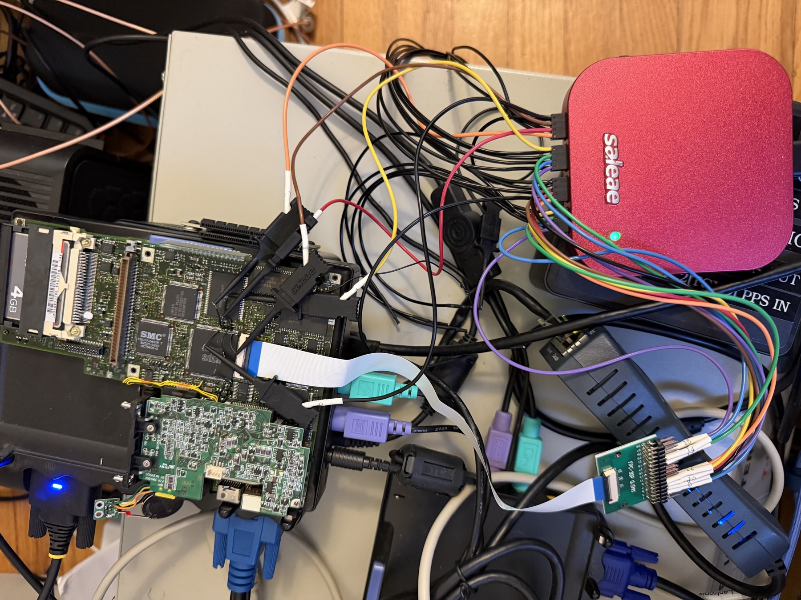
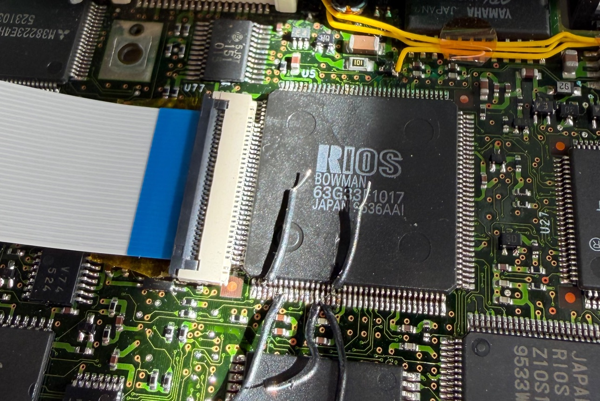

# ML-bus payload probe — capturing the multiplexed address/data

**Goal:** go beyond the 5 handshake lines and capture the *payload* of the VL82C420↔Bowman ML
bus — the three 16-bit groups that US 5,793,990 time-multiplexes onto the CPU's `A[25:2]`
address lines — so the full cycle (target address, cycle type, and 16-bit data) can be decoded.

Read alongside [Chipset §11a](readme.md) (protocol, decoded from the patent) and
[Chipset §11b](readme.md) (the handshake lines, measured live 2026-07-06). Bowman pinout is in
[Discovery/Bowman](../Bowman/readme.md) §3.1.

*Bench setup: the PC110 mainboard running live, with the **Saleae Logic Pro 16** (red) micro-gripping
Bowman/CPU pins — MLADS#/MLCLK plus the CPU address lines — via flying leads and grabber clips. The
SMC-fabbed **Pluto** (U35) sits mid-board beside the 4 GB CF card and the PC-Card connector; the
**Lantronix Spider** KVM (the blue-LED unit) carries the PC110's VGA + PS/2 + serial over IP, and an
FPC-30P breakout taps a flex connector. The whole rig is driven headless from the NUC
(`192.168.10.183`): Saleae automation for capture, COMrade for driving known bus cycles.*

---

> **⚠️ Measured outcome (2026-07-14):** the premise below — that this PC110 multiplexes address/data
> onto `A[25:2]` — was **tested and disproved**. The address is presented *statically* on `A[25:2]` for
> the whole cycle and the data rides a *separate* data bus; the multiple MLADS# strobes are Bowman
> decode/handshake phases, not multiplex groups. See [Chipset §11d](readme.md). This section is kept as
> the (generic, patent-derived) hypothesis that motivated the probe; to capture ML **data**, probe the
> data bus (`SD`/`D[15:0]`), not the address lines.

## 1. Why the address bus *is* the data bus (hypothesis — not what the PC110 does; see §11d)

The ML bus has **no dedicated data wires**. Each transaction is sent as **three successive
16-bit groups**, driven onto the CPU's own `A[25:2]` local-address lines and strobed by
`MLADS#` (the controller tri-states the CPU off the bus with `AHOLD` between groups):

| Group | Memory cycle | I/O cycle |
|------:|--------------|-----------|
| 1 | `A[25:10]` — high address, 1 KB granularity | address bits, 4-byte granularity |
| 2 | `A[9:2]` + control: `A1`, `BHE#`, `BLE#`, `W/R#`, `D/C#` | same control set |
| 3 | `D[15:0]` — the 16-bit data payload | `D[15:0]` |

So decoding the protocol = **sampling the CPU address lines on each `MLADS#` strobe** and
sorting the captured words into groups 1/2/3.

The CPU (U76, 80486SX-33) is **BGA256 — inaccessible**. Every one of these nets also lands on
**Bowman (U21), a 144-pin QFP** — the ML-bus companion — whose pins are physically reachable.
**Probe at Bowman.**

---

## 2. Probe points — Bowman U21

### 2.1 CPU address lines (all on the pins-1–36 edge)

| Signal | Pin | Signal | Pin | Signal | Pin |
|--------|----:|--------|----:|--------|----:|
| CPUA2  | 10  | CPUA10 | 19  | CPUA18 | 27  |
| CPUA3  | 11  | CPUA11 | 20  | CPUA19 | 29  |
| CPUA4  | 12  | CPUA12 | 21  | CPUA20 | 30  |
| CPUA5  | 13  | CPUA13 | 22  | CPUA21 | 31  |
| CPUA6  | 14  | CPUA14 | 23  | CPUA22 | 32  |
| CPUA7  | 15  | CPUA15 | 24  | CPUA23 | 33  |
| CPUA8  | 16  | CPUA16 | 25  | CPUA24 | 34  |
| CPUA9  | 17  | CPUA17 | 26  | CPUA25 | 35  |

*(Pins 18 and 28 are gaps in the `CPUA*` run — power/other nets, do not probe for this.)*

### 2.2 Framing + cycle-type (other edges)

| Signal | Pin | Edge | Why |
|--------|----:|------|-----|
| **MLADS#**  | **52**  | 37–72   | ML group strobe — the decode trigger / group framing |
| **MLCLK**   | **39**  | 37–72   | 22.7 MHz sample clock — count phases between strobes |
| CPU_ADS#    | 49      | 37–72   | CPU cycle start — correlate CPU cycle ↔ ML groups |
| CPU_MIO#    | 50      | 37–72   | memory vs I/O |
| CPU_WR#     | 42      | 37–72   | write vs read |
| CPU_DC#     | 41      | 37–72   | data vs control |

Note `A0`/`A1` are **not** exposed on Bowman (byte selection is via byte-enables); the group-2
control bits (`BHE#`/`BLE#`/etc.) are inferred from cycle behaviour, not from dedicated pins.

---

## 3. Channel budget — two passes

24 address lines + framing exceed the Logic Pro 16's 16 channels, so capture in **two passes**.
Keep the framing/cycle-type pins **identical across both passes** as alignment references, and
drive **repeatable** cycles from COMrade so the passes stitch together.

### Pass 1 — semantics + high address (what each cycle targets)

| CH | Signal | Pin | CH | Signal | Pin |
|---:|--------|----:|---:|--------|----:|
| 0 | MLADS#   | 52  | 8  | CPUA13 | 22 |
| 1 | MLCLK    | 39  | 9  | CPUA14 | 23 |
| 2 | CPU_ADS# | 49  | 10 | CPUA15 | 24 |
| 3 | CPU_MIO# | 50  | 11 | CPUA16 | 25 |
| 4 | CPU_WR#  | 42  | 12 | CPUA17 | 26 |
| 5 | CPUA10   | 19  | 13 | CPUA18 | 27 |
| 6 | CPUA11   | 20  | 14 | CPUA19 | 29 |
| 7 | CPUA12   | 21  | 15 | CPUA20 | 30 |

### Pass 2 — low address + data payload

Keep CH0–CH4 (MLADS#, MLCLK, ADS#, MIO#, WR#) on the same pins; move CH5–CH15 to:

| CH | Signal | Pin | CH | Signal | Pin |
|---:|--------|----:|---:|--------|----:|
| 5  | CPUA2 | 10 | 11 | CPUA8  | 16 |
| 6  | CPUA3 | 11 | 12 | CPUA9  | 17 |
| 7  | CPUA4 | 12 | 13 | CPUA21 | 31 |
| 8  | CPUA5 | 13 | 14 | CPUA22 | 32 |
| 9  | CPUA6 | 14 | 15 | CPUA23 | 33 |
| 10 | CPUA7 | 15 |    |        |    |

*(CPUA24/25 on pins 34/35 spill to a third short pass, or swap in for two low bits if the top
address bits prove constant for the chosen stimulus.)*

Group 3 (data) rides the same wires, so across the passes you recover the full `A[25:2]` **and**
the 16 data bits `D[15:0]`.

---

## 4. Capture settings

- **Rate:** 250 MS/s (≈11× oversample of the 22.7 MHz MLCLK — enough to resolve each phase).
- **Mode:** digital trigger, **`MLADS#` falling** (or `CPU_ADS#` falling to frame from the CPU side).
- **Window:** a few hundred µs is plenty; each transaction is a handful of MLCLK periods.
- Rig: Saleae Logic Pro 16 on the NUC (`192.168.10.183`), automation gRPC :10430 / MCP :10530.

---

## 5. Stimulus — drive deterministic cycles over COMrade

The passes only stitch if every capture frames the *same* transaction. Drive known, repeatable
cycles from the host:

- **I/O cycle:** `io_in` a fixed, side-effect-free port (e.g. a Pluto/PCIC status register) in a
  tight loop → `MIO#` low, `WR#` high, a known low-address group.
- **Memory read:** `mem_read` a fixed ROM address → `MIO#` high, `WR#` high, a known high-address
  group whose `A[25:10]` value you can predict and check against group 1.

> **Safety:** `io_out`/`mem_write` are unguarded on real hardware and can crash or reprogram the
> box — use **reads** for stimulus. **Never** issue CPU-speed changes over COMrade.

Predictable stimulus also validates the decode: the group-1 word you capture must equal the
`A[25:10]` of the address you asked COMrade to read.

---

## 6. Decode plan

1. Find each `MLADS#` assertion; sample all address channels on the qualifying `MLCLK` edge.
2. Sequence the samples into groups 1→2→3 by strobe order (see §11a read/write timing).
3. Group 1 → target address (1 KB page) → identify the device/register.
4. Group 2 → low address + control → reconstruct `W/R#`, `D/C#`, byte enables.
5. Group 3 → the 16-bit data word.
6. Cross-check `MIO#`/`WR#`/`ADS#` (captured directly) against the reconstructed control bits.
7. Correlate against the COMrade-driven address to confirm the mapping.

Open question this resolves: **how Bowman raises interrupts to the VL82C420's 8259 pair over the
ML bus** — candidates are an encoded field in group 2 or an as-yet-unmapped sideband ball
(see [Chipset §11a](readme.md) caveat).

---

## 7. Practical / mechanical notes

*Close-up of **Bowman (U21)** — marked `RIOS BOWMAN 63G33 1017 JAPAN S536AAI`, a 144-QFP. The probe
wires here are **soldered directly to the pins** with fine magnet wire rather than clipped — after grabber
clips kept slipping on the 0.5 mm pitch (and once crashed the machine), soldered taps gave reliable,
crash-free contact for the framing signals. The white FPC ribbon at left goes to the U77 flex connector.*

- **Pitch:** 0.5 mm QFP pins. The 24 address lines are all on the **pins-1–36 edge** — a 144-QFP
  test clip or a row of fine micro-hooks covers them in one go.
- `MLADS#` (52), `MLCLK` (39), and the control pins (41/42/49/50) are all on the **pins-37–72
  edge** — use individual micro-grabbers for those.
- **Ground:** tie several Saleae GND leads to a board `VSS` near Bowman; the 22 MHz edges need a
  short return path or you'll get ringing/false transitions.
- Verify each probe with a quick continuity/scope check before the run — a single lifted address
  line corrupts the whole group decode.

---

*Prerequisite established (2026-07-06): MLCLK and MLADS# are two of the `Chipset_IO` lines, the
other three (MLLBA#/MLRDY#/Mpriority) idle (see [Chipset §11b](readme.md)). Pin assignment
corrected 2026-07-14 from the schematic: **MLCLK = Bowman pin 39, MLADS# = Bowman pin 52**
(§11b's earlier 52/140 IDs were miscounted on the 0.5 mm pitch). This document extends that to the
multiplexed payload.*
