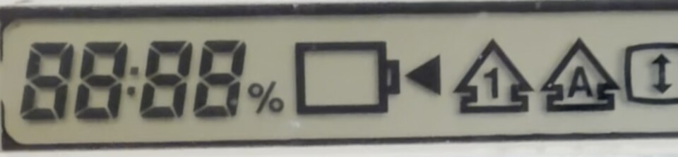
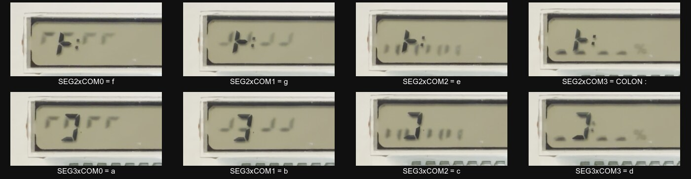
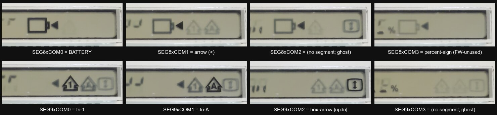

# IBM PC110 — U6 Power-Sense MCU & the J5 / J3 Inter-Board Connector

*Reverse-engineering of the firmware of U6 (Mitsubishi M38223E4HP) together with the
Mainboard (J5) and PSU daughter-board (J3) schematics.*

---

## 1. Executive summary

- **U6 is a Mitsubishi M38223E4HP** — an 8-bit, 740-core single-chip micro (3822 group,
  80-pin QFP), running as the machine's **power-management / power-sense controller**.
- Its ROM contains the banner **`M3822X POWER SENSE MICON FIRMWARE Rev 8 (C) 1995 RIOS SYSTEMS CO.,LTD.`**
  RIOS Systems is the Japanese design house that engineered the PC110 for IBM.
- **J5 (mainboard) and J3 (PSU board) are the same 40-pin board-to-board connector**, mated pin-for-pin.
  They carry three classes of signal between the two boards:
  1. **4 analog sense lines + VREF** going *into* U6's A-D converter (battery / charger sensing),
  2. **4 digital control / handshake lines** between U6 and the system,
  3. **power rails and grounds** (PNET1/4/5, 10.5 V, 5 V, VCC, GND, dock return).
- The "unknown" pins are the `M38_Pxx` nets. Decoded from the firmware + datasheet they are:

  | Net | MCU pin (alt fn) | Direction | Function |
  |-----|------------------|-----------|----------|
  | M38_P60 | P60 / **AN0** | analog in | A-D channel 0 — battery/PSU analog sense (via PSU op-amp U6C) |
  | M38_P61 | P61 / **AN1** | analog in | A-D channel 1 — battery/PSU analog sense (via PSU op-amp U6D) |
  | M38_P63 | P63 / **AN3** | analog in | A-D channel 3 — analog sense (via PSU op-amp U6A, near 5 W shunt) |
  | M38_P64 | P64 / **AN4** | analog in | A-D channel 4 — analog sense (via PSU op-amp U6B) |
  | M38_VREF | VREF | analog ref | A-D converter reference voltage |
  | M38_P52 | P52 / RTP0 | **output** | **Main power enable** — drives Q4 → switches PWR_IN_10v5 rail |
  | M38_P53 | P53 / RTP1 | output | Control output — drives transistor Q31/Q33 ("BLR") |
  | M38_P20 | P20 | I/O (bidir) | Handshake line with the system (read + driven low) |
  | M38_P21 | P21 | output | Handshake / control output (driven high in response) |

---

## 2. The firmware (U6 = M38223E4HP)

### 2.1 Identity & part
- **Core:** Mitsubishi 740 family (6502-compatible + bit instructions SEB/CLB/BBS/BBC, MUL, STP/WIT).
- **Group:** 3822 — LCD drive controller, **8-channel 8-bit A-D**, serial I/O, 3×8-bit + 2×16-bit timers,
  17 interrupt sources / 16 vectors. Package 80-pin QFP (matches `@QFP80`).
- The pin names on the schematic (`M38_P60` = port P6 bit 0, etc.) map exactly to the datasheet's
  alternate-function pins (`P60/AN0 … P67/AN7`, `VREF`, `P52/RTP0`, `P53/RTP1`, `P20–P27`).

### 2.2 ROM image & memory map
- Dump size **16 254 bytes (0x3F7E)**. The ROM is mapped at the **top of the address space**:
  base **0xC000**, i.e. file offset *N* = address 0xC000 + *N*. (Confirmed by internal JMP/JSR
  targets such as `JMP $C0EB`, `JMP $CD17`.)
- Layout:
  - `0xC000–0xC045` : ASCII copyright banner.
  - `0xC046` : **reset / start of code** (`78` = SEI).
  - `0xC046–0xE8FB` : program code (~10.4 KB used).
  - `0xE8FC–0xFF59` : **blank** (0xFF, unprogrammed EPROM).
  - `0xFF5A–0xFF7D` : **interrupt vector table** (16 little-endian pointers; unused entries → `$E8FC`).
  - `0xFF7E–0xFFFF` : **missing from this dump** (130 bytes were truncated — this is the CPU's
    hardware reset/IRQ vector area at 0xFFDC–0xFFFF; not present in the supplied file).

### 2.3 What the firmware does
A classic battery/power state-machine:
- **Initialises ports** (table-driven direction/pull-up setup), clears interrupt
  controllers, configures the A-D.
- **Main loop** repeatedly polls the **A-D converter** (`bbc 3,ADCON` = wait for the
  conversion-complete flag, `lda AD` = read the 8-bit result) and dispatches to handlers based on
  RAM state flags (heavy use of `seb`/`clb`/`bbs`/`bbc` on bit-flag bytes at 0x44, 0x50, 0x51, 0x80,
  0x95, 0xBF …).
- **A-D sensing** is the heart of the "power sense" job: it digitises the four analog lines that come
  across the connector from the PSU board's op-amp front-end.
- **Low-power modes:** three `stp` (STOP — oscillator off, deepest sleep/suspend) entry points and
  several `wit` (WAIT — CPU clock halted) instances. Before `stp` it masks interrupts and re-enables
  only the wake sources (`seb 3,ICON2`, `seb 4,ICON2`), so the system can be woken from suspend.
- **Serial I/O (SIO1):** the MCU also uses its UART (`sta TB_RB` to transmit, `bbc 6,TB_RB` to test
  receive) — but the serial pins are on **port P4**, which is *not* on J5/J3, so that link runs to a
  chip on the mainboard, not across this connector.
- **P2.0/P2.1 handshake:** the firmware reads `P2.0` as an input request, validates a sync value
  (`cmp #0x5A`), then drives `P2.0` low and `P2.1` high to acknowledge — a simple two-wire
  request/acknowledge handshake with the system across the connector.

---

## 3. The J5 / J3 connector

### 3.1 Numbering note (important)
J5 and J3 are the **same 40-pin connector mated together**, but the two schematics number the
**second row differently**:
- Pins **1–20** (first row): **identical** numbering on both boards.
- Pins **21–40** (second row): J3 counts **top→bottom 21→40**, J5 counts **top→bottom 40→21**.
- So a second-row signal has **J5 pin = 61 − (J3 pin)**. (e.g. P63 = J3-21 = J5-40.)

The net **names** are the ground truth and match across the gap, so the table below is keyed by the
physical signal. J3 (PSU side) labels every pin and is used as the authoritative net name.

### 3.2 Full reconciled pin map

| J3 pin | J5 pin | Net (PSU side) | Class | Function |
|:--:|:--:|---|---|---|
| 1  | 1  | M38_P60 / AN0 | **MCU analog** | A-D ch0 sense (PSU op-amp U6C output) |
| 2  | 2  | M38_P61 / AN1 | **MCU analog** | A-D ch1 sense (PSU op-amp U6D output) |
| 3  | 3  | PNET4 | power | inter-board power net |
| 4  | 4  | PNET4 | power | inter-board power net |
| 5  | 5  | GND  (J5: Dock_PWR_IN−) | power | ground / dock-power return |
| 6  | 6  | J5_6 | spare | generic pass-through (no dedicated PSU function) |
| 7  | 7  | GND  (J5: YellowWire2_3, no-connect) | power | ground / rework ("yellow") wire |
| 8  | 8  | PNET1 | power | inter-board power net |
| 9  | 9  | GND | power | ground |
| 10 | 10 | PNET5 | power | inter-board power net |
| 11 | 11 | PNET5 | power | inter-board power net |
| 12 | 12 | D28_1 | component | diode net |
| 13 | 13 | Q43_2 | component | transistor net |
| 14 | 14 | R284_2 | component | resistor net |
| 15 | 15 | R73_2 | component | resistor net |
| 16 | 16 | U54_VCC (VCC) | power | supply to U54 (74HC74 power-state latch) |
| 17 | 17 | U54_1D | logic | 74HC74 D-input (power-state latch) |
| 18 | 18 | M38_P52 / RTP0 | **MCU digital out** | **Main power enable** → Q4 → PWR_IN_10v5 |
| 19 | 19 | M38_P20 | **MCU digital I/O** | request/handshake line (bidirectional) |
| 20 | 20 | R412_1 | component | resistor net |
| 21 | 40 | M38_P63 / AN3 | **MCU analog** | A-D ch3 sense (PSU op-amp U6A; near 5 W shunt) |
| 22 | 39 | Q49_1 | component | transistor net |
| 23 | 38 | PNET4 | power | inter-board power net |
| 24 | 37 | GND | power | ground |
| 25 | 36 | GND | power | ground |
| 26 | 35 | D2_3 | component | diode net |
| 27 | 34 | M38_P64 / AN4 | **MCU analog** | A-D ch4 sense (PSU op-amp U6B output) |
| 28 | 33 | PNET1 | power | inter-board power net |
| 29 | 32 | GND | power | ground |
| 30 | 31 | M38_VREF | **MCU analog ref** | A-D reference voltage |
| 31 | 30 | PNET5 | power | inter-board power net |
| 32 | 29 | GND | power | ground |
| 33 | 28 | J5_33 | spare | generic pass-through |
| 34 | 27 | U21_131 | logic | control/status to system controller U21 |
| 35 | 26 | F65_ENAVEE | logic | **Enable VEE** (LCD negative-bias supply enable) |
| 36 | 25 | U54_1Q | logic | 74HC74 Q-output (power-state latch) |
| 37 | 24 | GND | power | ground |
| 38 | 23 | M38_P53 / RTP1 | **MCU digital out** | control output → Q31/Q33 ("BLR") |
| 39 | 22 | M38_P21 | **MCU digital out** | handshake / control output |
| 40 | 21 | D18_2_3 | component | diode net |

*(Pins 5/7/16/17 carry slightly different local names on the J5 side; the J3 names are used above as
they are fully labelled. All `M38_*` MCU pins are cross-confirmed identical on both boards.)*

---

## 4. The PSU analog front-end — what each sense pin actually measures

The four analog pins are conditioned by a **JRC quad op-amp on the PSU board (its own "U6" = 7064,
powered by `JRC_VCC`)** plus a fifth section **U7A**. Signal direction is:

> Battery / shunt (PSU) → op-amps (PSU U6 7064 + U7A) → J3 → J5 → MCU A-D inputs.

### 4.1 The main current path (where the shunt lives)
`Main Battery JX1` (a 2-terminal pack — B+, B−; **no thermistor pin**, so no battery-temperature
sense) feeds:

```
JX1 B+ ── 0.1 Ω shunt (R7 ‖ R8) ── F5 (2.5 A fuse) ── L1 (10 µH) ── U13 (J421 FET) ── system rails
```

The **0.1 Ω shunt pair R7/R8** in this path is the current-sense element, and the 2.5 A fuse sets the
full-scale current. A high-impedance **1 MΩ/1 MΩ divider (R89/R88)** also hangs off the battery node.

### 4.2 Channel-by-channel

| Ch | MCU pin | Op-amp | What it measures | Confidence |
|----|---------|--------|------------------|------------|
| **AN4** | P64 (J5-34/J3-27) | **U6B**, non-inverting | **Bus voltage** of PWR_IN_10v5: divider **R78 300k / R77 100k** (÷4) × gain (1+R54 100k/R53 300k ≈ 1.33) ⇒ ~3.5 V at 10.5 V in. | **High — fully traced** |
| **AN3** | P63 (J5-40/J3-21) | **U7A + U6A** diff-amp | **Battery current** — instrumentation amp across the 0.1 Ω shunt (R67 47k, R57 100k, R102 300k, R105 100k, R109 200k, R103 10k, R113 20k; C20/C43/C46 filtering). | **High (current)** |
| **AN0** | P60 (J5-1/J3-1) | **U6C**, gain ≈ ×20 | **Battery current, higher-gain/offset** — inverting stage (R63 10k in, R62 200k fb) fed from the shunt network, with an **R45 200k/R44 10k offset bias** on the + input ⇒ bidirectional (charge vs discharge) reading. Its net sits directly on the shunt/F5 node. | **High (current)** |
| **AN1** | P61 (J5-22/J3-39) | **U6D**, matched ×20 diff-amp | **Independent battery-rail current sense.** Netlist trace shows its + input is fed via **R52 10k from the battery rail node above fuse F5 (not from AN0)**; R52/R69 = R64/R101 = 10k/200k is a textbook difference amplifier (gain ×20). A ×20 gain on a battery-rail tap only makes sense for a **small differential (current)**, not raw pack voltage. | **Medium-High — netlist-verified topology** |
| **VREF** | (J5-31/J3-30) | — | A-D reference, RC-filtered (R6 470 Ω + C1 150 nF), tied to PNET5 / JRC_VCC. | High |

So the front end is a classic **battery fuel-gauge / charge-control sensor set**: at least one
**bus-voltage** channel (AN4) and a precision **current-sense** chain on a 0.1 Ω shunt feeding two-to-
three A-D channels at different gains/offsets so the MCU can resolve both large discharge currents
(up to the 2.5 A fuse limit) and small charge/standby currents — exactly what's needed for coulomb
counting and charge-termination on this Li-ion + bridge-battery system.

### 4.3 Firmware corroboration
The firmware confirms a **multi-channel, filtered scan**: a single channel-select write
`sta ADCON` ($D74F), the conversion-complete poll `bbc 3,ADCON`, and **11× `lda AD`** reads
($D5FD–$D831) that are stored into dedicated RAM variables and kept as **paired samples**
(0x7A/0x7B, 0x7C/0x7D, 0x76/0x77, 0x78/0x79) for averaging/debounce before the power state-machine
acts on them.

### 4.4 Netlist trace — resolving AN0 vs AN1 (the hard part)
I reconstructed the connectivity directly from the PDF vector data (union-find over the wire segments,
honouring junction dots and T-junctions, so two wires that merely *cross* without a dot are **not**
joined). This corrected an eyeball error and settled the question:

- **M38_P60 (AN0) is its own isolated signal net** (extent x≈1310–1426). The horizontal M38_P60 wire
  **crosses the battery vertical at x≈1444 without a junction dot** — they are *not* connected. (That
  crossing is exactly what made it *look* tied to fuse F5 in a static render.) So AN0 = the U6C
  op-amp output of the **low-side shunt (R7/R8) current chain** — confirmed.
- **AN1 (U6D) is independent of AN0.** Its + input net (R52→U6D pin 12, with R69 to ground) ties
  back through **R52 to the battery-rail node above F5**, *not* to M38_P60. So my earlier "AN1 is just
  a higher-gain copy of AN0" was wrong — they are two separate measurements.
- With **R52/R69 = R64/R101 = 10k/200k**, U6D is a matched **difference amplifier (×20)**. A ×20 gain
  referenced to the battery rail is only sensible for a **small differential** → AN1 is a
  **current** sense (high-side, on the battery rail), complementing the low-side shunt chain.

**Residual uncertainty / caveat:** ground is drawn as many separate GND symbols (not one wired net), so
wire-only tracing can't prove where U6D's − reference (R64) ultimately returns; that last hop is the
only thing a 2-minute continuity check on a real board would still pin down. But the *topology* —
AN1 = independent battery-rail current via a ×20 diff-amp — is netlist-verified.

**Net result:** the four channels are best read as **AN4 = main bus voltage** (battery *or* adapter,
since they share the PWR_IN_10v5 node — so no separate pack-voltage channel is needed) and
**AN0/AN3/AN1 = battery current** sensed at different points/gains (low-side shunt R7/R8 at two gains,
plus a high-side battery-rail diff-amp) for wide-range coulomb counting and charge-termination.

### 4.5 Other PSU-side details picked up along the way
- **P20 / P21** have back-to-back diode clamps (**Q28, "W6"**) at the connector — ESD/level
  protection on the handshake lines.
- **P53** drives transistor **Q31 (W6) → R87 → Q33 ("BLR")**; **P52** drives **Q4 ("8LR") via R2
  470k**, whose collector gates the **PWR_IN_10v5** transistor bank (Q5/Q22, "8C") — i.e. P52 is the
  hard main-power enable.
- The op-amps are JRC parts (the "7064" quad), supplied from `JRC_VCC` derived near the VREF network
  (D-clamp, Q2 "K", R3 1k, PNET5).

---

## 5. Method & caveats
- Disassembly: `m740dasm` (Mitsubishi 740 core) with a custom loader (ROM based at 0xC000, entry
  0xC046, vector table at 0xFF5A). Output: `disasm_full.asm`.
- SFR map used: standard 740 layout (P2=0x04, P5=0x0A, ADCON=0x34, AD=0x35, ICON1/2=0x3E/0x3F),
  confirmed against the Renesas/Mitsubishi 3822-group datasheet.
- The CPU hardware vector table (0xFFDC–0xFFFF) is **absent** from the supplied dump (last 130 bytes
  truncated); reset/IRQ entry was recovered from code structure instead.
- Schematic pin reading is from the vector PDFs (text + high-DPI render). Component-reference nets
  (Dxx_y, Qxx_y, Rxx_y) are named after the part pin they attach to and were not each traced to a
  function; the MCU, power, and control nets — the subject of the question — were.

---

## 6. ~~The host status window (ports `0xEC/0xED`)~~ — ⚠️ **SUPERSEDED: `0xEC/0xED` is the chipset config bank, not a U6 window**

> **Correction (2026‑07).** This section originally read the `0xEC/0xED` block as U6 power telemetry.
> That is **wrong**: `0xEC/0xED` is the **VL82C420 chipset shadow/cache/ROM config bank**, hardware‑confirmed
> in [Chipset §13j.5](../Chipset/readme.md). *Proof* — the exact bytes captured in §6.2 below match the
> chipset config decode: idx `0x07=EC` (MISCSET), `0x0C=29` (ROMSET), `0x15=6A` (CCBL), `0x18=AA` (FCBL);
> the "AA/55 framing" is just shadow/cache register values, not a report frame. **U6 does not own
> `0xEC/0xED`.** U6's real telemetry leaves the MCU over its **SIO1 serial** (streamed by `sub_e241`,
> routed off‑chip via **U72 = HD151015** IrDA/serial transceiver), and software gets the *cooked* status
> through the **APM BIOS (`INT 15h AX=530A`)** — see §4.5. The `M38_IO` link to Bowman is only a 4‑line
> control/handshake path (Bowman §3.6), not a data window. The firmware‑mechanism analysis below is kept
> for reference, but its `0xEC/0xED`‑is‑U6 attribution is **retracted**.

The 486 reads the power MCU through an **indexed I/O window: `0xEC` = index, `0xED` = data**. Probed
live it exposes a **32-byte status block** (`idx 0x00–0x1F`; `0xF0–0xFF` read back `0xFF`). This
section cross-references that block against the U6 firmware. **Everything here is a hypothesis [H]**
unless stated otherwise — see the caveats at the end.

### 6.1 How the block reaches the host (mechanism — corroborated)
U6's *own* processor bus is not on the ISA side; the host link is the MCU's **serial port (SIO1)**
(§2.3 — the serial pins are on P4, which runs to a mainboard chip, not the J5/J3 connector). The
gate array ("Bowman"/"Pluto") bridges that serial report into the `0xEC/0xED` ISA window. The
firmware confirms an **interrupt-driven block transmit** — `sub_e241` (`$E241`):

```
sub_e241:  tax
           sta TB_RB        ; push one byte to the SIO transmit buffer
           inc mem_00bc     ; advance the report pointer  (RAM $BC)
           dec mem_00bb     ; decrement the byte counter  (RAM $BB)
           bne +            ; ...until the block is drained
           clb 3,ICON1      ; then disable the TX interrupt
           clb 3,IREQ1
+          rts
```

So the MCU streams a counted byte block (pointer `$BC`, length `$BB`) out of SIO1 — exactly the
"report" the host later reads by index. The receive side (`bbc 6,TB_RB` at `$D74A`) is the host→MCU
command path (the P2.0/P2.1 `0x5A` handshake of §2.3 gates it).

> **Update (2026‑07) — the M38_IO link is narrow control, not this window.** A wire trace of
> `PCB/Mainboard/ASIC.kicad_sch` shows only **4** U6 pins reach Bowman — P14/P15 (buffered), P41, P43 →
> Bowman 106/107/110/111 (the `M38_IO` nets; Bowman §3.6). Four lines cannot carry an indexed byte
> window, and `0xEC/0xED` is in any case the chipset config bank (see the §6 correction banner). U6's
> **serial** (P44, pin 20) instead routes to **U72 = HD151015** (IrDA/serial). So the SIO1‑serial report
> described here is U6's real telemetry path — but the host consumes it via APM `530A`, **not** by reading
> `0xEC/0xED`. **[C]**

### 6.2 Live block (ground truth) and hypothesised fields
Captured live (identical to [Live-Dump §5.1](../Live-Dump/), and **byte-for-byte identical across two
separate sessions and static over time** while on AC at 100 %):

```
 idx: 00 01 02 03 04 05 06 07 08 09 0a 0b 0c 0d 0e 0f
 val: 42 d5 0b cc 06 a8 1a ec 38 00 03 00 29 00 00 2a
 idx: 10 11 12 13 14 15 16 17 18 19 1a 1b 1c 1d 1e 1f
 val: 00 00 aa 55 55 6a 55 55 aa 1a 04 08 74 00 00 00
```

| idx | live | hypothesised field | basis / confidence |
|---|---|---|---|
| `0x12,0x13,0x16,0x17` = `AA 55 … 55 55`, `0x18` = `AA`, `0x15` = `6A` | fixed | **framing / signature / handshake markers** | the `AA/55` pattern was already flagged in Live-Dump; matches the firmware's sync-validated two-wire handshake (§2.3). **[H, corroborated]** |
| `0x00–0x08` (`42 d5 0b cc 06 a8 1a ec 38`) | the "payload" | **A-D–derived power measurements** — bus voltage (AN4) and the battery-current chains (AN0/AN1/AN3) that the firmware digitises and keeps as *paired samples* in RAM `0x76–0x7D` (§4.3) before reporting | which index = which channel is **unproven [H]** |
| `0x09–0x11, 0x19–0x1F` (small ints / zeros) | state | **charge-state flags, timers, counters** — candidates for the firmware's flag bytes (`0x44/0x50/0x51/0x80/0x95/0xBF`, §2.3) and the charge-control `taper`/`ramp`/`step` tables (see `rios_pwr.c`) | mapping **unproven [H]** |

### 6.3 Caveats (why this is [H], not a decode)
- **The window is a *curated report*, not a RAM mirror.** The firmware variables that hold the
  interesting state (`0x44`, `0x76–0x7D`, `0x80`, `0x95`, `0xBF`) live *above* the 32-byte window, so
  host `idx N` ≠ MCU RAM address `N`. The host order is whatever byte order `sub_e241` streams, and
  that source array can't be recovered reliably from this dump (see next point).
- **The disassembly is partly desynced.** `m740dasm` mis-decodes 740-only ops and data-in-code as
  `.byte`, so the array feeding the SIO transmit isn't cleanly traceable. A second analysis
  (`rios_pwr.c`) even assumes a *different* ROM base (`RESET=$D1AF`, MMIO `$E320`) than the
  0xC000-based map used here — so absolute addresses carry uncertainty.
- **No dynamics to lean on.** The block is byte-identical across sessions and static on AC/100 %, and
  a deliberate liveness test — sampling the window before/after ~18 s of sustained CPU + memory-bus
  load — moved **no byte** (not even an LSB on the high-gain current channels). So from the host we
  cannot even confirm whether this window is *live-but-pinned* (battery current ≈ 0 and bus voltage
  regulated on a fully-charged AC machine, so the A-D operating point genuinely doesn't move) **or**
  a **latched/cached snapshot** that only refreshes on an MCU event or a host refresh-handshake we
  aren't issuing. Distinguishing the two — and reading the A-D as *changing* telemetry — needs an
  actual power-state change (unplug AC / discharge the pack) and watching the window: **bench work,
  not remote port I/O.** The *cooked* telemetry (AC line, battery state, charge %) is separately
  available live through the **APM BIOS** (`INT 15h AX=530A`), which is the supported path PS2TUI
  surfaces — so meaningful power status *is* readable even though this raw window looks frozen.

**Bottom line:** the *mechanism* is confirmed (MCU → SIO block → gate array → `0xEC/0xED`), the
framing bytes are identified with good confidence, and the payload is A-D power telemetry — but a
per-index field map remains a hypothesis pending bench correlation.

---

## 7. The front status LCD (connector U43) — driven by U6's on-chip LCD controller

- The small **front status LCD** is not driven by the main VGA/display chain at all — it hangs
  directly off **U6**, the power-sense MCU, via its **built-in 3822-group LCD controller**. This is
  why the glass can stay alive with the main system asleep: the always-on power controller owns it.
- The panel is a **passive multiplexed LCD at duty = 4** (COM0–COM3) driving **10 routed segment
  lines** (SEG0–SEG9) → **40 addressable pixels**, arranged as a **4-digit 7-segment display +
  a block of status icons**.
- U6 renders it out of its LCD display RAM (`$40–$4F`); only `$40–$44` map to physical pixels.
  Digits come from a real **7-segment font table at ROM `$D457`**, fed by the **A-D battery/charge
  gauge values** the firmware already computes for its power loop and the host report (§4, §6).
- Connector, package pinout, font, and RAM/pixel map are all independently corroborated (KiCad +
  datasheet Fig 31 + raw ROM) — **[C]**. The one genuine gap: **no explicit duty/bias LM
  configuration write survives in the recovered ROM image** (see §7.6).

### 7.1 Pin map — U43 "Front LCD" (Conn_01x14) ↔ U6

U43 (`PCB/Mainboard/PC110.kicad_pcb`, footprint `PC110:LCD`, value "Front LCD") has exactly 14 pins —
**no shield / GND / VEE / VREF / contrast pad** — so the whole bundle is nothing but `4 COM + 10 SEG`.
Pin order recovered by geometric trace in `PCB/Mainboard/Power.kicad_sch` (each U43 pin ties to its
net label via a uniform −19.05 mm horizontal stub, 1:1, all 14 unique) and cross-checked against the
U6 package pinout in `Discovery/ES488/mainboard.txt`. **[C]**

| U43 pin | Net (KiCad label) | U6 pin | Role |
|---:|---|---:|---|
| 1  | M38_SEG0 | 70 | Segment line 0 — digit-1 cell (low nibble of RAM `$40`) |
| 2  | M38_SEG1 | 69 | Segment line 1 — digit-1 cell (high nibble of `$40`) |
| 3  | M38_SEG2 | 68 | Segment line 2 — digit-2 cell (low nibble of `$41`) |
| 4  | M38_SEG3 | 67 | Segment line 3 — digit-2 cell (high nibble of `$41`) |
| 5  | M38_SEG4 | 66 | Segment line 4 — digit-3 cell (low nibble of `$42`) |
| 6  | M38_SEG5 | 65 | Segment line 5 — digit-3 cell (high nibble of `$42`) |
| 7  | M38_SEG6 | 64 | Segment line 6 — digit-4 cell (low nibble of `$43`) |
| 8  | M38_SEG7 | 63 | Segment line 7 — digit-4 cell (high nibble of `$43`) |
| 9  | M38_SEG8 | 62 | Segment line 8 — icon block (low nibble of `$44`) |
| 10 | M38_SEG9 | 61 | Segment line 9 — icon block (high nibble of `$44`) |
| 11 | M38_COM3 | 74 | Common 3 (duty-4 backplane) |
| 12 | M38_COM2 | 75 | Common 2 |
| 13 | M38_COM1 | 76 | Common 1 |
| 14 | M38_COM0 | 77 | Common 0 |

On U6 but **not** on the connector: **VL1 = pin 80, VL2 = pin 79, VL3 = pin 78** (bias-ladder taps),
`VCC = 71`, `M38_VREF = 72`, `GND = 73`. **SEG10 = pin 60 and SEG11 = pin 59 are deliberately
unrouted** — that is exactly what caps the panel at 10 segments. (Cosmetic: the U6 KiCad footprint is
named `QFN-80`; the datasheet/board is an 80-pin QFP — same 80 pins, same numbering.) **[C]**

### 7.2 Electrical operation

- **Type:** passive, statically-multiplexed LCD (no on-glass controller). U6 generates the COM/SEG
  waveforms internally, so only COM and SEG lines reach the glass — no data/clock. **[C]**
- **Duty = 4 (1/4).** All four commons are routed to U43; datasheet duty-4 mode uses COM0–COM3
  (Table 4); and the display-RAM nibble packing uses all 4 bits = COM0..COM3 (Fig 31). This is what
  the hardware *requires* — see §7.6 on whether the ROM actually programs it. **[C]** (hardware) /
  **anomaly** (firmware).
- **Bias = 1/3 (inferred).** LM (`$39`) bit2 = 0 → 1/3 bias: VL1 = 1/3·VLCD, VL2 = 2/3·VLCD,
  VL3 = VLCD, matching the 3-tap VL1/VL2/VL3 ladder on pins 80/79/78. This is the reset default,
  never written by firmware — confirm against the VL resistor network in `Power.kicad_sch`. **[H]**
- **Pixel budget = 40** (10 routed SEG × 4 COM): **32 px of digits** (RAM `$40–$43`, 4 cells × 8 px)
  + **8 px of icons** (RAM `$44`). The 3822 could drive 32 SEG × 4 COM = 128 px (`$40–$4F`), but only
  SEG0–SEG9 are wired; `$45–$4F` (SEG10–SEG31) drive nothing and the firmware reuses those RAM cells
  as ordinary zero-page scratch (e.g. `$4A/$4B` is an indirect pointer). **[C]**

### 7.3 Display RAM → SEG/COM pixel map

Datasheet Fig 31 is authoritative: each byte holds **2 SEG × 4 COM = 8 px**; low nibble `b0..b3` =
even SEG across COM0..COM3, high nibble `b4..b7` = odd SEG across COM0..COM3.

| RAM | Low nibble (b0..b3) | High nibble (b4..b7) | FW writes? | Physical role |
|---|---|---|---|---|
| `$40` | SEG0 × COM0–3 | SEG1 × COM0–3 | yes | **Digit 1** |
| `$41` | SEG2 × COM0–3 | SEG3 × COM0–3 | yes | **Digit 2** (+ spare bit3 icon) |
| `$42` | SEG4 × COM0–3 | SEG5 × COM0–3 | yes | **Digit 3** |
| `$43` | SEG6 × COM0–3 | SEG7 × COM0–3 | yes | **Digit 4** (+ spare bit3 icon) |
| `$44` | SEG8 × COM0–3 | SEG9 × COM0–3 | bit-ops only | **8 standalone icon pixels** |
| `$45–$4F` | SEG10..SEG30 | SEG11..SEG31 | no | **unrouted** — RAM reused as scratch |

**Digit-cell layout:** one display-RAM byte = one complete character cell (the datasheet Fig 2.7.9
duty-4 "2 SEG per digit" panel). There are **4 digit cells** (`$40–$43`). Of each cell's 8 px, **7
form the 7-segment glyph**; the **8th (bit3 = even-SEG × COM3) is a spare** the firmware repurposes as
a per-digit icon (`seb 3,$41` @ `$D26C`, `seb 3,$43` @ `$D3B7`; also cleared/set at `$E011–$E01E`).
Byte `$44` is **not** a digit — it is driven only by individual `clb`/`seb`/`bbc`/`bbs` bit-ops
(`$D1D7`, `$D250/$D254`, `$D56F`, …), and in this image **only bits 0,1,4,5,6 are ever driven**
(SEG8×COM0–1, SEG9×COM0–2 = 5 of 8 possible icon pixels; bits 2,3,7 unused). Whole-byte store counts
from the raw ROM: `85 40`×7, `85 41`×8, `85 42`×6, `85 43`×6, `85 44`×**0**. **[C]**

### 7.4 Font table and display state machine

**Font — 7-segment, at CPU `$D457` (file offset `0x13D7`).** Verified byte-for-byte from raw ROM. An
ASCII-from-space table (index = `char − 0x20`), looked up by the routine at `$D441`:
`CMP #$0A / BCS / ADC #$30` (nibble→'0'–'9'), `CMP #$60 / BCC / SBC #$20` (fold lowercase→upper),
`TAY / LDA $D457,Y / RTS`. Bit→segment map (uniquely pinned by the glyphs for 1/8/0/4/7):
**b0=f, b1=g, b2=e, b3=DP/unused, b4=a, b5=b, b6=c, b7=d**. All glyphs decode self-consistently:

| Char | Byte | Segments | Char | Byte | Segments |
|---|---|---|---|---|---|
| `0` | `F5` | a b c d e f | `8` | `F7` | a b c d e f g |
| `1` | `60` | b c | `9` | `F3` | a b c d f g |
| `2` | `B6` | a b d e g | `A` | `77` | a b c e f g |
| `3` | `F2` | a b c d g | `b` | `C7` | c d e f g |
| `4` | `63` | b c f g | `C` | `95` | a d e f |
| `5` | `D3` | a c d f g | `d` | `E6` | b c d e g |
| `6` | `D7` | a c d e f g | `E` | `97` | a d e f g |
| `7` | `71` | a b c f | `F` | `17` | a e f g |
| `-` | `02` | g only | space | `00` | blank |

A feeder table at `$D431` holds `20 31 32 … 46` = `" 123456789ABCDEF"` — note the **leading space at
index 0** for leading-zero blanking. **[C]**

> **Base-address correction (important):** the true ROM `.org` is **`$C080`, not `$C000`**
> (`file_offset = cpu_addr − 0xC080`; the 0x3F7E-byte BIN maps `$C080..$FFFD`). Proven by the hardcoded
> `LDA $D457,Y` inside the lookup routine (`$D457 − $C080 = 0x13D7`, landing exactly on the font).
> **`Discovery/PSU-MB-M38/disasm_full.asm` is base-mislabeled by +0x80** — its `sub_d441`/`sub_d33f`
> labels are bogus; use the raw ROM offsets and the `$C080` addresses here (or the emulator's
> `Components/Flash/M38223E4HP/m38223_emu/m38223_full_disasm.asm`, which is correct). This also
> corrects §2.2 above: with base `$C080` the 0x3F7E-byte image maps `$C080..$FFFD`, so the ROM is
> **essentially complete** — the reset vector (`$FFFC/D`) sits at the last two bytes of the file, and
> only the 2-byte IRQ/BRK vector (`$FFFE/F`) is beyond the image. §2.2's "130 bytes truncated
> (`$FF7E–$FFFF`)" is an artifact of the wrong `0xC000` base, not a real gap. **[C]**

**State machine.** The display routine (`$D24A`) first updates the `$44` icon bit1 (SEG8/COM1) from
status flags in `$C4` (`$D250`/`$D254`), fetches the current display mode (`JSR $D497`), then
dispatches at **`$D259`**:

| mode | routine | what it draws |
|---|---|---|
| `$01` | `$D293` | renders `$9D` (a range/level value) to the digits; conditionally sets per-digit icon `seb 3,$41` when `$CD==2` & flags |
| `$02` | `$D2F7` | digit render → `$40–$43` |
| `$03` | `$D33F` | digit render → `$40–$43` |
| `$05` | `$D3FF` | renders `$72` to digits |
| `$86` | `$D3BE` | **battery/charge gauge** → 4 hex digits |
| else | `$D576` | **blank** all four digit cells |

The **gauge render `$D3BE`** reads `$71` then `$70`, splits each into hi/lo nibble, hex-adjusts
(`CMP #$0A / ADC #$36` → 'A'–'F'), calls the font at `$D441`, and stores one glyph per digit:
`sta $40/$41/$42/$43` at `$D3CD/$D3DC/$D3ED/$D3FC`. **What feeds it:** `$70 = $7F ÷ ($62:$63)`
(computed at `$C3AA→$C3AC`) and `$71 = $7F ÷ ($68:$69)` (`$C3C0→$C3C2`) — the same A-D-derived
battery-current/voltage gauge values documented in §4. **[C]**

Two fixed strings are rendered through the same font (loop: `LDA table,X / JSR $D441 / STA $40,X`):
`"  AC"` at `$D591` (loop `$D581`) — the **AC-adapter-present** indicator, right-aligned on the 4
digits — and `"18r7"` (bytes `31 38 72 37`) at `$D5A8` (loop `$D598`), whose on-glass meaning is
undetermined (likely a diagnostic/self-test tag; `'r'` is outside the verified digit-font range).

**LCD on/off** is a read-modify-write of LM (`$39`) bit3: `AND #$E7` (OFF, `STA $39` @ `$D13F`) /
`AND #$EF; ORA #$08` (ON, `STA $39` @ `$D149`), cross-confirmed in
`Components/U6-M38224M6HP/pwr.ASM` L2647–2657. **[C]**

### 7.5 Why U6 owns the LCD

U6 is the always-on power-sense/PMU (§1–2): it runs whenever a battery is present, including with the
main system powered down. Hanging the front glass directly on U6's on-chip LCD driver lets the machine
show battery/charge state without waking the main chipset — the digits are literally the A-D gauge
values U6 is already sampling. No other chip needs to be alive to keep the front panel lit.

### 7.6 Caveats / open items

- **Duty/bias are never programmed in the recovered ROM — the key anomaly.** An exhaustive raw-byte
  scan for *every* write to LM (`$39`) — `STA/STX/STY` (all modes), `SEB/CLB n`, `LDM #imm` — finds
  **only the two on/off toggles** (`$D13F`, `$D149`), which touch just b3/b4 and preserve
  duty/bias/divider/clock. So the effective LM = reset default (`0x00`, → `0x08` after ON), whose duty
  bits `b1b0 = 00` = **"Not available"**, which *cannot* drive the 4-COM panel that is physically
  wired. A duty-4 (`b1b0 = 11`) setup write **must** exist in reality but is **absent from this
  image**. Note this is *not* explained by truncation: under the proven `$C080` base the image is
  complete (§7.4), so the escape hatch of "it's in the missing vector tail" does not hold. Candidate
  explanations, none confirmed: (a) this dumped OTP part differs from the mask-ROM variant that
  actually ships and boots (the `M38223E4HP` OTP vs `M38223M4` mask-ROM split is documented in
  `Components/U6-M38224M6HP/README.md`); (b) a config path the byte-scan didn't recognise. Settling it
  needs a live read of U6's LM (`$39`) — a private power-MCU SFR, so a debug probe on U6, not host
  I/O — or a mask-ROM dump. **[H] / anomaly.**
- **Bias = 1/3 is inferred**, not proven (reset default, never written). Confirm against the VL1–VL3
  ladder in `Power.kicad_sch`. **[H]**
- **SEG output-enable register (`$38`) is never written — and that is correct**, not a gap: SEG0–SEG11
  are dedicated segment outputs needing no enable bit; `$38` only multiplexes SEG12–SEG31 (aliased I/O
  ports), none of which are routed here. **[C]**
- **Icon legends** — ✅ **RESOLVED by live hardware capture, see §8.** The `$44` icon pixels map to a
  battery outline, a ◄ arrow, `△1`, `△A`, and a `[↕]` box; the two per-digit spare bits are the clock
  **colon** (`$41` b3) and a spare on the 4th digit (`$43` b3). A `%` segment exists on the glass but
  this ROM rev never drives it.
- **Exact glyph geometry / segment bit-map / colon** — ✅ **hardware-confirmed in §8** (the datasheet
  bit-map and the colon-on-`$41`-b3 prediction both matched the lit panel). The `"18r7"` string's
  meaning is still open. **[H, low-risk]**

*Method: pin order from `PCB/Mainboard/Power.kicad_sch` geometry + `PC110.kicad_pcb`; firmware from
the raw ROM `Components/Flash/M38223E4HP/M38223E4HP@QFP80.BIN` (base `$C080`) and the emulator
disassembly `m38223_emu/m38223_full_disasm.asm`; register model from the 3822-group datasheet
(`Components/U6-M38224M6HP/M3822*.pdf`). Claims tagged **[C]** confirmed, **[H]** hypothesis.*

---

## 8. Front LCD — live hardware capture & pin/element map  ✅ **[C, hardware-verified]**

The §7 decode was verified on the **physical LCD glass** by wiring it to an **Arduino Uno WiFi Rev2**
(ATmega4809) and filming a guided scan. Each SEG×COM pixel was driven **one at a time** with a
low-frequency AC square wave (the chosen COM + SEG driven anti-phase, every other pin held high-Z),
which gives a clean single-segment identification even without the VL1–VL3 bias ladder. Every
prediction from §7 held: the digit segment bit-map, the colon on `$41` bit3, and the icon-byte bits.

### 8.1 Full layout (all segments on)



Left→right the panel is: a **4-digit 7-segment field with a colon** (`88:88` — a clock / numeric
readout), a **`%`** sign, a **battery outline**, a **`◄`** arrow, two **triangle** icons (**`△1`**,
**`△A`**), and a **box-with-up/down-arrow** (**`[↕]`**).

### 8.2 Wiring used for the test (what is connected to what)

Arduino → LCD glass, and the corresponding PC110 nets/pins (glass pin = `U43`, MCU = `U6`):

| Arduino pin | LCD signal | U43 pin | Net (KiCad) | U6 pin |
|:--:|:--:|:--:|---|:--:|
| D2  | SEG0 | 1  | M38_SEG0 | 70 |
| D3  | SEG1 | 2  | M38_SEG1 | 69 |
| D4  | SEG2 | 3  | M38_SEG2 | 68 |
| D5  | SEG3 | 4  | M38_SEG3 | 67 |
| D6  | SEG4 | 5  | M38_SEG4 | 66 |
| D7  | SEG5 | 6  | M38_SEG5 | 65 |
| D8  | SEG6 | 7  | M38_SEG6 | 64 |
| D9  | SEG7 | 8  | M38_SEG7 | 63 |
| D10 | SEG8 | 9  | M38_SEG8 | 62 |
| D11 | SEG9 | 10 | M38_SEG9 | 61 |
| A0  | COM0 | 14 | M38_COM0 | 77 |
| A1  | COM1 | 13 | M38_COM1 | 76 |
| A2  | COM2 | 12 | M38_COM2 | 75 |
| A3  | COM3 | 11 | M38_COM3 | 74 |

### 8.3 What lights what — SEG×COM → element (hardware-confirmed)

**Digits.** Each of the 4 digit cells uses two SEG lines across all four COMs; one display-RAM byte
per cell (`$40`–`$43`). The per-cell segment map (confirmed on the 2nd digit, figure below, and
identical for every cell):

| Digit (L→R) | even SEG | odd SEG | even SEG × COM0/1/2/3 | odd SEG × COM0/1/2/3 |
|:--:|:--:|:--:|---|---|
| 1st (RAM `$40`) | SEG0 | SEG1 | f · g · e · *spare* | a · b · c · d |
| 2nd (RAM `$41`) | SEG2 | SEG3 | f · g · e · **colon `:`** | a · b · c · d |
| 3rd (RAM `$42`) | SEG4 | SEG5 | f · g · e · *spare* | a · b · c · d |
| 4th (RAM `$43`) | SEG6 | SEG7 | f · g · e · *spare²* | a · b · c · d |

> The **colon** is the 2nd digit's spare pixel **SEG2×COM3** — exactly the firmware's `seb 3,$41`.
> The 4th digit's spare **SEG6×COM3** (`seb 3,$43`) is a second indicator (not lit as the colon).



*Single-pixel scan of the 2nd digit cell (SEG2/SEG3): f, g, e, colon, a, b, c, d. Faint marks are
COM/SEG ghosting inherent to un-biased 2-level drive.*

**Icons** (the `$44` byte, SEG8/SEG9 × COM0–3):

| SEG×COM | `$44` bit | Element | Firmware drives it? |
|---|:--:|---|:--:|
| SEG8×COM0 | 0 | 🔋 **battery** outline | ✅ |
| SEG8×COM1 | 1 | **`◄`** arrow | ✅ |
| SEG8×COM2 | 2 | *(no dedicated segment)* | — |
| SEG8×COM3 | 3 | **`%`** sign | ✗ (present on glass, never lit by this ROM) |
| SEG9×COM0 | 4 | **`△1`** | ✅ |
| SEG9×COM1 | 5 | **`△A`** | ✅ |
| SEG9×COM2 | 6 | **`[↕]`** box+arrow | ✅ |
| SEG9×COM3 | 7 | *(no dedicated segment)* | — |



*Each icon driven alone. The bold symbol in each frame is the true pixel; faint symbols are ghosting
(driving a COM faintly lights its whole row). SEG8×COM2 / SEG9×COM3 show only ghosts — no segment.*

### 8.4 Cross-validation summary

Every §7 prediction was confirmed against the lit panel:

- **4 seven-segment digit cells** + colon → the `88:88` clock/number field. ✅
- **Segment bit-map** (even SEG = f/g/e, odd SEG = a/b/c/d). ✅
- **Colon = `$41` bit3 (SEG2×COM3)**, matching `seb 3,$41`. ✅
- **Icon byte `$44` bits 0,1,4,5,6 driven** → battery, `◄`, `△1`, `△A`, `[↕]`. ✅
- Bits **2,3,7 not driven** → no segment on 2/7; a **`%`** segment sits on bit3 that this ROM rev
  never turns on. ✅ (explains the firmware's `"  AC"` text vs a `%` readout)

### 8.5 Method / caveats

- Board: Arduino Uno WiFi Rev2, `SEG0..9 → D2..D11`, `COM0..3 → A0..A3`, AC drive (polarity flipped
  each frame, so the glass never sees DC). Test sketch: single-pixel static AC (clean) + software
  4-COM multiplex (used only for all-on).
- **No VL1–VL3 bias ladder** → multiplexed/mixed images have low contrast and ghost; the single-pixel
  static scan is what makes each element unambiguous.
- Screenshots decoded from the capture video by locating the all-on anchor + group-marker flashes
  (per-frame luma), then sampling each pixel's on-phase (`ffmpeg`). This is the physical glass wired
  to the Arduino; its 10-SEG/4-COM structure and 4-digit + icon-byte layout match the `U43` connector
  and the U6 firmware exactly.
