# IBM PalmTop PC110 — Comprehensive Service & Technical Reference Manual

*An unofficial service manual reconstructed from the [Open-Source-PC110](https://github.com/ahmadexp/Open-Source-PC110) reverse-engineering project: KiCad schematic recreations of the mainboard, PSU, RAM module, modem and docking station, plus firmware disassemblies of the power-sense, keyboard and modem processors and several mask/flash ROM dumps.*

**Document revision:** 2.1 · **Compiled:** June 2026 · **Updated:** July 2026
**Subject machine:** IBM PalmTop PC110 (type 2431), Japanese-market 486-class subnotebook, 1995, co-developed by IBM Japan and Ricoh / RIOS Systems.

> **What's new in revision 2.1 (July 2026 — live logic-analyzer I/O attribution):** a new **§10.5 I/O-ownership map** from a five-pass Saleae probe of Pluto's decode pins, which **corrects a prior error** — the floppy controller is **U22 (SMC FDC37C665IR Super-I/O)**, *not* Pluto (Pluto only routes FDD glue; §10, §16, §19). Confirmed Pluto directly decodes **only** the keyboard/KBC (`0x60/0x64`→`KB_CCS`) and the inking-pad branch (`0x15EA`→`KB_CNTR#`); the FDC/UART/IDE are U22, the PCIC is U74, and config/RTC are the VL82C420. Also: Pluto pin 58 ("FDC_IOW") **tested and shown *not* to be the FDC write strobe**; Pluto pins 55–57/74 are static straps; and VL82C420 **TP1 (ball T14)** probed as a static-high `ONCE#`-class test strap (§8.4, §20).
>
> **What's new in revision 2.0:** dedicated chapters for the **VLSI VL82C420 "SCAMP IV" system chipset** (§8) and the **Chips & Technologies F65535 display controller** (§11); a new chapter for the **PC-Card and pointing-device controllers** — Ricoh RB5C396 and NEC µPD17137A trackpad MCU (§14); a much-expanded **modem / fax-engine** chapter including the **MN195001** fax-engine architecture and the **IC11 firmware ROM** analysis (§15); plus roster, architecture, troubleshooting and glossary updates throughout.

---

> ### ⚠️ Read this first — what this manual is, and is not
>
> This is **not** an official IBM service manual. IBM never published full board-level schematics or chip
> datasheets for the PC110's custom silicon. Everything here was **reverse-engineered** from physical
> boards, optical/X-ray scans, schematic recreations, ROM disassembly, vendor patents and the datasheets
> of architectural-twin parts. It is offered as the best surviving technical reference for repairing and
> understanding the machine — but it has gaps and assumptions, all flagged with the confidence key below.
>
> Work on these boards at your own risk. The PC110 runs from Li-ion and adapter sources; observe ESD
> precautions, and never assume a board is "off" (see §4 — it never fully is while powered).

### Confidence key

Used throughout this manual to mark how certain each claim is:

- ✅ **Verified** — read directly from firmware, a ROM dump, or a fully traced schematic net.
- 🟡 **Strongly inferred** — consistent with the evidence and standard practice, but not independently confirmed.
- ⚠️ **Assumption** — plausible but unverified; **confirm on the bench** against a known-good unit before relying on it.

Some chapters drawn from the VL82C420 analysis also use provenance tags: **[DS]** Intel 486 SL datasheet
(architectural twin), **[PAT]** VLSI patents, **[DECAP]** die analysis, **[RE]** reverse-engineered pin
map / board, **[BIOS]** PC110 BIOS disassembly, **[H]** hypothesis.

---

## Table of contents

1. [Machine overview](#1-machine-overview)
2. [System architecture](#2-system-architecture)
3. [Chip roster / bill of materials](#3-chip-roster--bill-of-materials)
4. [Power subsystem — the U6 power-sense MCU](#4-power-subsystem--the-u6-power-sense-mcu)
5. [The J5 / J3 inter-board connector](#5-the-j5--j3-inter-board-connector)
6. [The PSU analog front-end (battery sensing)](#6-the-psu-analog-front-end-battery-sensing)
7. [Power-on sequence, step by step](#7-power-on-sequence-step-by-step)
8. [System chipset — VLSI VL82C420 (SCAMP IV)](#8-system-chipset--vlsi-vl82c420-scamp-iv)
9. [Bowman (U21) — system controller ASIC](#9-bowman-u21--system-controller-asic)
10. [Pluto (U35) — I/O gate array](#10-pluto-u35--io-gate-array)
11. [Graphics & display — C&T F65535 (U51)](#11-graphics--display--ct-f65535-u51)
12. [Audio subsystem — ES488 / OPL2](#12-audio-subsystem--es488--opl2)
13. [Memory, ROMs & expansion](#13-memory-roms--expansion)
14. [PC-Card & pointing-device controllers (U74, U75)](#14-pc-card--pointing-device-controllers-u74-u75)
15. [Modem & fax engine — MN195001 + IC11 firmware](#15-modem--fax-engine--mn195001--ic11-firmware)
16. [Docking station](#16-docking-station)
17. [Keyboard controller — M38813 (U67)](#17-keyboard-controller--m38813-u67)
18. [CPU debug headers & JTAG](#18-cpu-debug-headers--jtag)
19. [Troubleshooting guide](#19-troubleshooting-guide)
20. [Quick test-point reference](#20-quick-test-point-reference)
21. [Firmware anchors](#21-firmware-anchors-for-deep-debug)
22. [Glossary](#22-glossary)
23. [Sources & credits](#23-sources--credits)

---

## 1. Machine overview

The IBM PalmTop PC110 (type 2431, "PC110") is a 1995 clamshell subnotebook roughly the size of a VHS
cassette, sold primarily in Japan. It was co-developed by **IBM Japan** and **Ricoh**, with much of the
custom silicon and firmware engineered by the Japanese design house **RIOS Systems Co., Ltd.** — whose
name survives in firmware copyright banners (power MCU, keyboard MCU, and the modem ROM) and as one of
the internal chip code-names.

Rather than an off-the-shelf chipset, the PC110 mixes a standard 486SL-class system controller (the VLSI
**VL82C420 "SCAMP IV"**) with a small set of **custom RIOS gate-array ASICs** (code-named *Bowman*,
*Pluto*, *Rios*) surrounding a BGA-packaged 486SX CPU. Three small microcontrollers handle keyboard,
power/battery management and the trackpad; graphics come from a Chips & Technologies flat-panel VGA
controller; audio is an ESS AudioDrive plus a discrete Yamaha OPL2; and the internal fax/modem is a
Panasonic single-chip fax engine. Because almost none of the custom parts were ever publicly documented,
this manual exists.

| Attribute | Value |
|---|---|
| Model | IBM PalmTop PC110, type 2431 |
| Year | 1995 |
| Developers | IBM Japan + Ricoh; custom silicon & firmware by RIOS Systems Co., Ltd. |
| CPU | Intel 80486SX-33, BGA-256 (U76), RIOS-marked |
| System chipset | VLSI **VL82C420** "SCAMP IV" (U61, BGA-256) + custom RIOS ASICs *Bowman* (U21) and *Pluto* (U35) |
| Graphics | Chips & Technologies **F65535** flat-panel/CRT VGA controller (U51, BGA-169) |
| Display | 640×480 256-colour DSTN internal LCD + simultaneous external VGA |
| Video framebuffer | Mitsubishi **M5M4V16160** (U28) |
| Audio | ESS **ES488F** AudioDrive (U4) + Yamaha **YM3812** (OPL2) / **YM3014B** DAC |
| Super-I/O | SMC **FDC37C665IR** (U22) |
| Keyboard/EC MCU | Mitsubishi **M38813** (3813 group, 740 core) — KBC firmware by RIOS |
| Power-sense MCU | Mitsubishi **M38223E4HP** (3822 group, 740 core) — "POWER SENSE MICON" firmware by RIOS |
| Trackpad MCU | NEC **µPD17137A** (4-bit, SSOP-28, U75) |
| PC-Card controller | Ricoh **RB5C396** (U74, BGA-256) — dual-slot PCMCIA |
| Internal modem | Panasonic **MN195001** single-chip fax engine + EON **EN29F040A** firmware flash (IC11) |
| Memory | On-board DRAM + optional 16 MB expansion module |
| Storage | CompactFlash + PCMCIA; floppy via docking station |
| Display font | IBM DOS/V font ROM (OKI MSM538032E, P/N 84G7940) for software kanji rendering |
| BIOS | Flash (28F002) |

---

## 2. System architecture

The CPU sits on a 486SL local bus shared by the **VL82C420 (SCAMP IV)** system controller and the custom
**Bowman** ASIC. The VL82C420 is the AT-compatible core — DRAM controller, ISA bridge, integrated
DMA/timer/interrupt/RTC, and power management — while Bowman bridges to a 16-bit ISA-style system bus,
aggregates interrupts/DMA, decodes the ROM, and links to the keyboard/PM MCU. The two communicate over a
VLSI-proprietary 5-wire **Multiplexed Local (ML) bus** (`Bowman1–5`). The companion **Pluto** ASIC fans
the system bus out to the slow peripherals (keyboard controller, floppy, CF/PCMCIA detect, IrDA, RS-232,
LCD/power rails, dock detect, modem, BIOS flash control, RAM-module ID). Graphics are handled by the
**F65535** as a 486 VL-local-bus device with its own framebuffer. Power is managed off to the side by the
U6 power-sense MCU on its own PSU daughterboard, joined to the mainboard through the J5/J3 connector.

```
                         ┌───────────────────────────────┐
                         │  80486SX-33  (U76, BGA-256)    │
                         └───────────────┬───────────────┘
        486SL local bus: A2..A31, D0..D31, ADS#/MIO#/DC#/WR#/RDY#, BE0-3#, BS16#, LDEV#, CLK
              ┌──────────────────────────┼───────────────────────────┐
              ▼                          ▼                           ▼
   ┌────────────────────┐   ML bus  ┌───────────────────┐   ┌────────────────────┐
   │ U61  VL82C420       │◄Bowman1-5►│  U21  BOWMAN      │   │ U51  F65535 (BGA169)│
   │ SCAMP IV chipset    │           │  system controller │   │ LCD + CRT graphics  │
   │ DRAM/ISA/DMA/PIT/   │           │  (CPU↔16-bit ISA) │   │ + own framebuffer   │
   │ PIC/RTC/PM          │           │                   │   │  (U28 VRAM)         │
   └─────────┬──────────┘           └─────────┬─────────┘   └─────────┬──────────┘
             │ RTC-SQW/IRQ (via HD151015)      │ ROMA/ROMCE# → U59 Flash BIOS    │ VGA + LCD panel
             ▼                                 │ M38_IO → U67 KBC MCU            ▼
   ┌────────────────────┐                      │ ESS IRQ/DACK → U4 audio   internal DSTN / ext. CRT
   │ U6 M38223 power MCU │                      │ Pluto_IO / Chipset_IO
   │ (via J5/J3, PSU bd) │                      ▼
   └────────────────────┘            ┌────────────────────┐
                                      │  U35  PLUTO        │  KBC, FDD, CF, dock, IrDA,
        16-bit ISA-style system bus   │  I/O controller    │  RS-232, LCD bias, modem,
        SA/SD/IOR#/IOW#/AEN/IRQ/DRQ ◄►│                    │  BIOS-WE, RAM-ID
                                      └─────────┬──────────┘
                                                ▼
            CompactFlash · PCMCIA (U74 RB5C396) · trackpad (U75) · Super-I/O (U22)
            · font ROM (U36) · modem (MN195001) · docking station
```

A few architectural notes worth keeping in mind while servicing:

The VL82C420 and Bowman split the "chipset" role. The VL82C420 is a near-complete 486SL motherboard on
one die (its decap shows licensed 82C37/82C54/82C59/MC146818 cores); Bowman wraps around it to provide the
16-bit bus expansion and the IBM-specific glue. They talk over the ML bus, so a fault on those five
`Bowman1–5` lines can wedge the whole machine even though both chips test "alive."

The split between Bowman and Pluto is real and matters for fault isolation. Bowman owns CPU-side timing,
interrupts, DMA and ROM; Pluto owns the slow peripheral fan-out. The floppy is split between them — Pluto
carries most of the FDD data lines while Bowman handles floppy interrupt/DMA — so a floppy fault can sit
on either chip. Audio decode similarly straddles both: Pluto produces the ESS address-enable
(`Pluto_ESS_AEN`) while Bowman produces the ESS DMA-acknowledge (`Bowman_ESS_DACK1#`).

The power MCU (U6) is electrically and logically separate from the rest of the machine. It lives on the
PSU board and reaches the mainboard only through J5/J3. It can be alive and running while the rest of the
machine is dead — that distinction drives most "won't power on" diagnosis (§7, §19). Notably, the
VL82C420's integrated RTC outputs (`RTC-SQW` / `RTC-IRQ#`) are routed via an HD151015 bus switch to the
M38223 power MCU — a real electrical link between the timekeeping core and the power controller. ✅[RE]

---

## 3. Chip roster / bill of materials

Major active devices, with the manual section that covers each in depth. "Custom" parts have no public
datasheet; their behaviour was reverse-engineered.

| Ref | Part / marking | Package | Function | Detail |
|---|---|---|---|---|
| **U76** | Intel **80486SX-33** (RIOS-marked) | BGA-256 | Main CPU | §2, §18 |
| **U61** | VLSI **VL82C420FC5** "SCAMP IV" | BGA-256 | System controller chipset (DRAM/ISA/DMA/PIT/PIC/RTC/PM) | §8 |
| **U21** | **Bowman** (custom RIOS gate array) | ~144-pin QFP | System controller / CPU↔16-bit-ISA bridge | §9 |
| **U60** | **Bowman** (second instance / companion) | — | Part of the Bowman complex | §9 |
| **U35** | **Pluto** (custom RIOS gate array) | 100-pin QFP | Peripheral I/O controller | §10 |
| **U51** | Chips & Technologies **F65535** (`CHIPS65535`) | BGA-169 | Flat-panel / CRT VGA graphics controller | §11 |
| **U28** | Mitsubishi **M5M4V16160** (1M×16 FPM DRAM) | — | F65535 video framebuffer (VRAM) | §11, §13 |
| **U63** | ICS **AV9154A-27** | — | Clock generator (dot clock + CPU clock) | §11 |
| **U4** | ESS **ES488F** AudioDrive | 52-pin QFP | Sound-Blaster-compatible audio codec/mixer | §12 |
| **U10** | Yamaha **YM3812** (OPL2) | DIP/QFP | FM synthesizer | §12 |
| **U46** | Yamaha **YM3014B** | — | Serial DAC for the OPL2 | §12 |
| **U12** | National **LM4861** | — | ~1 W mono speaker amplifier | §12 |
| **U48** | Dallas **DS1669** | — | Digital "Dallastat" volume pot | §12 |
| **U22** | SMC **FDC37C665IR** | QFP | **Super-I/O** — the machine's floppy controller (FDC) + 2× 16550 UART + IDE + parallel port (own 24.576 MHz xtal). *This is the FDC, not Pluto.* | §10.5, §16 |
| **U74** | Ricoh **RB5C396** (RF5C396) | BGA-256 | Dual-slot PCMCIA / PC-Card controller | §14 |
| **U75** | NEC **µPD17137A** (`D17137AGT`) | SSOP-28 | Trackpad (pointing-device) MCU | §14 |
| **U6** (mainboard) | Mitsubishi **M38223E4HP** | 80-pin QFP | Power-sense / battery-management MCU | §4 |
| **U6** (PSU board) | JRC **7064** quad op-amp (+ U7A) | — | Battery voltage/current sense front-end | §6 |
| **U67** | Mitsubishi **M38813 / M38813M4** | 64-pin QFP | Keyboard & power-management MCU | §17 |
| **U54** | **74HC74** dual D flip-flop | — | Power-state latch | §4, §7 |
| **U36** | OKI **MSM538032E** (M538032C) | SOP-44 | IBM DOS/V font ROM (P/N 84G7940) | §13 |
| **U59** | Intel **28F002** | — | Flash BIOS | §9, §13 |
| **U70** | TI **TPS2201** | — | PCMCIA dual-slot power switch | §9, §14 |
| **U7/U49/U72** | Hitachi **HD151015** | — | Bus transceivers / 5 V↔3.3 V level translators | §12 |
| — (modem) | Panasonic **MN195001** | 128-pin QFP | Single-chip fax engine / modem DSP | §15 |
| **IC11** (modem) | EON **EN29F040A** | TSOP-32 | Modem firmware flash (512 KB) | §15 |
| **IC12** (modem) | SRAM | — | Modem scratch RAM | §15 |

> **Note on the two "U6"s.** The schematics reuse the reference designator `U6` on two different boards:
> on the **mainboard** U6 is the M38223E4HP power MCU (the brain), and on the **PSU daughterboard** U6 is
> the JRC 7064 quad op-amp (its analog senses). This manual always says which board it means. Likewise
> "Bowman" appears as both U21 and U60.

---

## 4. Power subsystem — the U6 power-sense MCU

### 4.1 The 30-second mental model

The PC110 is **never fully "off"** while a charged battery or adapter is attached. A tiny **standby
supply** keeps the **U6 power MCU** (mainboard M38223E4HP) alive in STOP (sleep) mode. U6 watches the
**power button** and the **battery via its A-D converter**. When you press power, U6 wakes, checks that
the battery is healthy, and only then drives its **enable outputs (P52/P53)** across J5→J3 to switch on
the main **~10.5 V rail (PWR_IN_10v5)**, which feeds all the downstream regulators (5 V, VCC, VEE, etc.).
A **74HC74 latch (U54)** holds the power state, and U6 **handshakes with the system (P20/P21)**.

If any link in that chain is broken, the machine appears dead or powers up partially. §7 walks the chain
in order; §19 turns it into a fault tree.

### 4.2 Identity of U6 (the power MCU)

- **U6 is a Mitsubishi M38223E4HP** — an 8-bit, 740-core single-chip microcontroller (3822 group,
  80-pin QFP), running as the machine's **power-management / power-sense controller**. ✅
- Its mask ROM contains the banner
  **`M3822X POWER SENSE MICON FIRMWARE Rev 8 (C) 1995 RIOS SYSTEMS CO.,LTD.`** ✅
- The 740 core is 6502-compatible plus bit instructions (`SEB`/`CLB`/`BBS`/`BBC`), `MUL`, and the
  low-power `STP`/`WIT` instructions. The 3822 group adds an LCD drive controller, an **8-channel 8-bit
  A-D converter**, serial I/O, timers, and a 16-vector interrupt controller. ✅

**ROM image & memory map** (from the supplied dump):

| Region | Address | Contents |
|---|---|---|
| Banner | `0xC000–0xC045` | ASCII copyright string |
| Reset / start of code | `0xC046` | first opcode `78` = `SEI` |
| Program code | `0xC046–0xE8FB` | ~10.4 KB used |
| Blank | `0xE8FC–0xFF59` | `0xFF`, unprogrammed |
| Interrupt vector table | `0xFF5A–0xFF7D` | 16 little-endian pointers |
| **Missing from dump** | `0xFF7E–0xFFFF` | last 130 bytes truncated — includes CPU hardware reset/IRQ vectors (0xFFDC–0xFFFF) ✅ |

ROM is mapped at the top of the address space: file offset *N* = address `0xC000 + N`. Dump size
16 254 bytes (`0x3F7E`). The firmware is a classic battery/power state machine: it initialises ports,
configures the A-D, then loops polling the A-D and dispatching on RAM state flags, with three `STP`
(deep-sleep) entry points used for suspend. ✅

### 4.3 Power domains / rails

| Rail / net | Approx. | Source | When present | Notes |
|---|---|---|---|---|
| **Battery B+** (JX1) | ~7–9 V Li-ion (or alkaline pack) | Main battery → **F5 2.5 A** fuse → **L1** → **U13 (J421 FET)** | Whenever battery fitted | Current sensed by **0.1 Ω shunt R7/R8** |
| **PWR_IN_10v5** | ~10.5 V | Battery boost **or** AC adapter / dock (`Dock_PWR_IN−`) | When a source is attached | The main pre-regulation bus |
| **Standby / VCC (U6)** | ~5 V (3–5 V) ⚠️ | Always-on micro-regulator off the bus | **Always** (source attached) | **Keeps U6 alive in STOP** |
| **5 V** | 5 V | DC-DC from PWR_IN_10v5 | After power-on (P52 asserted) | Logic/system rail (J5/J3 "5v") |
| **VEE** | negative LCD bias | VEE generator, gated by **F65_ENAVEE** | After display enable | LCD contrast/bias |
| **PNET1 / PNET4 / PNET5** | — | inter-board power distribution | with bus | Carried on multiple J5/J3 pins |
| **JRC_VCC** | op-amp supply | from bus near VREF network | with bus | Powers the PSU sense op-amps (U6 7064 + U7A) |

> ⚠️ The exact standby-rail voltage and which regulator makes it were not fully traced. Verify against a
> known-good board. Likewise the downstream DC-DC topology (which converter makes 5 V / VEE) is only
> partially traced.

### 4.4 The actors (who does what during power-up)

| Ref | Part | Role in power-up |
|---|---|---|
| **U6** (mainboard) | M38223E4HP 740 MCU | The brain. Sleeps in STOP, wakes on button, checks battery, drives enables, handshakes. |
| **U6** (PSU board) | JRC 7064 quad op-amp (+ **U7A**) | Conditions battery voltage/current into U6's A-D channels (AN0/AN1/AN3/AN4, VREF). |
| **U54** (mainboard) | 74HC74 dual D flip-flop | Latches the power-on state (`U54_1D`, `U54_1Q`, `U54_VCC`, `U54_1PRE#`). |
| **Q4** ("8LR") | NPN | Driven by **M38_P52** via **R2 470k** → gates the main-rail switch. |
| **Q5/Q22** ("8C") | switches | High-side switching of **PWR_IN_10v5**. |
| **Q31/Q33** ("BLR/BLB") | transistors | Driven by **M38_P53** path. |
| **F5** | 2.5 A fuse | In the battery current path (after the shunt). **Prime suspect on a dead board.** |
| **U13** | J421 FET | Battery path switch / ideal-diode. |
| **U3, U60, …** | regulators | Downstream DC-DC (5 V, etc.) ⚠️ not fully traced. |

---

## 5. The J5 / J3 inter-board connector

J5 (mainboard) and J3 (PSU daughterboard) are the **same 40-pin board-to-board connector**, mated
pin-for-pin. They carry three classes of signal between the two boards:

1. **4 analog sense lines + VREF** going *into* U6's A-D converter (battery / charger sensing);
2. **4 digital control / handshake lines** between U6 and the system;
3. **power rails and grounds** (PNET1/4/5, 10.5 V, 5 V, VCC, GND, dock return).

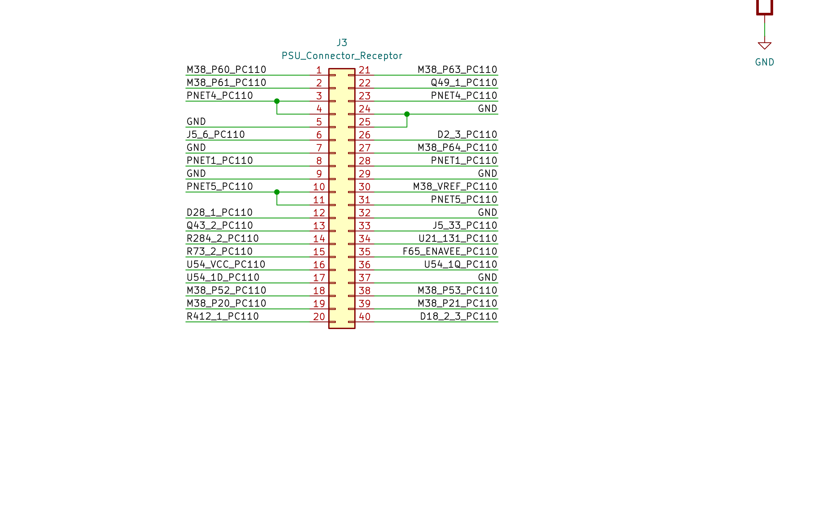

### 5.1 Numbering note (important — read before probing pins)

The two schematics number the **second row differently**:

- Pins **1–20** (first row): **identical** numbering on both boards.
- Pins **21–40** (second row): **J3** counts top→bottom `21→40`; **J5** counts top→bottom `40→21`.
- So a second-row signal has **J5 pin = 61 − (J3 pin)**. (e.g. P63 = J3-21 = J5-40.)

The net **names** are the ground truth and match across the gap. J3 (PSU side) labels every pin and is
used as the authoritative net name throughout this manual.

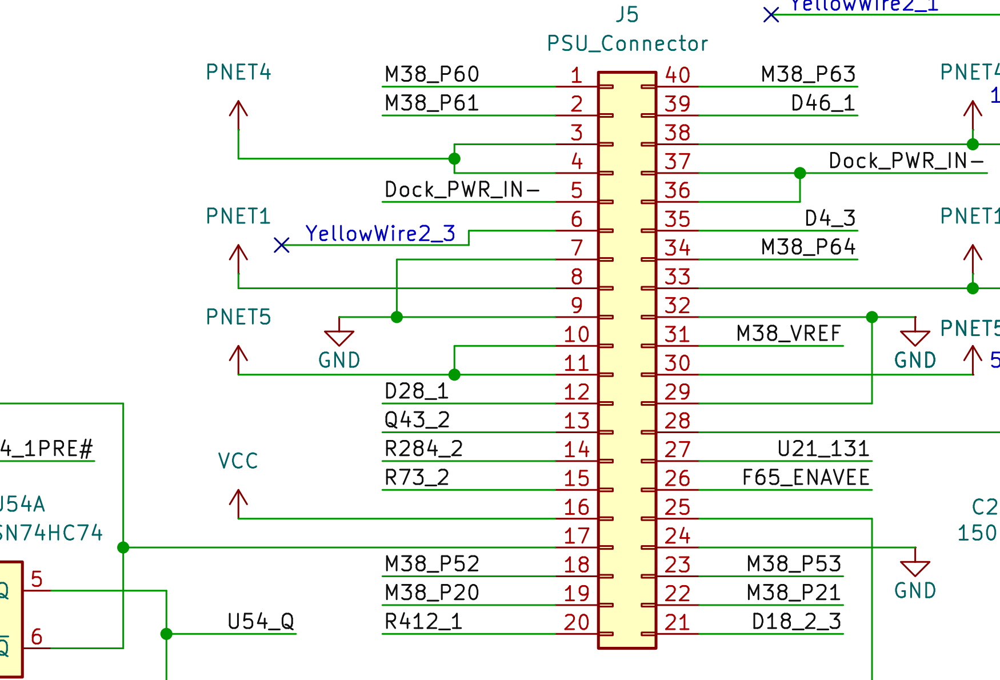

### 5.2 Full reconciled pin map

| J3 pin | J5 pin | Net (PSU side) | Class | Function |
|:--:|:--:|---|---|---|
| 1  | 1  | M38_P60 / AN0 | **MCU analog** | A-D ch0 sense (PSU op-amp U6C output) |
| 2  | 2  | M38_P61 / AN1 | **MCU analog** | A-D ch1 sense (PSU op-amp U6D output) |
| 3  | 3  | PNET4 | power | inter-board power net |
| 4  | 4  | PNET4 | power | inter-board power net |
| 5  | 5  | GND (J5: Dock_PWR_IN−) | power | ground / dock-power return |
| 6  | 6  | J5_6 | spare | generic pass-through |
| 7  | 7  | GND (J5: YellowWire2_3, NC) | power | ground / rework ("yellow") wire |
| 8  | 8  | PNET1 | power | inter-board power net |
| 9  | 9  | GND | power | ground |
| 10 | 10 | PNET5 | power | inter-board power net |
| 11 | 11 | PNET5 | power | inter-board power net |
| 12 | 12 | D28_1 | component | diode net |
| 13 | 13 | Q43_2 | component | transistor net |
| 14 | 14 | R284_2 | component | resistor net |
| 15 | 15 | R73_2 | component | resistor net |
| 16 | 16 | U54_VCC (VCC) | power | supply to U54 (74HC74 power-state latch) |
| 17 | 17 | U54_1D | logic | 74HC74 D-input (power-state latch) |
| 18 | 18 | **M38_P52 / RTP0** | **MCU digital out** | **Main power enable** → Q4 → PWR_IN_10v5 |
| 19 | 19 | M38_P20 | **MCU digital I/O** | request/handshake line (bidirectional) |
| 20 | 20 | R412_1 | component | resistor net |
| 21 | 40 | M38_P63 / AN3 | **MCU analog** | A-D ch3 sense (PSU op-amp U6A; near 5 W shunt) |
| 22 | 39 | Q49_1 | component | transistor net |
| 23 | 38 | PNET4 | power | inter-board power net |
| 24 | 37 | GND | power | ground |
| 25 | 36 | GND | power | ground |
| 26 | 35 | D2_3 | component | diode net |
| 27 | 34 | M38_P64 / AN4 | **MCU analog** | A-D ch4 sense (PSU op-amp U6B output) — **bus voltage** |
| 28 | 33 | PNET1 | power | inter-board power net |
| 29 | 32 | GND | power | ground |
| 30 | 31 | M38_VREF | **MCU analog ref** | A-D reference voltage |
| 31 | 30 | PNET5 | power | inter-board power net |
| 32 | 29 | GND | power | ground |
| 33 | 28 | J5_33 | spare | generic pass-through |
| 34 | 27 | U21_131 | logic | control/status to system controller (Bowman U21 pin 131) |
| 35 | 26 | F65_ENAVEE | logic | **Enable VEE** (LCD negative-bias supply enable) |
| 36 | 25 | U54_1Q | logic | 74HC74 Q-output (power-state latch) |
| 37 | 24 | GND | power | ground |
| 38 | 23 | **M38_P53 / RTP1** | **MCU digital out** | control output → Q31/Q33 ("BLR") |
| 39 | 22 | M38_P21 | **MCU digital out** | handshake / control output |
| 40 | 21 | D18_2_3 | component | diode net |

The `M38_Pxx` MCU pins map exactly to the M38223 datasheet's alternate-function pins
(`P60/AN0 … P67/AN7`, `VREF`, `P52/RTP0`, `P53/RTP1`, `P20–P27`) and are cross-confirmed identical on
both boards. ✅

---

## 6. The PSU analog front-end (battery sensing)

The four analog pins are conditioned by a **JRC quad op-amp on the PSU board (its own "U6" = 7064,
powered by `JRC_VCC`)** plus a fifth section **U7A**. Signal direction is:

> Battery / shunt (PSU) → op-amps (PSU U6 7064 + U7A) → J3 → J5 → MCU A-D inputs.

### 6.1 The main current path (where the shunt lives)

`Main Battery JX1` is a 2-terminal pack (B+, B−; **no thermistor pin**, so there is **no battery-
temperature sense**). It feeds:

```
JX1 B+ ── 0.1 Ω shunt (R7 ‖ R8) ── F5 (2.5 A fuse) ── L1 (10 µH) ── U13 (J421 FET) ── system rails
```

The **0.1 Ω shunt pair R7/R8** is the current-sense element; the 2.5 A fuse sets the full-scale current.
A high-impedance **1 MΩ/1 MΩ divider (R89/R88)** also hangs off the battery node.

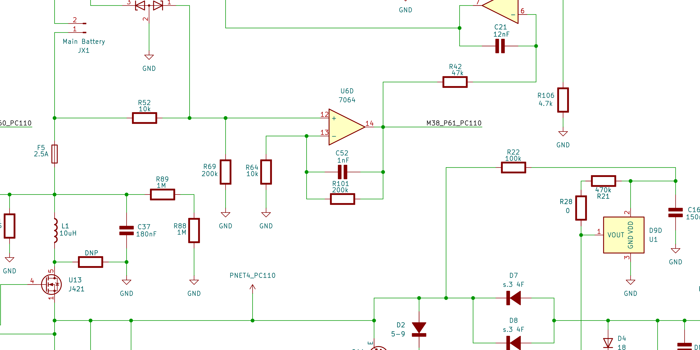

### 6.2 Channel-by-channel

| Ch | MCU pin | Op-amp | What it measures | Confidence |
|----|---------|--------|------------------|------------|
| **AN4** | P64 (J5-34/J3-27) | **U6B**, non-inverting | **Bus voltage** of PWR_IN_10v5: divider **R78 300k / R77 100k** (÷4) × gain (1 + R54 100k/R53 300k ≈ 1.33) ⇒ ~3.5 V at 10.5 V in. | ✅ fully traced |
| **AN3** | P63 (J5-40/J3-21) | **U7A + U6A** diff-amp | **Battery current** — instrumentation amp across the 0.1 Ω shunt (R67 47k, R57 100k, R102 300k, R105 100k, R109 200k, R103 10k, R113 20k; C20/C43/C46 filtering). | ✅ (current) |
| **AN0** | P60 (J5-1/J3-1) | **U6C**, gain ≈ ×20 | **Battery current, higher gain/offset** — inverting stage (R63 10k in, R62 200k fb) fed from the shunt network, with R45 200k/R44 10k offset bias on the + input ⇒ bidirectional (charge vs discharge) reading. | ✅ (current) |
| **AN1** | P61 (J5-22/J3-39) | **U6D**, matched ×20 diff-amp | **Independent battery-rail current sense.** + input fed via **R52 10k from the rail node above F5** (not from AN0); R52/R69 = R64/R101 = 10k/200k is a textbook difference amplifier (×20). | 🟡 netlist-verified topology |
| **VREF** | (J5-31/J3-30) | — | A-D reference, RC-filtered (R6 470 Ω + C1 150 nF), tied to PNET5 / JRC_VCC. | ✅ |

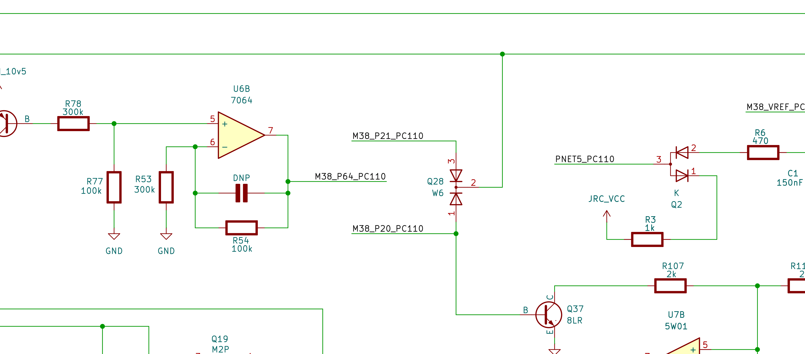

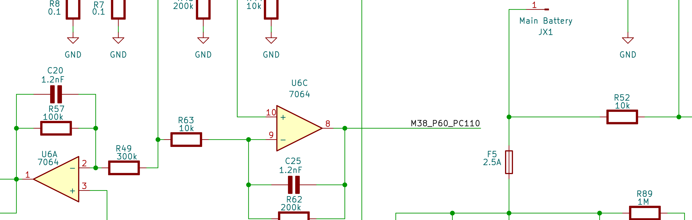

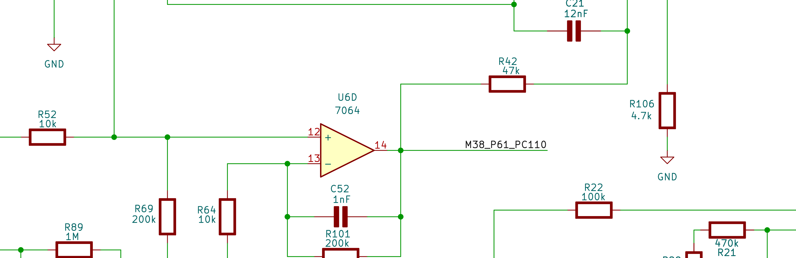

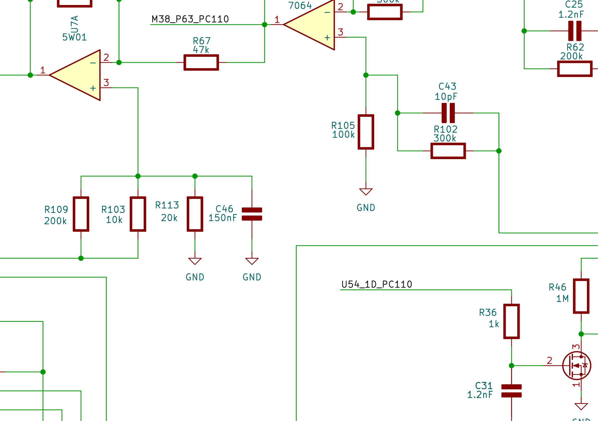

So the front end is a classic **battery fuel-gauge / charge-control sensor set**: one **bus-voltage**
channel (AN4) plus a precision **current-sense** chain on the 0.1 Ω shunt feeding two-to-three A-D
channels at different gains/offsets, so the MCU can resolve both large discharge currents (up to the
2.5 A fuse limit) and small charge/standby currents — exactly what's needed for coulomb counting and
charge-termination on a Li-ion + bridge-battery system.

### 6.3 Firmware corroboration

The firmware confirms a **multi-channel, filtered scan**: a single channel-select write `sta ADCON`
(`$D74F`), the conversion-complete poll `bbc 3,ADCON`, and **11× `lda AD`** reads (`$D5FD–$D831`) stored
into dedicated RAM variables and kept as **paired samples** (0x7A/0x7B, 0x7C/0x7D, 0x76/0x77, 0x78/0x79)
for averaging/debounce before the power state-machine acts on them. ✅

### 6.4 Net-result reading

The four channels are best read as **AN4 = main bus voltage** (battery *or* adapter, since they share
the PWR_IN_10v5 node — so no separate pack-voltage channel is needed) and **AN0/AN3/AN1 = battery
current** sensed at different points/gains (low-side shunt R7/R8 at two gains, plus a high-side
battery-rail diff-amp). Other PSU-side details:

- **P20 / P21** have back-to-back diode clamps (**Q28, "W6"**) at the connector — ESD/level protection on
  the handshake lines.
- **P53** drives **Q31 (W6) → R87 → Q33 ("BLR")**; **P52** drives **Q4 ("8LR") via R2 470k**, whose
  collector gates the **PWR_IN_10v5** transistor bank (Q5/Q22, "8C"). P52 is the hard main-power enable.
- The op-amps are JRC "7064" parts, supplied from `JRC_VCC` derived near the VREF network (D-clamp, Q2
  "K", R3 1k, PNET5).

> **Residual uncertainty:** ground is drawn as many separate GND symbols, so wire-only tracing cannot
> prove where U6D's − reference (R64) ultimately returns. The *topology* (AN1 = independent battery-rail
> current via a ×20 diff-amp) is netlist-verified, but a 2-minute continuity check on a real board would
> settle that last hop. 🟡

---

## 7. Power-on sequence, step by step

This is the chain §19 turns into a fault tree. Stop at the first broken link.

### Phase A — Standby (machine "off")

1. A source (battery or adapter) is attached → **PWR_IN bus** live → **standby regulator** powers **U6
   VCC**. ✅ (U6 must have VCC or nothing below happens.)
2. After reset, U6 firmware configures ports and **enters STOP mode** (`STP` at `$CD00`; it sits in
   `STP / bra $CD00`). Only the wake interrupts are armed (`seb 3,ICON2`, `seb 4,ICON2`). ✅
3. In this state the **main rail is OFF**: `M38_P52`/`M38_P53` are **low**, Q4 off, Q5/Q22 off. ✅

### Phase B — Wake (you press the power button)

4. The **power button** pulls **U6's INT3 input (port P5.1)** → wakes U6 from STOP. ✅ that P5.1/INT3 is
   a polled wake/startup trigger; 🟡 that the physical button sits on this line (it is **not** on J5/J3 —
   it's a mainboard signal straight to U6).
5. Firmware **classifies the wake reason** (routines `$CCFC/$CD03/$CD0D`) by reading P5.1 (INT3) and a P7
   input, producing a startup-mode code (0–5). ✅ This is why a brief vs. held press, or
   adapter-insert vs. button, can behave differently.

### Phase C — Battery / source health check (the big gatekeeper)

6. U6 runs an **A-D scan** of the PSU front end (`sta ADCON` channel select at `$D74F`, then repeated
   `lda AD`, paired-sample averaging). It reads AN4 (bus voltage ÷4), AN0/AN3 (shunt current), and AN1
   (high-side rail current). ✅
7. **If the measured voltage/health is below threshold, U6 refuses to assert the enables** and returns to
   STOP. 🟡 → *This is the #1 reason a PC110 with a flat/dead battery won't turn on even though it
   "should."*

### Phase D — Turn the main rail on

8. U6 executes its **power-enable routine** (`$D056`): `seb 2,P5` + `seb 3,P5` → drives **M38_P52 = HIGH**
   and **M38_P53 = HIGH**. ✅
9. **M38_P52 (J5-18 / J3-18)** → R2 470k → **Q4 base** → Q4 conducts → gates the **Q5/Q22 bank** →
   **PWR_IN_10v5 main rail switches ON**. ✅
10. **U54 (74HC74)** latches the power-on state (`U54_1D` clocked to `U54_1Q`) — holds power up after the
    button is released. 🟡
11. Downstream **regulators come up** (5 V, VCC rails) → the system/CPU side begins to boot. 🟡

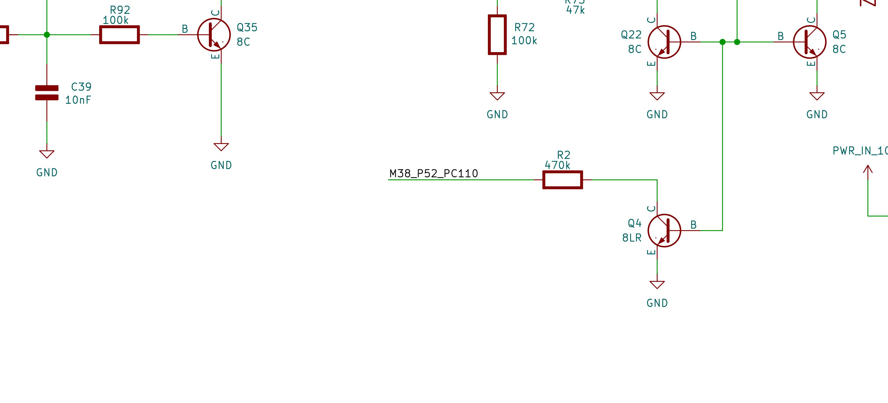

### Phase E — Handshake & housekeeping

12. U6 **handshakes with the system controller** on **P2.0 / P2.1** (J5-19/J3-19 and J5-22/J3-39): it
    reads P2.0 as a request, validates a **`0x5A` sync byte**, then drives P2.0 low and P2.1 high to
    acknowledge (`$CAD3…$CAE4`, and the `$C983–$CBF2` state machine). U6 also has a **UART** (TXD/RXD on
    port **P4**, mainboard-side) for fuller comms. ✅
13. Later in bring-up, **F65_ENAVEE (J5-26 / J3-35)** is asserted to enable the **LCD VEE** bias so the
    display can light. 🟡
14. U6 stays awake running its monitor loop (battery gauging, charge control, suspend/resume). On
    power-off or critical battery it runs the **`$D05B` power-down** (`clb 2,P5` / `clb 3,P5` → P52/P53
    low → main rail off) and re-enters STOP. ✅

### 7.1 Signal state cheat-sheet (off vs. on)

| Signal (pin) | Standby/off | After power-on | How to read |
|---|---|---|---|
| U6 VCC (standby) | **present** ⚠️ | present | Must be present even when "off". If 0 V → dead micro. |
| **M38_P52** (J5-18/J3-18) | low | **high** | Goes high on button press = "U6 decided to turn on". |
| **M38_P53** (J5-23/J3-38) | low | **high** | Driven together with P52. |
| **PWR_IN_10v5** | off* | **~10.5 V** | *Present if adapter feeds it directly; switched for battery. |
| **5 V** | off | **5 V** | Downstream of the main rail. |
| **M38_P20/P21** (J5-19,22 / J3-19,39) | idle | toggling handshake | Activity = U6 talking to the system. |
| **AN4/P64** (J5-34/J3-27) | tracks bus | tracks bus | DC analog ≈ Vbus/4. |
| **VREF** (J5-31/J3-30) | steady ref | steady ref | If 0 V, A-D reads garbage → U6 may refuse to start. |
| **F65_ENAVEE** (J5-26/J3-35) | low | high (at display-on) | LCD bias enable. |

*Pin numbers: J3 (PSU) numbering is authoritative; for J5 second-row pins use **J5 = 61 − J3**.*

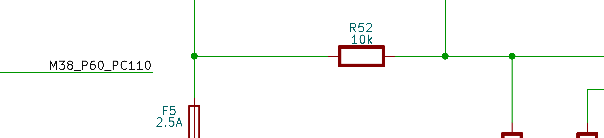

---

## 8. System chipset — VLSI VL82C420 (SCAMP IV)

**U61 is a VLSI VL82C420FC5**, the system controller of VLSI Technology's **SCAMP IV** 80486SL-class
chipset (announced June 1993 by VLSI's Portable Systems Division). It integrates almost the entire
AT-compatible "motherboard" of a portable PC into one **256-ball BGA** — of which ~208 balls are active
signals. No official VL82C420 datasheet was ever published; the description below is reconstructed from
VLSI patents **[PAT]**, die analysis **[DECAP]**, the architecturally-twin **Intel 486 SL** datasheet
**[DS]**, the PC110 board **[RE]** and BIOS **[BIOS]**.

| Attribute | Value |
|---|---|
| Reference designator | **U61** |
| Part | VL82C420FC5 (SCAMP IV system controller) |
| Package | 256-ball BGA, ~208 active signals **[RE]** |
| Family | SCAMP IV = VL82C420 + VL82C144 (peripheral) + optional VL82C146 (ExCA) |
| Process | 0.8 µm CMOS, mixed 3.3 V / 5 V |
| CPU support | power-managed Intel 486SL-class, up to 33 MHz (incl. clock-doublers) |
| Memory | up to **32 MB** DRAM |
| Companion link | VLSI-proprietary **Multiplexed Local (ML) bus** → here, the `Bowman1–5` nets to U21 |

### 8.1 Integrated cores (what's inside)

Decap of the PC110's VL82C420 confirms it absorbs the standard AT peripheral set as licensed cores
**[DECAP]**:

| Block | Core | I/O ports | Function |
|---|---|---|---|
| DMA | **82C37** ×2 cascaded | `0x00–0x0F`, `0xC0–0xDF`, pages `0x80–0x8F` | 7-channel ISA/floppy DMA |
| Timer | **82C54** | `0x40–0x43` | system tick, refresh, speaker (timer-2 → `SPKR`) |
| Interrupts | **82C59** ×2 | `0x20/0x21`, `0xA0/0xA1` | 15-level PIC |
| RTC/CMOS | **MC146818** | `0x70/0x71` | clock/calendar + battery-backed CMOS RAM |
| Memory ctlr | VLSI | — | DRAM RAS/CAS, up to 32 MB |
| ISA bridge | VLSI | — | full ISA bus |
| Power mgmt | VLSI / Intel-licensed | — | SMI / STPCLK# / suspend / resume |

### 8.2 Interfaces

- **CPU (486SL local bus) [RE+DS]:** `A[2..31]`, `D[0..31]`, `ADS#`, `BLAST#`, `BRDY#`, `RDY#`, `KEN#`,
  `HOLD`, `AHOLD`, `HLDA`, `W/R#`, `D/C#`, `M/IO#`, `BE0-3#`, `EADS#`, `A20M#/A20GATE`, `RESET`, `SRESET`,
  `FLUSH#`, `INTR`, `NMI`, `SMI#`, `SMIACT#`, `STPCLK#`, plus `LDEV#`. Clocks `CPU_CLK`, `CPU_CLK_33`,
  `2XCPU_CLK`.
- **DRAM controller [RE]:** `RAM_A[0..11]` (muxed row/col), `RAM_RAS0-3` (four bank selects),
  `RAM_UCASU#/UCASL#/LCASU#/LCASL#`, `RAM_WE#`. FPM-DRAM, refresh from the integrated timer.
- **ISA bridge & ROM [RE+DS]:** `SA0/SA1/SA16`, `LA17–23`, `SD0–15`, `BALE`, `AEN`, `SBHE#`,
  `MEMR#/MEMW#`, `IOR#/IOW#`, `MEMCS16#`, `IOCS16#`, `IOCHRDY`, `ZEROWS#`, `REFRESH#`, `ISA_SYSCLK`
  (8 MHz from a 16 MHz osc). ROM/flash: `ROMCS0#`, `ROMCS1#`, `BIOS_CE#`/`FLSHCS#`, `ROM16/8#`, `FDC_TC`.
- **Power management [PAT+DS]:** `SMI#`/`SMIACT#`, `STPCLK#`, `SUS_STAT#`, `PWRGD`. Supports socket power
  control, 3.3 V/5 V suspend, and modem ring-resume detection. The event-driven scheme (US 5,715,467)
  modulates `STPCLK#` so the CPU returns to full speed to service break events.

### 8.3 The Multiplexed Local (ML) bus — VL82C420 ↔ Bowman [PAT: US 5,793,990]

The ML bus is the proprietary 5-wire interconnect that lets the VL82C420 drive a companion device with
very few pins: the controller tri-states the CPU's address bus (via `AHOLD`) and time-multiplexes
address and data over the same CPU lines, qualified by five control signals:

| Signal | Dir | Function |
|---|---|---|
| `MLCLK` | out | bus clock, gateable for power saving |
| `MLADS#` | out | address strobe — valid addr/data on the CPU lines |
| `MLLBA#` | in | device asserts when it decodes its address; indicates which lines carry read data |
| `MLRDY#` | in/out | transfer complete / data valid |
| `Mpriority` | in | a higher-priority device can pre-empt the cycle |

In the PC110 these five lines are the **`Bowman1–5`** net group between U61 (balls N9/P9/R9/T9/T13) and
the Bowman gate array (QFP pins 45/140/39/52/130, symbol names `Chipset_IO1–5` — same wires, two naming
conventions) **[RE]**. The mapping is now measured at **both ends** (2026-07): **`Bowman3` (U61 R9 →
via R149 → Bowman 39) = MLCLK** (~22.7 MHz free-running) and **`Bowman4` (U61 T9 → Bowman 52) =
MLADS#** (per-cycle strobe); **`Bowman1` = MLRDY# (pin 45), `Bowman2` = MLLBA# (pin 140), `Bowman5` =
MPriority (pin 130)** — all static in this cache-less fixed-timing machine (naming applied in KiCad).

The **cycle-level protocol** is now decoded from US 5,793,990 and written up in
[Chipset §11a](../Chipset/readme.md#11a-ml-bus-cycle-protocol--decoded-from-us-5793990--pat): each
transaction is **three 16-bit groups multiplexed over the CPU's own `A[25:2]` lines** (group 1 = high
address, group 2 = low address + `A1/BHE#/BLE#/W/R#/D/C#`, group 3 = `D[15:0]`), sequenced by `AHOLD`
+ `MLADS#`/`MLLBA#`/`MLRDY#`. Bowman (U21) is the ML-bus **companion** — it sits in the socket VLSI's
stock **VL82C144** peripheral chip occupies in a standard SCAMP IV set, which is why the PC110 needs a
custom ASIC there.

### 8.4 Configuration & PC110 specifics

The PC110 BIOS programs the chipset config through an unlock at `0x22/0x23 ← 0x80` and the SCAMP indexed
pair `0x74/0x76` **[BIOS]** (the `0x74/0x76` gate is the `and al,0x7F → out 0x74 → out 0x76` sequence at
BIOS `F000:DC55`). The register *semantics* (DRAM timing, decode windows, PM control) remain to be mapped.
Logic-analyzer attribution (§10.5) confirms the config/RTC ports `0x74/0x76`, `0x24/0x25` and `0x70` are
decoded **by the VL82C420 itself** (they assert no Pluto line) — `0x24/0x25` being a second on-chip
indexed config window alongside the `0x74/0x76` SCAMP pair.

> **Test strap — `TP1` (ball T14).** One of the few remaining `[H]` balls. Probed live 2026-07-18: reads
> a **clean static HIGH** (0 transitions, solidly held, no dynamic activity) — consistent with an
> `ONCE#`-class test/tri-state strap held **inactive** (idle-high = normal operation). Confirmed a static
> test/config strap, not a functional signal; the exact test function can't be resolved without risky
> active driving (which would tri-state/hang the chipset).

> **Correction (BIOS disassembly, 2026-07-06):** `0x4F` is **not** a chipset-config latch. Disassembling
> POST shows it is always written in lockstep with the CMOS/RTC index port `0x70` — `out 0x70,al ; out
> 0x4F,al ; in/out 0x71` (e.g. BIOS `F000:4656`, `:4715`, `:4732`). It is the VL82C420's **CMOS/RTC
> index** carrying the full 8-bit register number (data still at `0x71`), used to reach the **extended
> CMOS bank** (regs `0x80–0xFF`; the disassembly hits `0x8F` and status-reg `0x0D`). The BIOS only ever
> *writes* `0x4F`, never reads it — consistent with it being the chipset's real extended index (with
> `0x70` kept for the NMI-disable bit) and/or an SMM-readable shadow of the write-only `0x70` so the
> power-management SMI can save/restore the CMOS index. The values previously listed as "`0x4F` config
> indices" (`0x11, 0x66, 0x70, 0x0A, 0x1E, 0xB6, 0x8F, 0x65, 0xBF, 0xFF`) are **CMOS register numbers**,
> not chipset-config indices. Board specifics **[RE]**: the integrated RTC's
`RTC-SQW`/`RTC-IRQ#` route via an **HD151015** bus switch to the **M38223 power-sense MCU**; two
pulled-up straps (`PullDN1/2`, balls R8/N8) set chipset config/test mode; and the **J9/J12** CPU debug
headers (§18) expose the 486's HOLD/cache/reset signals.

> **Caution — don't confuse with QuadNote.** VLSI's contemporaneous **QuadNote** (VL82C410 + VL82C142,
> used in the Compaq Contura Aero) is a close cousin but a *different* chipset. PC110 parts/firmware are
> not interchangeable with it.

---

## 9. Bowman (U21) — system controller ASIC

**U21 (value field `Bowman`)** is the PC110's **main custom system-controller ASIC** — a ~144-pin RIOS
gate array that bridges the 80486SX local bus to a 16-bit ISA-style system bus and absorbs nearly all of
the machine's glue logic: ROM decode, interrupt aggregation, DMA handshaking, floppy, the keyboard-MCU
link, audio glue and power sequencing. It corresponds to the documented custom RIOS chip that
"controlled the ISA bus and expanded the bus width to 16 bits," and it couples to the VL82C420 over the
ML bus (§8.3). There is no public datasheet; `Bowman` is the schematic code-name.

| Attribute | Value |
|---|---|
| Reference designator | **U21** (a companion instance is **U60**) |
| Code-name | **Bowman** |
| Function | System controller / CPU→ISA bridge ("chipset" glue), ML-bus companion to VL82C420 |
| Pin count | 144 (QFP-class custom gate array) |
| CPU interface | 80486SX local bus (U76, BGA-256) |
| Companion controllers | U61 VL82C420 (ML bus); U35 **Pluto** (`Bowman_IO1/2`, `Pluto_IO`) |

### 9.1 Pinout by function

**CPU local bus (80486SX interface):**

| Signal | Pin | Notes |
|---|---|---|
| `CPUA2`–`CPUA25` | 10–17, 19–27, 29–35 | CPU address bus (A0/A1 handled as byte-enables, not exposed) |
| `CPU_ADS#` | 49 | Address strobe |
| `CPU_MIO#` | 50 | Memory / IO# |
| `CPU_DC#` | 41 | Data / Control# |
| `CPU_WR#` | 42 | Write / Read# |
| `CPU_RDY#` | 134 | Ready / cycle complete |
| `CPU_INTR` | 133 | Maskable interrupt to CPU (8259 INTR equivalent) |
| `CPU_RESET` | 46 | CPU reset |
| `CPUCLK` | 38 | CPU clock |

**16-bit ISA-style system bus:**

| Signal | Pin | Notes |
|---|---|---|
| `SA0`–`SA15` | 55–63, 65–71 | System address bus |
| `SD0`–`SD7` | 96,95,94,93,92,91,89,88 | System data, low byte on Bowman (high byte routed elsewhere) |
| `IOR#` / `IOW#` | 112 / 113 | I/O read / write |
| `AEN` | 114 | Address enable (DMA in progress) |
| `MEMCS16#` | 119 | 16-bit memory chip-select |
| `LDEV#` | 43 | Local device select |
| `ADDHI` | 124 | High-address qualifier |
| `DS3#` | 123 | Decode / strobe |

**Interrupt controller (8259-class aggregation):** `IRQ2`=87, `IRQ3`=85, `IRQ4`=84, `IRQ5`=83, `IRQ7`=81,
`IRQ9`=79, `IRQ10`=78, `IRQ11`=77, `IRQ12`=76, `IRQ14`=75, `IRQ15`=74, `KB_IRQ1`=86, `ESS_IRQ1`=118.

**DMA & floppy:** `FINTR`=82, `FDRQ`=115, `PDRQ`=117, `DACK#`=120, `PDACK#`=121, `ESS_DACK#`=122,
`FDD_IO`=125.

**ROM / BIOS decode:** `ROMA12`–`ROMA19` = 9,7,6,5,4,3,2,143; `ROMCE#`=142. (Bowman controls the Flash
BIOS path — distinct from the OKI font ROM in §13.)

**Keyboard / PM MCU link (to M38813):** `M38_IO1`–`M38_IO12` = 97,98,101,102,103,104,105,106,107,110,111,
139; `KB_RESET#`=48; `KB_SCRLED#`=53.

**Power, clocks & housekeeping:** `PWRGD_IN`=141, `PWRGD`=47, `PSU_IO1`=131, `PSU_IO2`=138, `24MHz`=40,
`32kHz`=51, `VolUP`=127, `VolDN`=128, `Pluto_IO`=129, `Chipset_IO1`–`5` = 45,140,39,52,130.

**Power rails:** `VCC`/`VCC2` = 1,18,36,37,54,72,73,90,99,108,109,126,144; `GND` =
8,28,44,64,80,100,116,136; `NC` = 132,135,137.

### 9.2 Service notes & open questions

Local support around U21 includes pull-ups R98 (4.7k) / R99 (470 Ω), transistors Q9/Q13, and the
`PNET`/`PSU_IO` power-sequencing network shared with the PCMCIA power switch (U70 TPS2201) — consistent
with Bowman also overseeing card-slot power-up and reset timing.

- **No `CPUA0`/`CPUA1`** — the address bus to Bowman starts at A2; byte selection uses byte-enables
  (standard 486 practice). 🟡
- **8-bit data on Bowman, 16-bit elsewhere.** Bowman exposes only `SD0..7`, yet its documented job is the
  16-bit bus expansion (CompactFlash uses `SD0..15`). The high-byte / `MEMCS16#` steering likely happens
  through `ADDHI`, `Chipset_IO*`, or in concert with Pluto. ⚠️ worth tracing against the X-rays.
- **Bowman ↔ Pluto coupling (traced 2026‑07).** A **single** dedicated line: Bowman pin 129 `Pluto_IO`
  ↔ Pluto pin 51 `Bowman_IO1` (direct). Pluto pin 52 `Bowman_IO2` is **not wired to Bowman** (NC/spare on
  the schematic). Otherwise the two share only ISA control (`AEN`/`IOR#`/`IOW#`/`KB_RESET#`/`PWRGD`). The
  one wire is an inter‑gate‑array status/handshake; its protocol needs a live bus probe (see Bowman §5.204).
- **The `Chipset_IO*` group** is the most likely home of Bowman's ML-bus interface to the VL82C420 — a
  natural follow-up trace.

---

## 10. Pluto (U35) — I/O gate array

U35 ("Pluto") is the **system I/O glue / peripheral controller** — a 100-pin custom RIOS gate array. It
hangs off the ISA-style local bus (`SD0–7`, `SA0–15`, `IOR#`, `IOW#`, `AEN`) and fans it out to the
keyboard controller, floppy, PCMCIA/CompactFlash detect, IrDA, RS-232, LCD/power-management rails,
docking detect, modem and external BIOS flash. It also offloads some latching to discrete 74-series
flip-flops (U30/U40/U45/U53).

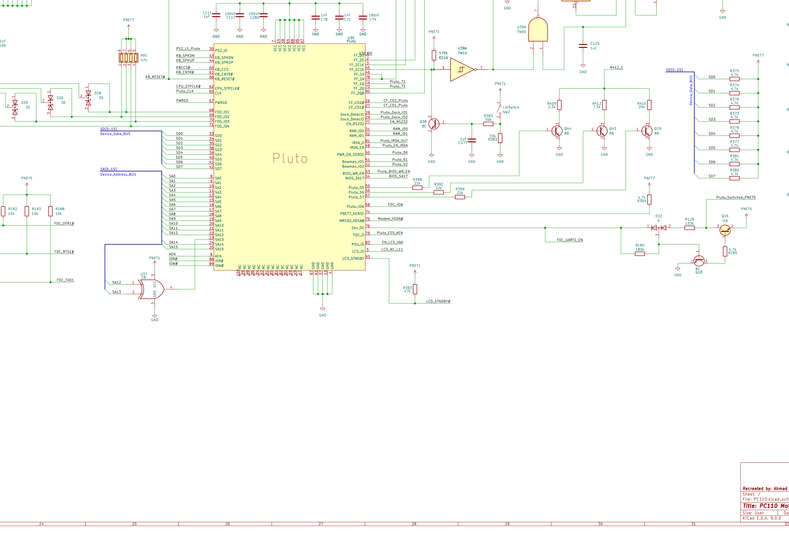

### 10.1 Package & power

100 pins total. **VCC (7):** 7, 14, 38, 64, 88, 95, 97. **GND (5):** 4, 13, 37, 63, 87.
**NC / unused (14):** 47, 49, 59, 80, 82, 84, 85, 91, 92, 94, 96, 98, 99, 100. Decoupling clustered
directly above U35: C111 (1 nF), C117 (100 nF), C280 (100 nF), C78 (1 nF), C71 (1 nF), C74 (180 nF).

### 10.2 Bus interface

`SD0–SD7` = 33,34,35,36,39,40,41,42. `SA0–SA15` = 8,9,10,11,12,15,16,17,18,19,20,21,22,23,24,25.
`AEN`=6, `IOR#`=86, `IOW#`=89. (Address pins skip 13/14 = GND/VCC and data pins skip 37/38 = GND/VCC,
which is why the numbering has gaps.)

### 10.3 Functional / peripheral pins

| Group | Pins (name) |
|---|---|
| **Keyboard & speaker** | 30 PS2_IO, 43 KB_SPKDN, 44 KB_SPKUP, 60 KB_CCS (KBC chip-select), 61 KB_CNTR#, 66 KB_RESET# |
| **CPU / clock / power** | 62 CPU_STPCLK#, 65 CLK, 67 PWRGD, 50 PWR_ON_SENSE |
| **Floppy (FDD) glue** | 68–71 FDD_IO1–4 (FDD data-line routing only). 58 Pluto_IOW — **not** the FDC write strobe: tested 2026-07-18 (never asserts on floppy, keyboard, or any writes); the FDC is U22, which takes `IOW#` directly off the ISA bus (its own pin 43). Pin 58's true function is unconfirmed |
| **External flip-flops** | 1 FF_D0, 2 FF_2D, 3 FF_2CLK, 45 FF_1CLK, 46/78 FF_1A, 72 FF_1Q, 73 FF_2Q, 90 FF_2Q# |
| **PCMCIA/CF & docking** | 26 CF_CD2, 27 CF_CD1, 28 Dock_Detect1, 29 Dock_Detect2 |
| **Serial / IrDA / modem** | 77 EN_RS232, 81 IRDA_O, 48 IRDA_EN, 75 MN195_VSDA (modem fax-engine line, see §15), 79 FDC_O (ESS AEN) |
| **Bowman link** | 51 Bowman_IO1, 52 Bowman_IO2 |
| **BIOS flash control** | 53 BIOS_WR_EN, 54 BIOS_SA17 (address bit 17 / bank select) |
| **LCD / display power** | 83 PSU_IO (EN_LCD_VAA), 5 LCD_IO (LCD_NC_L11), 93 LCD_IO (LCD_STNDBY, pulled up by R393 47k) |
| **Misc / straps** | 31 RAM_ID0, 32 RAM_ID1, 55–57 Pluto_55..57 ⚠️, 74 PNET7_SENSE ⚠️, 76 Dev_OE, 50 PWR_ON_SENSE ⚠️ — pins 55–57/74 **probed static** (held at fixed DC through thousands of I/O cycles): they are strap/config/slow-status lines, **not** bus-cycle signals (2026-07-17) |

### 10.4 What cross-module checks confirmed

Comparing Pluto's nets against the dock, modem and RAM-module schematics confirmed several previously-
guessed pins and showed Pluto reaches well beyond the mainboard:

- **The FDC is U22 (SMC FDC37C665IR Super-I/O), NOT Pluto.** *(Corrected 2026-07-17/18 — earlier drafts
  called Pluto the FDC.)* The floppy/UART/IDE controller is the U22 Super-I/O; Pluto only routes the FDD
  **data-line glue** (pins 68–71). Confirmed three ways: netlist part-ID (`U22 = FDC37C665IR`, with its own
  24.576 MHz crystal); the pin-58 "FDC_IOW" strobe **disproven** by live test (never asserts on floppy
  writes); and a live logic-analyzer sweep — a floppy read at `0x3F4` drives real data on the bus yet
  asserts **no** Pluto decode line, the signature of the FDC living in U22. The drive itself is in the
  dock; `CN2` there carries the full classic floppy interface (`FDC_RDATA#`, `FDC_WDATA#`, `FDC_STEP#`,
  `FDC_DIR#`, `FDC_TRK0`, `FDC_INDEX#`, `FDC_WGATE#`, `FDC_WRTPRT#`, `FDC_DSKCHG#`, `FDD_MOTEN`,
  `FDD_DRSEL`, `FDC_DRATE0/1#`), which route to U22 with Pluto/Bowman glue alongside (`FDD_Bowman`). ✅
- **RS-232 enable (pin 77)** gates the dock's serial line drivers (`U3 DS14C535`, `LT1237`, `74HCT244`
  U1) — Pluto controls when the dock's serial port is live. ✅
- **Dock detect (pins 28/29)** line up with the dock's `Pluto_Dock1/2` nets to the J1–J4 dock
  connectors. ✅
- **Modem control (pin 75)** taps the MN195001's `VSDA#` line (§15). ✅
- **RAM-module ID (pins 31/32)** read the expansion module's two identity straps (see §13). ✅

**Takeaway:** Pluto is the **keyboard/KBC decoder** + serial/dock power manager + modem control-bus tap +
RAM-module ID reader + FDD data-line glue — but **not** the FDC (that is U22), and not just a generic bus
buffer. See §10.5 for the measured I/O-ownership map.

> ⚠️ Pin *names* for 50, 58 are placeholders, not confirmed silicon function. Pins **55–57** are now
> decoded as a **3‑bit weighted‑resistor DAC** (Q44/Q43/Q19 → common node `R412_1` → PSU via J5/J3‑20; a
> software‑stepped analog level, likely LCD contrast — see [Pluto readme](../Pluto/readme.md)), and **74**
> is a power‑rail sense input — *not* static straps as earlier guessed. Pin 75's symbol label
> reads `NM192_VSDA` but should read `MN195_VSDA` — the modem chip is the MN195001, and `VSDA` is its
> scanner-data line, not a "voice" line (§15.9).

### 10.5 Live I/O-ownership map (logic-analyzer attribution, 2026-07)

A five-pass logic-analyzer campaign (Saleae probing Pluto's decode/select pins while driving each port
over the serial debug link) established **which chip actually decodes each host I/O port** — settling
several long-standing guesses. Method: drive a port so its cycles dominate the bus, then watch which
Pluto output asserts per cycle (`KB_CCS` is the proven per-access chip-select; `SD0` witnesses that real
data was driven). Full write-up: [Pluto probe plan](../Pluto/pluto-probe-plan.md).

| Host port(s) | Decoded by | Evidence |
|---|---|---|
| `0x60` / `0x64` keyboard | **Pluto** (→ KBC MCU U67) | `KB_CCS` asserts 100 %/cycle, reads *and* writes |
| `0x15EA` inking/signature pad | **Pluto**, distinct KBC branch | toggles `KB_CNTR#` (not `KB_CCS`); base `0x15E0`, full-address decoded |
| `0x3F0–0x3F7` floppy · `0x3F8`/`0x2F8` UART · `0x1F0–0x1F7` IDE | **U22 FDC37C665IR** | data flows on `SD0`, but **no** Pluto decode line asserts |
| `0x3E0/0x3E1` PCMCIA (PCIC) | **U74 Ricoh RB5C396** | 82365SL/ExCA model at `0x3E0` (§14) |
| `0x24/0x25`, `0x70`, `0x74/0x76` config & RTC | **VL82C420 chipset** (U61) | fire *none* of the ~20 probed Pluto lines; behave identically to the known-chipset SCAMP pair |

**Net:** among the CPU-visible I/O, **Pluto directly decodes only the keyboard/KBC interface and the
inking-pad branch.** The FDC/UART/IDE are U22, the PCIC is U74, and the config/RTC ports are the
VL82C420. The Pluto↔Bowman link (pins 51/52) carried neither I/O nor memory cycles in any test — its
function remains open. *(The one gap: proving the chipset-config ports beyond inference would need a
VL82C420 BGA interposer; the QFP-probe rig reached its limit here.)*

---

## 11. Graphics & display — C&T F65535 (U51)

**U51 is a Chips & Technologies F65535**, a single-chip flat-panel / CRT VGA controller, here in a
**BGA-169** package (schematic value `CHIPS65535`). It is almost a complete graphics card on one die: a
32-bit CPU-bus interface, an integrated **DRAM controller** owning its own framebuffer, an integrated
**RAMDAC** for analog CRT, and a **flat-panel formatter** for the LCD — all running simultaneously. In
the PC110 it drives the internal **640×480 256-colour DSTN** panel and up to **800×600/16-colour** on an
external monitor.

In one sentence: U51 takes pixel commands from the 486 over the local bus, stores them in its own DRAM
(U28), and paints them onto both the internal LCD and an external VGA monitor, clocked by U63 and
orchestrated by Bowman.

| Attribute | Value |
|---|---|
| Reference designator | **U51** |
| Part | Chips & Technologies **F65535** (655xx flat-panel VGA family) |
| Package | BGA-169 |
| Core | 32-bit, ~65 MHz |
| Memory | integrated DRAM controller; framebuffer in **U28** (M5M4V16160) |
| Displays | simultaneous CRT (integrated RAMDAC) **and** STN/TFT flat panel |
| Silicon-ID quirk | shares its chip ID with the 65530 — drivers probe it as a "65530" |

### 11.1 Pin map by function (BGA balls)

- **CPU local-bus (the "front door") [RE]:** `D0–D31` (the 486 data bus), `A2–A23`, `BE0#–BE3#` (M5/L13/
  N5/J9), `BS16#` (C11, dynamic 16-bit sizing), `ADS#` (K12), `MIO#` (J11), `LDEV#` (D11 — U51 claims its
  address range), `RDY#`, `CCLK` (E10, `Chipset_CPU_CLK`), `RESET` (K10).
- **ISA / peripheral side:** `SA0–SA15`, `MEMR#/MEMW#` (D12/C12), `IOWR#` (C13), `ADDHI` (J10,
  `VGA_ADDHI`), `OEH#/OEL#` (D10/B13, data-buffer output enables).
- **Framebuffer DRAM port (private VRAM bus to U28):** `IO0–IO15` (16-bit VRAM data), `SA0–SA8` (muxed
  row/col), `RASA#/RASB#` (H4/A2 — two banks), `CASAL#/CASAH#/CASBL#/CASBH#` (K2/J3/A1/C3), `WEA#/WEB#`
  (K1/D4), `32kHz` (J2, refresh timebase).
- **Flat-panel (LCD) interface:** `P0–P15` → `LCD_R0..4 / LCD_G0..4 / LCD_B0..4 / LCD_24`, `SHFCLK` (B8,
  pixel clock), `LP` (A9, line pulse), `FLM` (B9, first-line marker / frame sync), `M` (C8, STN AC
  modulation), `STNDBY#` (K13, `LCD_STNDBY#`), `ENABKL` (C4, backlight enable), `ENAVDD/ENAVEE` (A11/E9,
  panel logic / bias supply enables).
- **CRT / analog VGA (integrated RAMDAC):** `VGA_Red` (D9), `VGA_Green` (A12), `VGA_Blue` (C10), `HSYNC`
  (A10), `VSYNC` (C9).
- **Clocks:** `XTAL0` (L10, `VGA_CLK` dot-clock from U63), `XTALI` (K9).
- **Power/NC:** multiple `VCC`/`VCC2`/`CVCC`/`CVCC2` and a large `GND` field; balls **F6–F8, G6–G8,
  H6–H8** are left unconnected on this layout.

### 11.2 The chips around U51

| Ref | Part | How it connects |
|---|---|---|
| **U76** | 80486SX-33 | Shares the full local bus: `CPU_D0..31`, `CPU_A2..23`, `BE0..3#`, `ADS#`, `MIO#`, `BS16#`, `RDY#`, clock. |
| **U21** | Bowman | Generates/uses `LDEV#`, `RESET`, `MEMW#/IOWR#`, `ADDHI`, `Chipset_CPU_CLK`, `MIO#`, `ADS#`; the hub U51 talks through. |
| **U61** | VL82C420 | Same CPU bus; supplies the `SA[0..15]` peripheral bus and reset/clock domain. |
| **U28** | Mitsubishi **M5M4V16160** (1M×16 FPM DRAM) | U51's dedicated **framebuffer (VRAM)** — the §11.1 DRAM port. |
| **U63** | ICS **AV9154A-27** | Clock synth: feeds `VGA_CLK` (dot clock) and `Chipset_CPU_CLK`. |
| **U36** | OKI MSM538032E | Japanese font ROM read through the bus/Bowman path U51 serves (§13). |
| LCD conn. | 640×480 DSTN panel | `LCD_R*/G*/B*`, `FLM`, `LP`, `M`, `SHFCLK`, `STNDBY#`, backlight/supply enables. |
| VGA conn. | external CRT | `VGA_Red/Green/Blue`, `VGA_HSync`, `VGA_VSync`. |

### 11.3 Data flow & service notes

The CPU writes pixels over the local bus; U51 decodes its range and asserts **`LDEV#`** to claim the
cycle. It stores data in its **private framebuffer (U28)** over the `IO0..15` + RAS/CAS port — a memory
bus the CPU never touches directly — and scans out **twice in parallel**: the RAMDAC produces analog
`VGA_R/G/B` + sync to the external monitor, while the panel formatter produces digital `P0–P15` with
`SHFCLK/LP/FLM/M` timing plus the panel-power enables. The dot clock and CPU clock both originate at the
**AV9154 (U63)** synthesizer.

For service: a **total** loss of both LCD and external VGA points at U51 itself, its VRAM (U28), its
clock (U63 `VGA_CLK`), or the `LDEV#`/bus path from Bowman. A loss of the **internal panel only** (with
external VGA fine) points at the flat-panel side — `ENAVDD`/`ENAVEE`/`ENABKL`, the VEE bias generator,
`LCD_STNDBY#` (Pluto pin 93) — not the graphics core. Note the LCD bias enable also depends on the power
MCU's `F65_ENAVEE` (§7) and Pluto's `EN_LCD_VAA` (pin 83). The F65535 presents itself to drivers as a
"65530" due to a shared chip ID — not a fault. 🟡 This board's U28 is a 1M×16 (2 MB) part, more
framebuffer than the factory machine's stated 512 KB.

---

## 12. Audio subsystem — ES488 / OPL2

**U4 is an ESS Technology `ES488F` "AudioDrive"** — a single-chip, ISA-bus, Sound-Blaster-(Pro)-
compatible audio controller in a **52-pin QFP**. ESS never released a public datasheet, so the pin
functions below come from how the chip is actually wired on this board. The signal chain:

```
   YM3812 (U10, OPL2 FM) ──digital──► YM3014B (U46, serial DAC) ──analog FM──►
   ┌─────────────────────────────────────┐
   │ ES488F (U4) — mixer / codec / SB     │ ◄── ISA data/addr (via HD151015 + 74LV buffers)
   └─────────────────────────────────────┘
        │ LineOut → net "ESS_Sound"
        ▼
   LM4861 (U12, ~1 W speaker amp)  ◄── volume set by DS1669 (U48)  →  Speaker
```

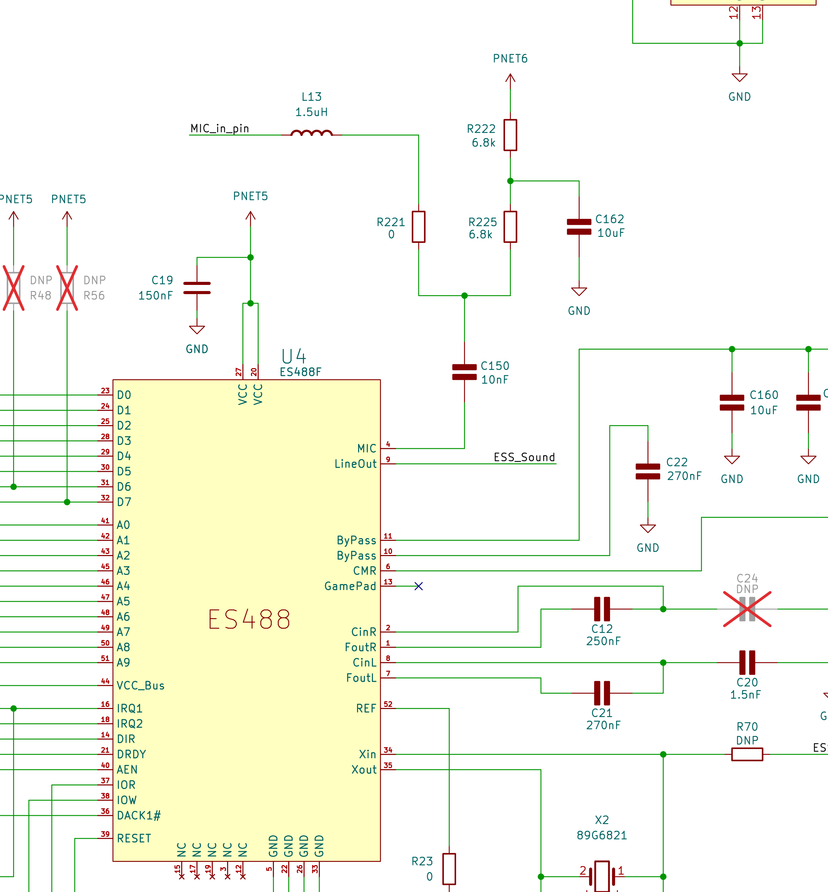

### 12.1 U4 pinout (as wired)

**Digital / ISA-bus interface:** `D0–D7` = 23,24,25,28,29,30,31,32; `A0–A9` = 41,42,43,45,46,47,48,49,50,
51 (board nets `SA1…SA9`); `IRQ1`=16 (`ESS_IRQ1`), `IRQ2`=18 (`ESS_IRQ2`), `DRDY`=21 (`ESS_DRDY`),
`AEN`=40 (`ESS_AEN`), `DIR`=14, `DACK1#`=36 (`Bowman_ESS_DACK1#`), `IOR`=37, `IOW`=38, `RESET`=39
(`FCS_RESET`).

**Power / clock / reference:** `VCC`=20,27 (decoupled by C150 10 nF, C19 150 nF); `VCC_Bus`=44;
`Xin/Xout`=34/35 (crystal X2 + C53 22 pF); `REF`=52; NC = 3,5,12,15,17,19,22,26,33.

**Analog audio:** `MIC`=4, `LineOut`=9 (→ `ESS_Sound`), `ByPass`=10/11, `CMR`=6, `GamePad`=13,
`CinR/FoutR`=2/1 (C12 250 nF), `CinL/FoutL`=8/7; analog filtering C20 1.5 nF, C21/C22 270 nF.

### 12.2 Associated chips

| Ref | Part | Role |
|---|---|---|
| **U10** | Yamaha **YM3812** (OPL2) | FM synthesizer (AdLib / SB-Pro music). CS via `YMF_CS#_Buf`. |
| **U46** | Yamaha **YM3014B** | Serial floating-point DAC for the YM3812 stream. |
| **U11A** | **NJM2904** | Dual op-amp buffering the FM analog output into the mixer. |
| **U34 (A/B/D)** | **74LV126** | Quad tri-state buffers gating the data bus / `YMF_SA0_A0` decode. |
| **U7, U49, U72** | Hitachi **HD151015** | Bidirectional transceivers / 5 V↔3.3 V level translators. |
| **U58** | single-gate Schmitt inverter (74LVC1G14-class) | Generates `FCS_RESET` → U4 pin 39. |
| **U69A/B** | **SN74LVC2G32** (dual OR) | Decode: (`FDC_DS3` OR `Pluto_ESS_AEN`) OR `AEN` → ESS reset/decode strobe. |
| **U12** | National **LM4861** | ~1 W mono speaker amp (C203 150 nF, C204 10 µF). |
| **U48** | Dallas **DS1669** | Digital "Dallastat" volume pot (UpC/DnC, RH/RW/RL; C13 270 nF, C147/C153 1 µF). |
| **X2** | crystal + C53 22 pF | Reference on U4 Xin/Xout. |
| **U17** | oscillator can (4-pin) | Buffered clock in the ESS area (via a 7W14-class Schmitt buffer). |

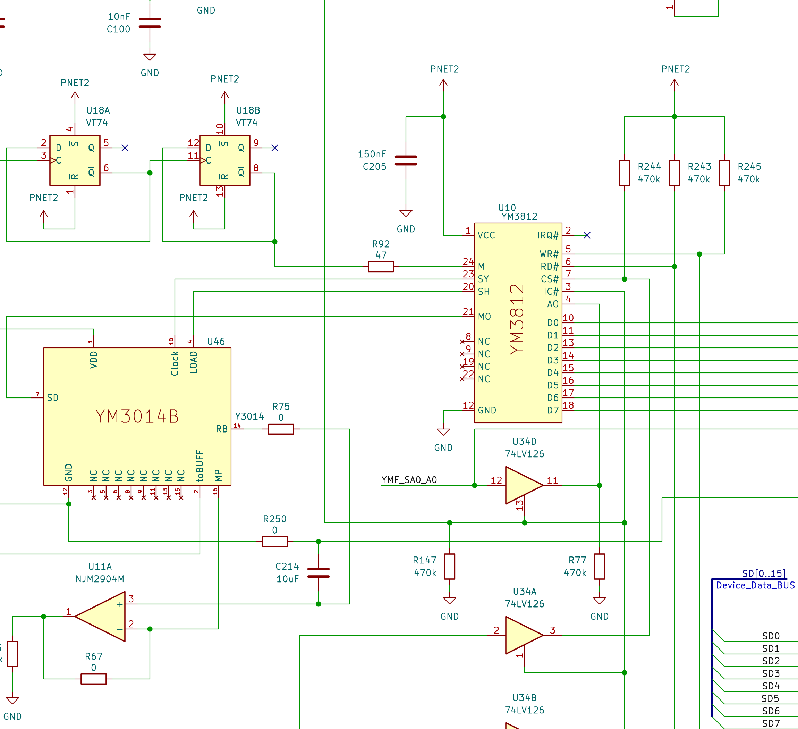

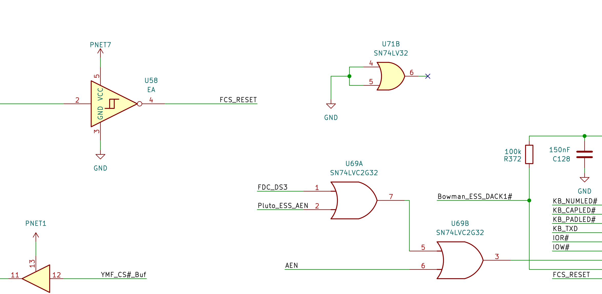

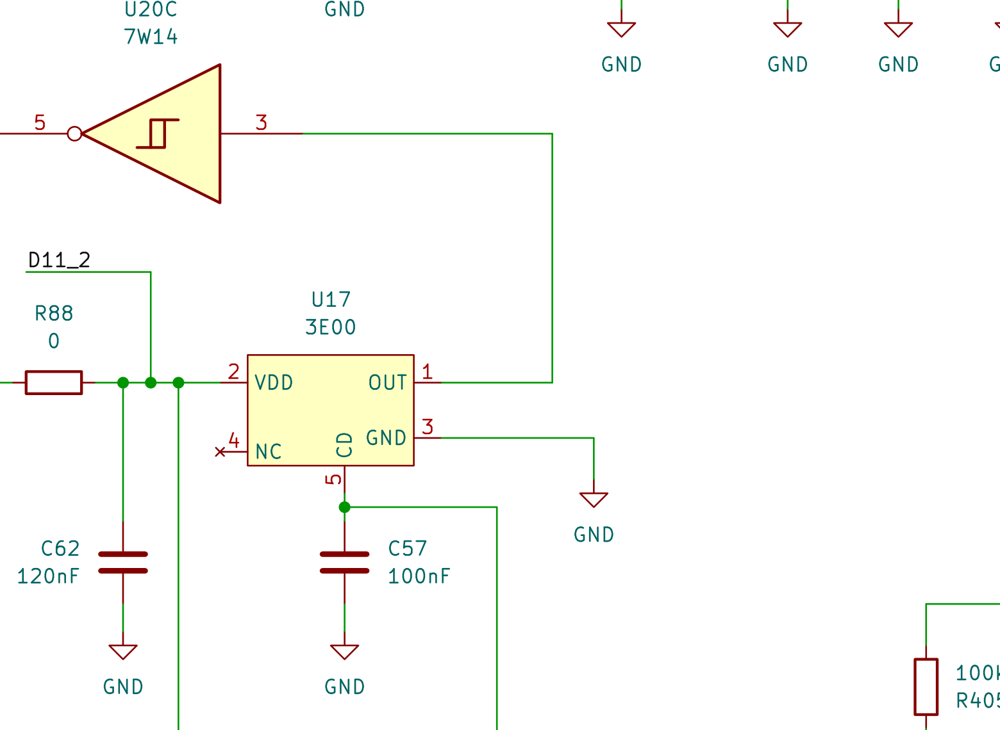

### 12.3 Service note

U4 looks like a standard ISA sound device, but its bus arbitration, AEN and DMA handshakes are produced
by the **custom gate arrays**, not a generic ISA controller: `Pluto_ESS_AEN` (address-enable) comes from
Pluto (U35) and `Bowman_ESS_DACK1#` (DMA-acknowledge to U4 pin 36) comes from Bowman (U21). So an audio
fault that looks like "the sound chip is dead" can actually be a missing decode/DMA strobe from a custom
ASIC — check `FCS_RESET` (U58/U69), `Pluto_ESS_AEN` and `Bowman_ESS_DACK1#` before condemning U4.

---

## 13. Memory, ROMs & expansion

### 13.1 On-board DRAM, video RAM & chipset

The DRAM controller proper lives in the **VL82C420** (U61, §8) — it owns the system memory RAS/CAS,
address muxing and refresh, up to 32 MB. Separately, the **F65535** graphics controller (U51, §11) has
its *own* DRAM controller and a dedicated framebuffer: **U28, a Mitsubishi M5M4V16160 (1M×16 FPM DRAM)**,
wired to U51's private `IO0..15` + RAS/CAS port. ✅[RE]

> ⚠️ Earlier project notes loosely listed "U28/U33 = DRAM." The detailed F65535 net trace establishes
> **U28 as the video framebuffer**; whether a second part (e.g. U33) serves as additional system DRAM, and
> how the system DRAM is partitioned vs. the VL82C420's banks, is worth confirming on a board. The F65535
> exposes two VRAM banks (`RASA#/RASB#`) but this layout appears to populate one, with the second
> available (note `R131 DNP` near the memory).

### 13.2 16 MB RAM expansion module

The optional expansion module (connector **J15**) carries eight **HM51W1788** DRAMs wired 32-bit-wide as
`CPU_D0–D31`, with `RAM_A0–A11`, `RAS2/RAS3`, `LCASU#/LCASL#/UCASU#/UCASL#`, and `WE#`. It brings out two
identity straps: `ID0` (J15 pin 60) and `ID1` (J15 pin 31). On this 16 MB module both are tied **low to
GND through 0 Ω jumpers R1/R2** → ID = `00`. By populating/omitting those links a module encodes its
size/type; with mainboard pull-ups an **absent** module reads `11`. **Pluto pins 31/32 (`RAM_ID0/1`)**
sample these bits so firmware can size installed RAM. ✅

### 13.3 Flash BIOS

System firmware lives in a **28F002 flash** (U59), decoded by Bowman over `ROMA12–ROMA19` / `ROMCE#`.
Pluto additionally gates flashing/banking via **pin 53 `BIOS_WR_EN`** (write-enable) and **pin 54
`BIOS_SA17`** (extra high address bit / bank select). So in-system BIOS reflashing depends on Pluto
asserting the write-enable.

### 13.4 Font ROM (U36) — software kanji

A separate, CPU-addressable **font ROM** sits on the system data bus: **U36, OKI `MSM538032E`** (alt.
marking `M538032C`, SOP-44, 16-bit `D0..D15`, `A0..A19`, on the `OKI_SA*` / `SD[0..15]` nets). It is
**not** the BIOS — it is the **IBM DOS/V display font ROM**.

- **Header:** magic `55 AA 10 CB`, label `FONT`, string
  `84G7940 (C) Copyright IBM Corporation 1990, 1995 All Rights Reserved`, dated **03/23/95**. ✅
- **IBM part number 84G7940**, size **1 MiB**, fully populated.

Font directory (parsed from offset `0x210`, 48-byte entries):

| Font set | Glyph size | Bytes/glyph | Data offset | Glyphs |
|---|---|---|---|---|
| System SBCS 12 | 6 × 12 | 12 | 0x0D8000 | 256 |
| System SBCS 16 | 8 × 16 | 16 | 0x002000 | 256 |
| System SBCS 19 | 8 × 19 | 19 | 0x000400 | ~256 |
| System SBCS 24 | 12 × 24 | 48 | 0x044000 | 256 |
| System DBCS 12 | 12 × 12 | 18 | 0x0D8C00 | ~8,900 |
| System DBCS 16 | 16 × 16 | 32 | 0x003000 | ~8,300 |
| System DBCS 24 | 24 × 24 | 72 | 0x047000 | ~8,200 |

SBCS = single-byte (JIS X 0201): ASCII (with `¥` at 0x5C) plus half-width katakana at 0xA1–0xDF. DBCS =
double-byte (JIS X 0208): hiragana, full-width katakana, Greek, Cyrillic, symbols and the ~6,800 kanji of
JIS levels 1 & 2. The PC110 has **no hardware kanji video** — IBM DOS/V renders Japanese text in software
by reading bitmaps from this ROM. Relevant for service: a corrupt or failed U36 manifests as garbled
Japanese glyphs (not a total video failure), since ASCII can be drawn from the smaller sets.

> ⚠️ The dump is 1 MB but the device's `A0..A19` × 16-bit organisation implies up to ~2 MB. Confirm
> whether a second 1 MB bank exists (8 Mbit read as bytes vs. 16 Mbit single bank).

---

## 14. PC-Card & pointing-device controllers (U74, U75)

### 14.1 PCMCIA / PC-Card controller — Ricoh RB5C396 (U74)

**U74 is a Ricoh RB5C396** (a.k.a. RF5C396), a **dual-slot PCMCIA / PC-Card controller** in a **BGA-256**
package. It manages the PC110's two card slots — card detect, voltage steering and per-slot supplies
(`VCCSLOT`, `AVCC`/`BVCC`) — and aggregates the slots' interrupts (`IRQ3..15`) into the system. It sits
on the system bus and works alongside the **TPS2201 (U70)** dual-slot power switch, with the `PNET`/
`PSU_IO` sequencing network shared with Bowman (§9.2). 🟡 Pin-level detail for U74 has not been fully
traced; treat the function as confirmed and the exact pinout as an open item.

CompactFlash storage (connector `J11`, 16-bit `SD0..15`) and the PCMCIA slots are the machine's primary
mass-storage and expansion path, since the floppy is external (dock, §16).

### 14.2 Pointing device — trackpad controller (U75, NEC µPD17137A)

The PC110's pointing device is **not** a dedicated touch ASIC; it is a small general-purpose **4-bit
microcontroller** running firmware that scans the pad matrix, reads the click buttons, and reports
movement to the host over a PS/2-style clock+data pair.

| Field | Value |
|---|---|
| Reference designator | **U75** |
| Part (value) | **D17137AGT** → NEC **µPD17137A** (17K-family, µPD17134A subseries) |
| Class | 4-bit single-chip CMOS microcontroller |
| Package | **SSOP-28** |
| Net prefix | `D171_` (derived from the part number) |
| Supply | `PNET3` + `GND` |

Because it is a programmable MCU, the schematic exposes raw port lines to the pad (the scan logic is in
firmware):

- **Pad sensing matrix:** Port 0A `D171_P0A0..3`, Port 0B `D171_P0B0..3`, Port 0C `D171_P0C2/3`,
  Port 1A `D171_P1A0..3`, Port 1B `P1B0`.
- **Buttons:** `TRKPD_Lclick` (left), `TRKPD_Rclick` (right).
- **Host interface:** `D171_GPCLK` (PS/2-style clock) and `D171_GPDATA` (PS/2-style data) → the host
  keyboard/mouse controller.
- **Control:** an interrupt line `Net-(U75-INT)`.

```
   Pad matrix ─► P0A0..3 / P0B0..3 / P0C2,3 / P1A0..3 / P1B0 ┐
   L/R buttons ─► TRKPD_Lclick / TRKPD_Rclick                ├─► U75 µPD17137A (4-bit) ─► GPCLK / GPDATA ─► host KBC
                                                             ┘                          └─► INT
                          supply PNET3 / GND, decoupling C87 (120 nF), C126 (150 nF), C135 (2.7 µF)
```

**Support circuitry:** decoupling C87 (120 nF), C126 (150 nF), C135 (2.7 µF); pull-ups/dividers R196/
R197/R200/R204/R206 (47 k), R198/R203 (10 k), R201/R205 (100 k); R199/R202 are DNP. U75 sits near U51
(graphics) and U74 (PCMCIA), with the CPU data bus `CPU_D28..D31` routing nearby.

For service: a dead trackpad with a working external PS/2 mouse points at U75, the pad itself, or the
`GPCLK`/`GPDATA` pair to the KBC — not the system bus. Streaming garbage or stuck buttons is usually the
pad/flex or the button inputs.

---

## 15. Modem & fax engine — MN195001 + IC11 firmware

### 15.1 The chip — a fax engine, not just a modem

The internal modem module is built around a single chip, the **Panasonic / Matsushita MN195001** — which
is not a plain modem but a complete **single-chip fax engine**: a DSP modem core *plus* an on-chip
fax-machine peripheral controller (document scanner, thermal print head, paper-feed motors, eye-pattern
diagnostic). It is a 128-pin QFP (QFH128-P-1818). In the PC110 the chip is used **only as a data/fax
modem over the phone line**; none of the fax mechanical peripherals exist, so a large block of its pins is
idle. IBM routed a handful of those idle/auxiliary lines, plus two reserved connector pins, out to the
docking connector (§15.4). ✅

| Block | Function | Used in PC110? |
|---|---|---|
| DSP + CPU core | modem/fax algorithms (ITU-T G3: V.29, V.27ter, V.21 ch1/2) | **Yes** |
| Analog front-end (AFP) | line interface: A/D, D/A, filters, AGC | **Yes** |
| DTE interface (USART + 8-bit I/O) | serial link to the host | **Yes** |
| Memory interface (`A0–23`, `MD0–7`) | external firmware ROM/RAM bus → **IC11** | **Yes** |
| Facsimile peripheral controller | scanner, plotter/thermal head, motors | **No mechanism present** |
| Eye-pattern monitor (EYE I/F) | modem constellation diagnostics | exposed, not used |

Companion parts on the module: a **Line Module 681000** (line interface/transformer), the **EN29F040A**
firmware flash (**IC11**), and an **SRAM (IC12)**. Parts of the module run on `VCC_STNDBY`.

### 15.2 Relevant pin groups (from the datasheet)

**Fax document-path signals** (the part the PC110 doesn't mechanically use):

| Symbol | Pin | I/O | Function |
|---|---|---|---|
| VPDA | 88 | O | plotter data (thermal print-head) |
| VPCK | 87 | O | plotter sync clock |
| VSDA | 96 | I | scanner data |
| VSEN | 98 | I | scanner data input enable |
| VSCK / V8CK / VIR | 95 / 94 / 97 | I/O | scanner clocks / input-ready |
| SH1–4, MTA1–4, MTB1–4, MOT | 85–82, 92–89, 81–78, 93 | O | thermal head / motor control |

**Eye-pattern monitor:** `ADCK` (21, data clock), `EYSY` (22, sync), `EQMD` (20, data).
**GPIO & interrupts:** `S0–S15` (46–61, general-purpose I/O; **S11 = pin 57**), `IRQ1–4` (67–70).
**Analog line (the actual modem):** `TXOUT` (34), `RXL` (32), `RXLPIN` (30), `HPOUT` (29), `AGCIN/OUT`
(28/27), `VREFH/L` (40/41) — these stay on the module and reach the phone line via the isolation
transformer.

> **Pluto's tap.** Pluto pin 75 (`MN195_VSDA`, mislabelled `NM192_VSDA` on the schematic) connects to the
> MN195001's **VSDA** = *scanner data* line (pin 96). The `V*` prefix means the video/fax **document
> path**, **not** "voice." Earlier readings that called these "voice codec" lines are corrected here.

### 15.3 Stage 1 — modem module → J8 "Modem-Connector"

The module plugs into a 26-pin connector **J8** on the motherboard. Its pins split into the normal
host-facing modem interface and an "extra" group:

**Normal modem interface (USART / handshake):** `U1RD#` (J8-3, `MN195_U1RD#`), `DCD1#` (4, `FDC_DCD1`),
`RI1#` (5, `FDC_RI1`), `DTR1#` (6), `DSR1` (7), `CTS1#` (8, `FDC_CTS1`), `RTS1#` (9), `RXD1` (10,
`FDC_RXD`), `TXD1` (11); VCC on 2/25, GND on 1/13/14/26.

**The "extra" group** (fax-peripheral / diagnostic / GPIO / reserved — *not* needed for the modem):

| J8 pin | Signal | MN195001 pin & meaning | To dock? |
|---|---|---|---|
| 23 | RSRVD1 | reserved connector pin | **Yes** |
| 24 | RSRVD2 | reserved connector pin | **Yes** |
| 22 | S11 | pin 57 — GPIO | **Yes** |
| 21 | ADCK# | pin 21 — eye-pattern data clock | **Yes** |
| 20 | IRQ1# | pin 67 — external interrupt | **Yes** |
| 19 | VPDA# | pin 88 — plotter (print-head) data | **Yes** |
| 18 | VPCK# | pin 87 — plotter sync clock | No (local) |
| 17 | VSDA# | pin 96 — scanner data (→ Pluto tap) | No (local) |
| 16 | VSEN# | pin 98 — scanner enable | No (local) |
| 12, 15 | PNET5_Pluto | power/net switch | No |

### 15.4 Stages 2–3 — motherboard J13 → docking station J1–J4

Six of the J8 "extra" pins cross the motherboard to **J13 (Docking Station Connector)** and reappear on
the dock's **J1–J4** connectors:

| Signal | MN195001 pin | J8 | Motherboard net | J13 | Dock net |
|---|---|---|---|---|---|
| Reserved 1 | (reserved) | 23 | Modem_RSRVD1 | 42 | Modem_RSRVD1 |
| Reserved 2 | (reserved) | 24 | Modem_RSRVD2 | 41 | Modem_RSRVD2 |
| GPIO | 57 (S11) | 22 | Modem_S11 | 58 | MN195_S11 |
| Eye clock | 21 (ADCK) | 21 | Modem_ADCK# | 59 | MN195_ADCK# |
| Interrupt | 67 (IRQ1) | 20 | Modem_IRQ1# | 60 | MN195_IRQ1# |
| Plotter data | 88 (VPDA) | 19 | Modem_VPDA# | 52 | MN195_VPDA# |

### 15.5 Why these pins exist — and whether anything used them

Because the MN195001 is a fax engine, it carries pins for a physical fax (scanner, thermal head, motors,
eye-pattern monitor); the PC110 has none of that. IBM repurposed a small selection — a spare GPIO (S11),
an interrupt (IRQ1), the eye clock (ADCK), a plotter-data line (VPDA) — plus two reserved pins, and routed
them to the dock. **No shipping peripheral (IBM or third-party) is documented as using them.** The dock
IBM actually shipped added only standard PC ports (external floppy, VGA, PS/2 keyboard/mouse, serial,
parallel). The PC110 used the modem purely over the phone line — catalogued as a *2400/9600 bps data/FAX
modem*, usable as a telephone and answering machine (wake-on-ring, canned ROM voice messages) with add-on
software. Best understood as **unused spare/expansion/test points.** ✅

### 15.6 The IC11 firmware ROM

The MN195001 has no on-chip program store; it boots from external parallel flash over its memory bus.
That flash is **IC11**.

| Property | Value |
|---|---|
| Designator | **IC11** (modem module) |
| Device | EON **EN29F040A** — 4 Mbit (512 KB) parallel NOR flash, TSOP-32, 8-bit |
| Image size | 524,288 bytes (512 KB) |
| MD5 | `a9f38ef86fba9d31285308fd71a6072b` |
| SHA-1 | `90f681f2af63310d49cbaa9ec15b3f7965fbe79a` |
| Programmed | ~259 KB (~49.5 %); remainder erased `0xFF` |

The EN29F040A is a modern drop-in for the original Am29F040-class part — i.e. the dump likely comes from a
re-flashed/replacement chip, but the firmware image is the original.

### 15.7 Firmware identity & provenance

Four human-readable strings pin down the firmware: `RIOS Ver 1.04` at `0x00000` (image header),
`RIOS SYSTEMS Co.,Ltd.` at `0x4A68A` (author), `PANASONIC MN195001` at `0x4A6A0` (embedded chip-ID — the
firmware names its own target silicon), and `PROGRAM LOADER  Ver.1.00` at `0x7FEE2` (boot-loader banner).
So the modem runs a third-party firmware product, **RIOS Ver 1.04 by RIOS SYSTEMS Co., Ltd.** — the same
design house behind the power-MCU and keyboard firmware. The embedded `PANASONIC MN195001` literal is
independent confirmation of the part number (settling the `MN192_VSEN#`/`NM192_VSDA` schematic typos). ✅

### 15.8 Memory map, CPU & boot flow

The image is sparse — code/data islands separated by erased gaps:

| File offset | Size | Contents |
|---|---|---|
| `0x00000`–`0x000FF` | 256 B | header `RIOS Ver 1.04` |
| `0x20000`–`0x272FF` | ~29 KB | high-entropy DSP data — modem waveform / symbol tables |
| `0x30000`–`0x66BFF` | ~224 KB | **main CPU/DSP firmware** — code, strings, per-module version tags |
| `0x6E400`–`0x6EFFF` | 3 KB | lookup / scaling tables (ramps, gain curves) |
| `0x6FE00`–`0x715FF` | ~6 KB | boot / banner + reset-entry code (maps to address `0xFF00xx`) |
| `0x7FE00`–`0x7FFFF` | 512 B | `PROGRAM LOADER Ver.1.00` banner + **CPU vector table** |

The firmware is **big-endian** (a recurring `0xA2` load-immediate opcode dominates the histogram —
consistent with a Panasonic MN-series core). The top 256 bytes are a 64-entry vector table of 32-bit
big-endian pointers into a 24-bit (16 MB) address space; the flash maps at the top, `0xF80000–0xFFFFFF`.
The **reset vector** (`0xFFFFFC`) = `0x00FF0001` → file `0x70001`, landing exactly on the banner/boot code
(the proof of the mapping). One other live vector (`0xFFFFD0` → file `0x70044`); the remaining 62 vectors
are parked at an erased stub. Boot flow: reset → loader at `0x70001` → prints the RIOS banner → runs the
main firmware in the `0x30000` block. The block carries ~18 three-character `Ver xx` module stamps
(`F55 V08 R17 V09 …`) — one per DSP/protocol sub-module (the V.29/V.27ter/V.21 modems, HDLC framer, tone
handling, etc.).

### 15.9 What's *not* in the ROM, and errata

There are **no ASCII "AT" command strings** anywhere (`ATDT`, `CONNECT`, `RING` …). The Hayes/AT command
interpreter lives **host-side** (DOS modem software / BIOS); this ROM speaks to the host over the
MN195001 USART in a binary, table-driven protocol. It is the low-level signal engine, not the user-facing
AT personality.

**Errata caught during the trace:** the schematic's `NM192_VSDA` (Pluto pin 75) and `MN192_VSEN#` are
both typos for the **MN195001** (`MN195_*`); the `V*` lines are the fax document path (scanner/plotter),
**not** voice. The `S0–S15` lines are general-purpose I/O, so routing S11 to the dock is a genuine
spare-GPIO use.

---

## 16. Docking station

The dock extends Pluto's I/O fan-out and the modem's spare pins:

- **Floppy** — `CN2 (FDC_Connector)` carries the full classic floppy interface (`FDC_RDATA#`,
  `FDC_WDATA#`, `FDC_STEP#`, `FDC_DIR#`, `FDC_TRK0`, `FDC_INDEX#`, `FDC_WGATE#`, `FDC_WRTPRT#`,
  `FDC_DSKCHG#`, `FDD_MOTEN`, `FDD_DRSEL`, `FDC_DRATE0/1#`); the drive physically lives in the dock. The
  **controller is U22 (SMC FDC37C665IR Super-I/O)**, not Pluto (§10.5); Pluto (pins 68–71) and Bowman
  (IRQ/DMA) only route the FDD interface glue out to `CN2`.
- **Serial** — `CN5 Serial Port` with line drivers `U3 (DS14C535MSA)`, `LT1237`, and `74HCT244` buffer
  `U1`, all enabled by Pluto's `EN_RS232` (pin 77).
- **Modem spare lines** — `MN195_S11`, `MN195_ADCK#`, `MN195_IRQ1#`, `MN195_VPDA#`, `Modem_RSRVD1/2`
  arrive via J13 (§15.4) — present but unused.
- **Dock connectors** — `J1–J4` carry the `Pluto_Dock1/2` presence/handshake lines (Pluto pins 28/29)
  plus dock power (`Dock_PWR_IN−`, which appears on J5/J3 pin 5). The shipped dock added external floppy,
  VGA, PS/2 keyboard/mouse, serial and parallel ports — standard PC I/O only.

---

## 17. Keyboard controller — M38813 (U67)

The keyboard subsystem MCU is a **Mitsubishi M38813E4HP** (3813 group, MELPS 740 core, 6502-compatible,
QFP-64). Pluto presents it to the CPU as an 8042-style keyboard controller: Pluto decodes the I/O port,
asserts `KB_CCS` (chip-select), and exchanges bytes over `SD0–7`, while `KB_CNTR#`/`KB_RESET#` and the
IRQ lines handle handshaking. Bowman also links to this MCU over `M38_IO1..12`. **Confirmed live**
(§10.5): reads *and* writes of `0x60/0x64` assert `KB_CCS` on 100 % of cycles — this is the one host I/O
range Pluto decodes directly. The **inking/signature pad** (`0x15E0` base) is a *separate* KBC branch:
its accesses toggle `KB_CNTR#` (not `KB_CCS`), i.e. the pad is serviced through the KBC-MCU path rather
than the 8042 chip-select.

From the mask-ROM dump (`M38813E4HP@QFP64.bin`):

| Item | Value |
|---|---|
| Banner | `MELPS 740 Series Keyboard Firmware Version 1.1 (C) Copyright 1992-1995 RIOS Systems Co.,Ltd.` ✅ |
| Image size | 16,255 bytes, mapped `0xC081–0xFFFF` (16 KB mask ROM) |
| MD5 | `835fc971bf700ddcc834ef5ba904aaa2` |
| RESET vector (FFFC) | `0xC208` |
| IRQ/BRK vector (FFFE) | `0xE49E` |
| NMI vector (FFFA) | `0xE62C` (→ an `RTI` stub) |
| Active peripheral vectors | FFF0 → `0xC0DB`, FFF6 → `0xD088` (two live sources — likely host/serial + a timer) |

> The banner is a concrete attribution: **RIOS Systems Co., Ltd.** wrote the keyboard firmware. Since
> "Rios" is also one of the PC110 custom-chip code-names (alongside Pluto and Bowman), and RIOS also wrote
> the power-MCU and modem firmware, this is strong evidence the whole custom-silicon + firmware family
> originated at RIOS Systems.
>
> ⚠️ The included disassembly (`kbc_disasm.txt`) was produced with a stock-6502 decoder, so it desyncs on
> 740-only opcodes (`0x80 = BRA`, the `SEB/CLB/BBS/BBC` bit ops) and shows `.byte` gaps there. An accurate
> listing needs a 740-aware disassembler.

The trackpad MCU (U75, §14.2) reports into this same keyboard/mouse path via its PS/2-style
`GPCLK`/`GPDATA` lines.

---

## 18. CPU debug headers & JTAG

The PC110 exposes two CPU debug headers plus a JTAG TAP, all tied to the **80486SX** (not the VL82C420
chipset), buffered through `74LVT125` with 33 Ω series resistors. This is a **HOLD-method 486
in-circuit-emulator / debug interface** — the standard way to ICE a *soldered* (BGA) CPU.

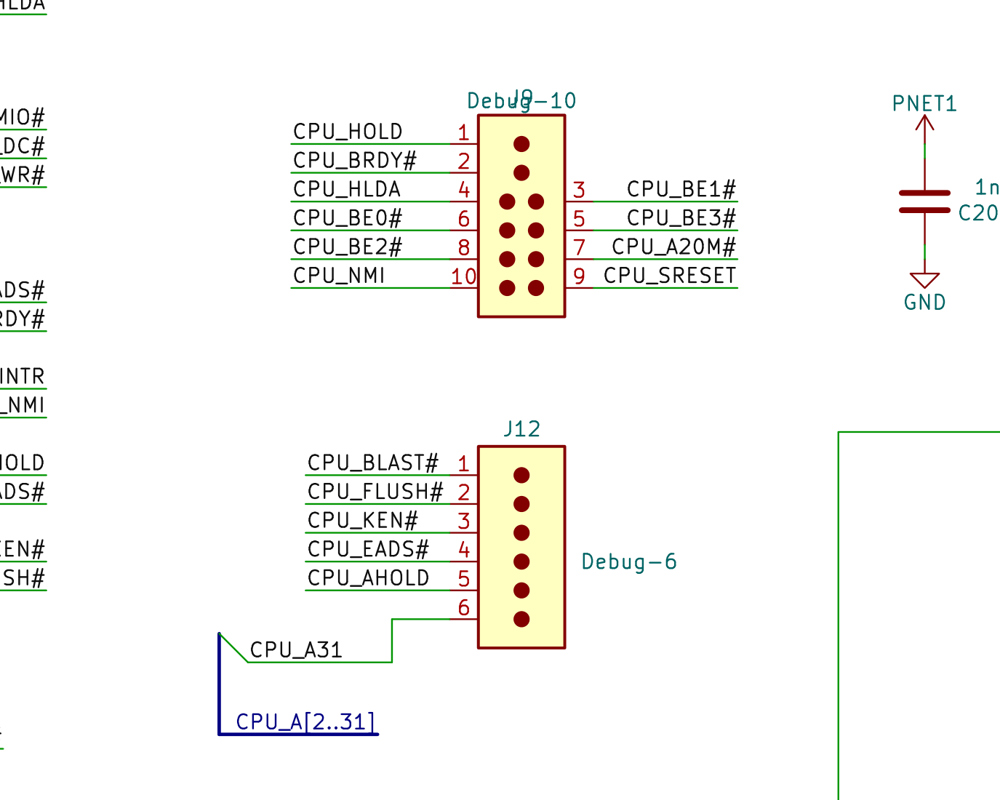

### 18.1 Pinouts (as drawn)

**J9 — "Debug-10" (2×5, 0.1″):**

| Pin | Signal | 486 dir | Pin | Signal | 486 dir |
|----:|--------|:------:|----:|--------|:------:|
| 1 | CPU_HOLD | **in** | 2 | CPU_BRDY# | **in** |
| 3 | CPU_BE1# | out | 4 | CPU_HLDA | out |
| 5 | CPU_BE3# | out | 6 | CPU_BE0# | out |
| 7 | CPU_A20M# | **in** | 8 | CPU_BE2# | out |
| 9 | CPU_SRESET | **in** | 10 | CPU_NMI | **in** |

**J12 — "Debug-6" (1×6, 0.1″):**

| Pin | Signal | 486 dir |
|----:|--------|:------:|
| 1 | CPU_BLAST# | out |
| 2 | CPU_FLUSH# | **in** |
| 3 | CPU_KEN# | **in** |
| 4 | CPU_EADS# | **in** |
| 5 | CPU_AHOLD | **in** |
| 6 | CPU_A31 | out (`CPU_A[2..31]` runs alongside) |

**JTAG TAP (separate):** `TCK`, `TDI`, `TMS`, `TDO` (IEEE 1149.1 boundary scan on the 486). `TRST#` is
not separately broken out.

*("in" = CPU input → a pod **drives** it; "out" = CPU output → a pod **senses** it.)*

### 18.2 What the headers are for

The signal selection gives it away: bus takeover (`HOLD`/`HLDA`/`AHOLD`) to float the 486 so an emulator
can own the local bus; cycle control (`BRDY#`/`BLAST#`); cache coherency (`EADS#` + `FLUSH#` + `KEN#` —
the tell, for a tool that modifies memory behind the running CPU); control (`SRESET`, `NMI`, `A20M#`,
byte enables); and a JTAG TAP for boundary scan.

**Honest limitation:** J9/J12 expose control + byte-enables + the address bus but **not the data bus**.
By themselves they let you halt, reset, interrupt, manage the cache, and observe cycles — but a full
RAM-override (read/write memory behind the CPU) also needs the data bus (tap it at the DRAM/ROM, or use
JTAG boundary-scan EXTEST).

### 18.3 Building a homebrew debug pod

Two practical paths; do JTAG first (cleanest), then add the J9/J12 controller for run-control. A
reference C implementation is in `Debug/pc110_debug_pod.c`.

**Path A — JTAG boundary scan (recommended, lowest-risk).** Use an **FT2232H** mini-module (or any
OpenOCD-supported dongle). Wire `TCK/TMS/TDI/TDO` (+ GND; tie `TRST#` inactive); 3.3 V LVTTL via the
existing `74LVT125` buffers is level-safe. With **OpenOCD** and the 486's **BSDL**, you can `SAMPLE`
every pin live and `EXTEST`-drive pins for board test — even do slow memory peeks by walking the boundary
register. No high-speed bus mastering needed. A safe first milestone is **JTAG `SAMPLE` to watch the CPU
pins live during POST** — zero risk, immediately useful for bring-up.

**Path B — J9/J12 run-control pod (MCU or small FPGA).** A 3.3 V MCU (RP2040, for fast GPIO + PIO) or a
small FPGA drives CPU-input signals and samples CPU-output signals. **Use level shifting** — the 486 side
may be 5 V; the `74LVT125` buffers are 5 V-tolerant in / 3.3 V out, with 33 Ω series Rs, but put proper
translation between pod and header. Core operations:

| Pod role | Drive | Sense |
|---|---|---|
| Halt/run | `HOLD`, `AHOLD` | `HLDA`, `BLAST#` |
| Reset/IRQ | `SRESET`, `NMI`, `A20M#` | — |
| Cache | `FLUSH#`, `EADS#`, `KEN#` | — |
| Cycle | `BRDY#` | `BLAST#`, `BE0-3#`, `A31`/`A[2..31]` |

1. **Halt:** drive `HOLD`=1 → wait `HLDA`=1 → CPU bus floated.
2. **Resume:** `HOLD`=0 → wait `HLDA`=0.
3. **Flush cache:** pulse `FLUSH#` low.
4. **Snoop-invalidate a line:** `AHOLD`=1 → present line address on `A[2..31]` → pulse `EADS#` low →
   `AHOLD`=0.
5. **Soft reset:** pulse `SRESET`. **Inject NMI:** pulse `NMI`.
6. **Single-cycle stepping** (if you also drive data/addr): use `BRDY#` to terminate each cycle.

**Caveats:** respect 5 V vs 3.3 V per net; the 486 internal cache is write-through, so after any pod write
to memory, `FLUSH#` (or per-line `EADS#`) before resuming or the CPU may read stale data; and don't fight
the chipset — the VL82C420 also issues `AHOLD`/`HOLD`/refresh, so coordinate or only take the bus while it
is idle.

---

## 19. Troubleshooting guide

> Safety first: a source attached means rails are live and the standby supply is running even when the
> machine looks off. Observe ESD precautions. Pin numbers below use the J3 (PSU) convention; for J5
> second-row pins, **J5 = 61 − J3**.

### 19.1 Completely dead — no reaction to the power button

Work the power-on chain (§7) in order; stop when you find the break.

**Step 1 — Source & standby.**
Confirm the battery/adapter actually delivers voltage to the board. Check **F5 (2.5 A fuse)** for
continuity — a blown F5 kills the battery path and is a prime suspect. Then measure **U6 VCC (standby)**:
no standby supply means U6 cannot run and the machine is totally dead. Trace the always-on regulator from
the bus. ⚠️

**Step 2 — Is U6 alive?**
With standby present, U6 should be oscillating (check XIN/XOUT) and sitting in STOP. No clock → bad
crystal or dead U6.

**Step 3 — Does the button reach U6?**
Press the button while monitoring **U6 P5.1 / INT3**; you should see the line move. No edge → the button,
its pull, or the trace is open. (The button is mainboard-side, not on J5/J3.)

**Step 4 — Does U6 try to turn on?**
Watch **M38_P52 (J3-18 / J5-18)** on button press:

- **P52 never goes high** → U6 woke but **refused** (battery/health gate, §7 Phase C) *or* a U6/firmware
  fault. Check the A-D inputs: is **VREF** present (J3-30/J5-31)? Is **AN4 ≈ Vbus/4** (J3-27/J5-34)? A
  dead VREF or a shorted sense op-amp makes U6 read "battery bad" and abort. ✅ logic / 🟡 threshold.
- **P52 goes high but nothing else happens** → fault is downstream (Step 5).

**Step 5 — Main-rail switch.**
With P52 high, verify **Q4** turns on and the **Q5/Q22** bank passes **PWR_IN_10v5**. A failed Q4 / R2
(470k) / Q5 / Q22 leaves the rail off despite a good enable.

**Step 6 — The J5↔J3 connector.**
Re-seat it; check continuity of P52, P53, GND and PWR/PNET pins. A dirty or cracked board-to-board
connector breaks the enable or sense path and mimics a dead board.

### 19.2 Powers on but a subsystem is faulty

| Symptom | Likely area | Checks |
|---|---|---|
| Main rail comes up then **drops after ~1 s** | U54 latch not holding, or U6 read a fault and ran power-down (`$D05B`) | Scope **P52** — if it pulses high then low, U6 aborted. Check **AN4/VREF** and battery current sense; check **U54 (74HC74)** `1D/1Q/PRE#`. |
| Runs on **adapter only**, not battery | Battery path | **F5**, **U13 (J421)**, shunt **R7/R8**, battery contacts; U6 sees "battery absent/low". |
| Runs on **battery only**, not adapter | Adapter / dock input | `Dock_PWR_IN−`, dock/adapter steering diodes (D2/D4/D7/D8 area), bus OR-ing. |
| **Boots but hangs very early / no POST** | CPU↔chipset path | Bowman↔VL82C420 **ML bus** (`Bowman1–5`); CPU local-bus reset/clock (`CPUCLK`, `RESET`); VL82C420 config (`0x4F` writes). |
| **No video at all** (LCD *and* external VGA dead) | Graphics core | **U51 (F65535)**, its VRAM **U28**, dot clock from **U63** (`VGA_CLK`), and the `LDEV#`/bus path from Bowman. |
| **No internal LCD** but external VGA works | Flat-panel side | `ENAVDD/ENAVEE/ENABKL` (U51), the **VEE** generator, **F65_ENAVEE (J3-35/J5-26)**, `LCD_STNDBY#` (Pluto pin 93), `EN_LCD_VAA` (Pluto pin 83). |
| **Garbled Japanese text** (ASCII OK) | Font ROM | Suspect **U36 (OKI MSM538032E)** or its decode — not a total video fault. |
| Powers up, **won't talk / hangs early** | Handshake | Activity on **P2.0/P2.1**; UART on U6 port **P4**. No handshake → system-controller side (Bowman). |
| **No sound** | Audio decode/DMA | Check `FCS_RESET` (U58/U69) to U4 pin 39, `Pluto_ESS_AEN` (Pluto pin 79), `Bowman_ESS_DACK1#` (U4 pin 36) before condemning U4; for FM-only loss check YM3812 (U10) and `YMF_CS#_Buf`. |
| **Won't charge / bad gauge** | Current sensing | **R7/R8 shunt**, PSU op-amps (7064 U6A–D / U7A), AN0/AN1/AN3; VREF. |
| **No floppy** (with dock) | FDC = **U22** (FDC37C665IR); Pluto/Bowman only route glue | Check **U22** (Super-I/O) first; dock `CN2` lines; Pluto pins 68–71 (FDD data glue); Bowman floppy IRQ/DMA (`FINTR`/`FDRQ`/`DACK#`). |
| **Serial port dead** (dock) | RS-232 enable | Pluto **pin 77 `EN_RS232`** must be asserted; check dock drivers U3/LT1237/U1. |
| **PCMCIA / CF card not detected** | Card controller / power | **U74 (RB5C396)** card-detect & slot power; **U70 (TPS2201)** switch; Pluto `CF_CD1/2` (pins 26/27). |
| **Trackpad dead** (ext. PS/2 mouse OK) | Pointing-device MCU | **U75 (µPD17137A)**, the pad flex, the click inputs, and `GPCLK`/`GPDATA` to the KBC. |
| **Modem dead / no dial tone** | Modem module | IC11 firmware present (`RIOS Ver 1.04`), MN195001 USART lines (`U1RD#`,`RXD1`,`TXD1`,`DCD1#`,`RI1#`), Line Module 681000, phone-line transformer. |
| **RAM mis-sized** | Module ID straps | Pluto pins 31/32 (`RAM_ID0/1`); confirm module R1/R2 0 Ω links and mainboard pull-ups. |
| **Random no-boot, intermittent** | Connector / standby | Re-seat **J5/J3**; verify the standby rail is solid under load. |

### 19.3 Fault-isolation flow (power-up chain)

```
   Power button pressed
          │
   U6 VCC present? ──no──► standby regulator / F5 / source  (§19.1 step 1)
          │yes
   U6 clocked & in STOP? ──no──► crystal / U6 dead          (§19.1 step 2)
          │yes
   P5.1/INT3 moves on press? ──no──► button / trace         (§19.1 step 3)
          │yes
   P52 goes high? ──no──► A-D gate: VREF, AN4, sense op-amps (§19.1 step 4)
          │yes
   PWR_IN_10v5 on? ──no──► Q4 / R2 / Q5 / Q22 switch bank    (§19.1 step 5)
          │yes
   Stays on >1 s? ──no──► U54 latch / U6 abort (AN4,current) (§19.2)
          │yes
   POST / handshake on P2.0/P2.1? ──no──► Bowman / VL82C420 / ML bus
          │yes
   Video? Audio? Floppy? Serial? PCMCIA? Trackpad? Modem? ──► peripheral table (§19.2)
```

---

## 20. Quick test-point reference

| Test point | Where | Expect | Confidence |
|---|---|---|---|
| **F5** (2.5 A) | battery current path | continuity; **check first** | ✅ |
| **U6 VCC / standby** | mainboard U6 supply | live even when "off" | ⚠️ |
| **U6 P5.1 / INT3** | mainboard (power button) | edge on button press | ✅ |
| **M38_P52** | J3-18 / J5-18 | low→**high** to turn on | ✅ |
| **M38_P53** | J3-38 / J5-23 | driven high with P52 | ✅ |
| **PWR_IN_10v5** | after Q4/Q5/Q22 | ~10.5 V when on | ✅ |
| **5 V** | downstream rail | 5 V when on | 🟡 |
| **VREF** | J3-30 / J5-31 | steady A-D reference | ✅ |
| **AN4 / P64** | J3-27 / J5-34 | ≈ Vbus/4 (~3.5 V at 10.5 V) | ✅ |
| **P2.0 / P2.1** | J3-19,39 / J5-19,22 | toggling handshake when booting | ✅ |
| **F65_ENAVEE** | J3-35 / J5-26 | high at display-on | 🟡 |
| **U54 (74HC74)** | mainboard | power-state latch holds 1Q | 🟡 |
| **VGA_CLK** | U63 → U51 (XTAL0) | dot clock present for video | 🟡 |
| **Bowman1–5 (ML bus)** | U61 ↔ U21 | clock + strobes active during cycles | 🟡 |
| **FCS_RESET** | U58 → U4 pin 39 | released (high) for audio | ✅ |
| **GPCLK / GPDATA** | U75 → KBC | clock+data activity on pad use | 🟡 |
| **KB_CCS** | Pluto pin 60 | pulses low on every `0x60/0x64` access (keyboard alive) | ✅ |
| **TP1** | VL82C420 ball T14 pad | static **high** (`ONCE#`-class test strap, inactive) | ✅ |

---

## 21. Firmware anchors (for deep debug)

Addresses in the **U6 power-sense MCU** (M38223E4HP) ROM, mapped at `0xC000`:

| Anchor | Address | Meaning |
|---|---|---|
| Reset / entry | `$C046` | `SEI; jsr $CC5E …`; A-D-ready wait at `$C055` (`bbc 3,ADCON`) ✅ |
| STOP / sleep | `$CD00` | `STP; bra $CD00`; deep-sleep setup at `$D0D6` (masks IRQs, arms ICON2 b3/b4) ✅ |
| Power **ON** | `$D056` | `seb 2,P5; seb 3,P5` → P52/P53 high ✅ |
| Power **OFF** | `$D05B` | `… clb 2,P5; clb 3,P5` → P52/P53 low ✅ |
| Wake-reason classify | `$CCFC / $CD03 / $CD0D` | read P5.1/INT3 + P7 ✅ |
| A-D scan / channel select | `$D74F` | `sta ADCON`; reads `$D5FD–$D831` ✅ |
| P2.0/P2.1 handshake + `0x5A` sync | `$CAD3`, `$C983–$CBF2` | request/acknowledge state machine ✅ |
| Vector table | `0xFF5A–0xFF7D` | 16 little-endian pointers; CPU reset/IRQ vectors at `0xFFDC–0xFFFF` **missing from dump** ✅ |

SFR map used (standard 740 layout, confirmed against the 3822-group datasheet): `P2`=0x04, `P5`=0x0A,
`ADCON`=0x34, `AD`=0x35, `ICON1/2`=0x3E/0x3F. Disassembly via `m740dasm` (ROM based at 0xC000, entry
0xC046, vectors at 0xFF5A) → `PSU-MB-M38/disasm_full.asm`.

Other firmware images in the project:

| ROM | Device | Reset vector | Notes |
|---|---|---|---|
| Keyboard MCU (`M38813E4HP@QFP64.bin`) | M38813, 16 KB mask | `0xC208` (FFFC) | RIOS KBC firmware v1.1; MD5 `835fc971…` (§17) |
| Modem (`EN29F040A@TSOP32.BIN`) | EN29F040A, 512 KB flash | `0x00FF0001` → file `0x70001` | RIOS Ver 1.04, big-endian MN-core; SHA-1 `90f681f2…` (§15.6–15.8) |
| Font ROM (`MSM538032E@SOP44.BIN`) | OKI mask, 1 MB | — | IBM DOS/V fonts P/N 84G7940 (§13.4) |

> Some firmware paths run through indirect jump tables a static trace can't fully follow; the control
> flow documented here reflects the routines that *were* decoded.

---

## 22. Glossary

- **740 core / MELPS 740** — Mitsubishi's 8-bit CPU core, 6502-compatible with added bit-manipulation
  (`SEB`/`CLB`/`BBS`/`BBC`), `MUL`, and low-power `STP`/`WIT` instructions. Used by both the power MCU
  (M38223) and the keyboard MCU (M38813).
- **AudioDrive** — ESS Technology's family of single-chip ISA sound controllers (here, the ES488F).
- **Bowman** — schematic code-name for the custom RIOS system-controller ASIC (U21 / U60).
- **DBCS / SBCS** — double-byte / single-byte character set (Japanese vs. ASCII+katakana), as stored in
  the font ROM.
- **DOS/V** — IBM's PC-DOS variant that renders Japanese on standard VGA hardware in software.
- **DSTN** — dual-scan twisted-nematic passive LCD; the PC110's 640×480 internal panel type.
- **F65535** — Chips & Technologies flat-panel/CRT VGA controller (U51); shares a chip ID with the 65530.
- **J5 / J3** — the 40-pin board-to-board connector joining mainboard (J5) and PSU board (J3).
- **JRC 7064** — the quad op-amp (PSU-board "U6") forming the battery sense front-end.
- **MN195001** — Panasonic single-chip fax engine used as the PC110's modem (U-modem module).
- **ML bus** — VLSI's proprietary Multiplexed Local bus linking the VL82C420 to Bowman (`Bowman1–5`).
- **Pluto** — schematic code-name for the custom RIOS peripheral I/O gate array (U35).
- **PWR_IN_10v5** — the ~10.5 V main pre-regulation bus, switched on by U6 via P52.
- **RIOS Systems Co., Ltd.** — Japanese design house behind the PC110's custom silicon and the power,
  keyboard and modem firmware.
- **SCAMP IV** — VLSI's 80486SL single-chip-AT chipset generation; the VL82C420 is its system controller.
- **STOP / STP** — the 740's deepest sleep (oscillator off); how U6 idles while the machine is "off".
- **VEE** — the negative LCD bias rail, enabled by `F65_ENAVEE`.
- **VRAM** — the F65535's private video framebuffer (U28, M5M4V16160).

---

## 23. Sources & credits

This manual is a synthesis of the Open-Source-PC110 reverse-engineering project's per-subsystem analyses
(the `readme.md` files under each subfolder), firmware disassemblies, and ROM dumps, cross-checked against
public references, vendor patents and architectural-twin datasheets.

**Primary (project) sources**

- Open-Source-PC110 — GitHub: https://github.com/ahmadexp/Open-Source-PC110
- KiCad schematic recreations (Ahmad Byagowi): `PC110.kicad_sch` / `Mainboard.pdf`,
  `DockingStation.kicad_sch`, `Modem.kicad_sch`, `RAM-Module.kicad_sch`.
- In-repo subsystem analyses: `Power-Sequence/`, `PSU-MB-M38/`, `Pluto/`, `Bowman/`, `ES488/`, `65535/`,
  `Chipset/`, `Modem/`, `Trackpoint/`, `Debug/` (+ `pc110_debug_pod.c`).
- Firmware/ROM dumps: U6 power MCU `M38223E4HP` ("POWER SENSE MICON Rev 8", RIOS 1995); keyboard MCU
  `M38813E4HP@QFP64.bin` (RIOS KBC v1.1, MD5 `835fc971bf700ddcc834ef5ba904aaa2`); modem
  `EN29F040A@TSOP32.BIN` (RIOS Ver 1.04, SHA-1 `90f681f2af63310d49cbaa9ec15b3f7965fbe79a`); font ROM
  `MSM538032E@SOP44.BIN` (IBM P/N 84G7940, 1995); reverse-engineered `vl82c420_pinmap.xlsx`.

**Public references**

- Hackaday — *Reverse Engineering The IBM PC110, One PCB At A Time*:
  https://hackaday.com/2025/04/06/reverse-engineering-the-ibm-pc110-one-pcb-at-a-time/
- *Archaeology of the IBM PC110* — VCFMW20 talk: https://www.youtube.com/watch?v=8Uja7g9hQlo
- ThinkWiki — PC110: https://www.thinkwiki.org/wiki/PC110 · IBM PC110 Wiki (Miraheze):
  https://pc110.miraheze.org/wiki/Main_Page · Dan Basterfield's PC110 pages: https://www.basterfield.com/pc110/pc110idx.htm
- Wikipedia — IBM Palm Top PC 110: https://en.wikipedia.org/wiki/IBM_Palm_Top_PC_110
- ESS AudioDrive ES1868 data sheet (family reference), bitsavers.org:
  https://bitsavers.org/components/ess/ESS_ES1868_Data_Sheet_1996.pdf
- C&T F65535 — VGA Legacy MKIII: https://www.vgamuseum.info/index.php/cpu/item/183-chips-technologies-f65535
- VL82C420 / SCAMP IV — The Retro Web: https://theretroweb.com/chipsets/568 ; VLSI patents
  US 5,793,990 (ML bus), US 5,715,467 (power mgmt); Intel 486 SL datasheet (architectural twin).
- Ricoh RB5C396 / RF5C396 PC-Card controller datasheet; NEC µPD17137A / 1992 NEC 17K data book
  (bitsavers); Panasonic MN195001 Single-Chip Fax Engine LSI datasheet.

**Methods & caveats**

Schematic pins were read from vector PDFs (text + high-DPI render). PSU analog net connectivity was
reconstructed with a union-find pass over wire segments honouring junction dots. Firmware was disassembled
with `m740dasm` (U6) and a stock-6502 decoder (KBC — note the 740-opcode desync); the modem ROM was
analysed by string/vector inspection. Custom-ASIC pin *functions* are inferred from board wiring, not
manufacturer datasheets (none exist publicly for Bowman, Pluto, ES488 or VL82C420); the VL82C420 leans on
its Intel 486 SL twin and VLSI patents. Items marked 🟡 / ⚠️ (or hypothesis tag **[H]**) should be
confirmed against a known-good unit before relying on them for repair.

*End of manual — revision 2.0.*
