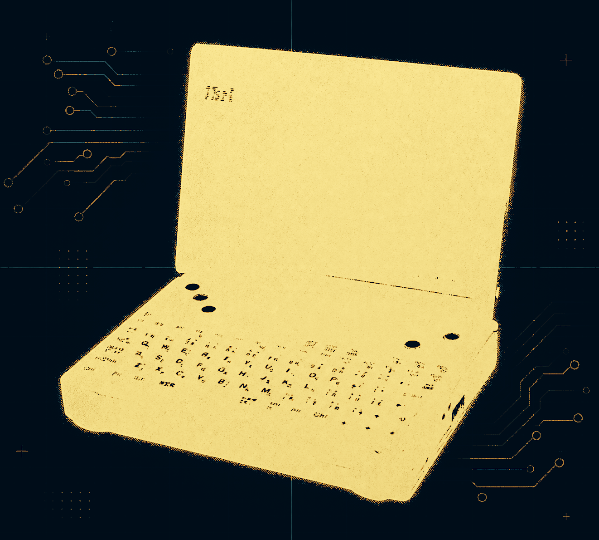
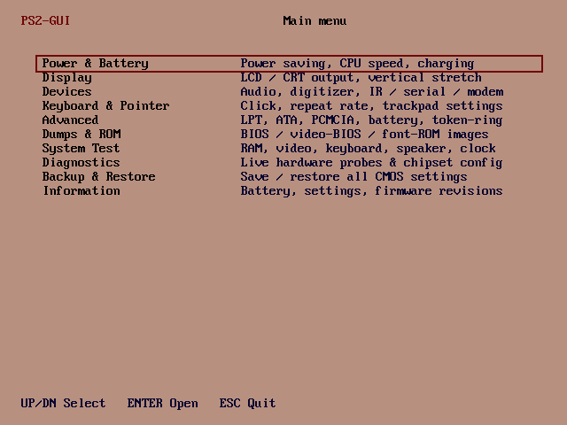

  

<h1 align="center">IBM Palm Top PC110 de código abierto</h1>

  Una ingeniería inversa completa y de código abierto del IBM Palm Top PC110: esquemáticos, diseños de PCB,
  volcados de ROM y firmware, análisis de chips, escaneos ópticos, modificaciones de hardware y herramientas del sistema.

  <a href="https://github.com/ahmadexp/Open-Source-PC110/wiki"><strong>Wiki / historia del proyecto</strong></a>
  ·
  <a href="PCB/PC110-Schematics-Combined.pdf"><strong>Esquemáticos combinados</strong></a>
  ·
  <a href="Discovery/Service-Manual/"><strong>Manual de servicio</strong></a>
  ·
  <a href="Mods/ROADMAP.md"><strong>Hoja de ruta de modernización</strong></a>
  ·
  <a href="Mods/"><strong>Mods</strong></a>
  ·
  <a href="Software/"><strong>Software</strong></a>

  
  

Una ingeniería inversa completa y de código abierto del **IBM Palm Top PC110** (tipo 2431, 1995), un subportátil de clase 486 para el mercado japonés co-desarrollado por IBM Japan y Ricoh / RIOS Systems. Este repositorio reúne todo lo necesario para comprender, reparar, recrear y modernizar el equipo: esquemáticos y diseños de PCB recreados, análisis de chips a nivel de die, volcados de firmware y BIOS con desensamblaje, escaneos ópticos y de rayos X de alta resolución, fichas técnicas y modificaciones de hardware.

> **Objetivo:** preservar el PC110 en su totalidad, señal por señal, para que pueda reconstruirse, repararse, emularse y reimaginarse mucho después de que la última placa original haya quedado corroída.

---

## Comienza aquí

| Si deseas... | Ve aquí |
|---|---|
| Entender el viaje completo de ingeniería inversa | [Wiki / Un tributo al IBM PC110](https://github.com/ahmadexp/Open-Source-PC110/wiki) |
| Reparar o inspeccionar el hardware original | [Manual de servicio no oficial](Discovery/Service-Manual/) y [guía de secuencia de encendido](Discovery/Power-Sequence/) |
| Revisar las placas recreadas | [Proyectos de PCB](PCB/) y [PDF de esquemático combinado](PCB/PC110-Schematics-Combined.pdf) |
| Explorar los chips personalizados y las ROMs | [Componentes](Components/) y [Volcados de Flash / ROM](Components/Flash/) |
| Trabajar en emulación o software del sistema | [Notas de descubrimiento](Discovery/), [Herramientas PS2](Software/), y [PC110 emulators & FPGA cores](#pc110-emulators--fpga-cores) |
| Construir una variante modernizada del PC110 | [Mods](Mods/) incluyendo placas ITX, trabajo de actualización de CPU, expansión de RAM y reemplazo de pantalla TFT |

## Mapa del repositorio

| Carpeta | Qué encontrarás |
|--------|------------------|
| [**Wiki**](https://github.com/ahmadexp/Open-Source-PC110/wiki) | La historia pulida del proyecto y el recorrido guiado: por qué importa el PC110, cómo se reconstruyó la placa y por dónde empezar. |
| [**`PCB/`**](PCB/) | **Esquemáticos y diseños de PCB recreados en KiCad** para la placa base, fuente de alimentación, membrana del teclado, estación de acoplamiento, módem y módulo de RAM de 16 MB. Incluye un [PDF de esquemático combinado](PCB/PC110-Schematics-Combined.pdf), archivos de fabricación, listas de materiales y renders 3D. |
| [**`Components/`**](Components/) | **Ingeniería inversa a nivel de chip**: análisis a nivel de die (con John McMaster), volcados de firmware/BIOS/ROM de seis chips, desensamblaje, emuladores y la imagen de disco interno de 4 MB. |
| [**`Discovery/`**](Discovery/) | **Notas detalladas de subsistemas** para cada chip y bus principales, además de un **manual de servicio y referencia técnica** no oficial y completo, un **volcado de hardware en vivo** de una unidad en funcionamiento y una ingeniería inversa de la herramienta `PS2.EXE` de IBM. Comienza aquí para entender cómo encaja todo. |
| [**`Software/`**](Software/) | **Herramientas para el PC110** — incluyendo **PS2TUI**, **PS2GUI** y **COMrade**, el puente serial para el control de DOS y Windows 95. |
| [**`Mods/`**](Mods/) | **Modificaciones y rediseños de hardware**: recreaciones en formato ITX, un adaptador de actualización de CPU, una nueva estación de acoplamiento, un mod de RAM de +4 MB, un cambio de pantalla TFT y puertos para Altium. |
| [**`Optical/`**](Optical/) | **Escaneos ópticos de alta resolución, capturas de rayos X e imágenes individuales de capas de cobre** de cada placa y los chips personalizados. |
| [**`Datasheets/`**](Datasheets/) | Fichas técnicas, pines y mapas de conectores para los chips y conectores de la placa base y las placas periféricas. |
| [**`Docs/`**](Docs/) | La historia del proyecto — ["Un tributo al IBM PC110"](Docs/) — que cubre el viaje de lijado, escaneo, decapado y extracción de esquemáticos. |

---

## PCBs recreadas ([`PCB/`](PCB/))

Todas las placas están recreadas en **KiCad 9.0** (requiere la [Biblioteca Alternativa de KiCad](https://alternatekicadlibrary.com/)), con archivos de fabricación y listas de materiales.

| Placa | Descripción | Capas |
|-------|-------------|--------|
| Placa base | Motherboard | 10 |
| PSU | Fuente de alimentación | 4 |
| Teclado | Membrana del teclado | 2 + 2 |
| Estación de acoplamiento | Expansión de puertos | 4 |
| Módem | Módem interno de 14.4 kbps | 6 |
| RAM-16MB | Módulo de RAM de 16 MB | 4 |

**[PDF de esquemático combinado →](PCB/PC110-Schematics-Combined.pdf)**

### Placa base
- Esquemático

- Diseño (Layout)

### Fuente de alimentación
- Esquemático

- Diseño (Layout)

### Membrana del teclado
- Esquemático

- Diseño (Layout)

### Expansión de puertos (Estación de acoplamiento)
- Esquemático

- Diseño (Layout)

### Módem interno de 14.4 kbps
- Esquemático

- Diseño (Layout)

### Módulo de RAM de 16 MB
- Esquemático

- Diseño (Layout)

---

## Ingeniería inversa de componentes ([`Components/`](Components/))

### Investigación a nivel de die

Una colaboración con [John McMaster](https://siliconpr0n.org/archive/doku.php?id=ibm:pc110): chips decapados con láser e imágenes de die de alta resolución.

| Designador | Pieza | Función | Notas |
|------------|------|----------|-------|
| U61 | VL82C420FC5 | Chipset "SCAMP IV" (DMA, PIC, PIT, RTC) | [Notas](Components/U61-VL82C420FC5/) |
| U35 | Pluto | Matriz de puertas I/O personalizada | [Notas](Components/U35-Pluto/) |
| U21 | Bowman | Matriz de puertas de controlador del sistema personalizada | [Notas](Components/U21-Bowman/) |
| U75 | D17137AGT | Controlador TrackPoint | [Notas](Components/U75-D17137AGT/) |

### Volcados de Flash y ROM

Lecturas en bruto más análisis de ingeniería inversa (informes, cadenas extraídas, volcados hexadecimales, desensamblaje y, en algunos casos, emuladores) para los chips programables. Consulta [`Components/Flash/`](Components/Flash/).

| Chip | Tamaño | Rol |
|------|------|------|
| [Intel E28F002BXT](Components/Flash/E28F002BXT/) | 256 KiB | **BIOS** principal/sistema (IBM compatible con VGA, APM) — incluye proyecto de desensamblaje de BIOS |
| [OKI MSM538032E](Components/Flash/OKI-MSM538032E/) | 1 MiB | **ROM de fuentes enmascarada** japonesa/sistema |
| [Eon EN29F040A](Components/Flash/EN29F040A/) | 512 KiB | Flash de la **placa de módem/fax** |
| [Mitsubishi M38813E4HP](Components/Flash/M38813E4HP/) | ~16 KiB | Firmware del **controlador de teclado** (U67) |
| [Mitsubishi M38223E4HP](Components/Flash/M38223E4HP/) | ~16 KiB | Firmware del MCU de **detección de energía** (U6) — incluye un emulador |
| [Atmel AT29LV512](Components/Flash/AT29LV512/) | 64 KiB | Controlador FlashDisk ATA PCMCIA SanDisk (68000) |

### Imagen de disco interno

Imágenes del disco de estado sólido interno de 4 MB del PC110 en [`Components/Internal-Disk-Image/`](Components/Internal-Disk-Image/) (`.img` en bruto y `.PQI` de PowerQuest).

---

## Descubrimiento: análisis en profundidad de subsistemas ([`Discovery/`](Discovery/))

Reconstruido a partir de recreaciones de esquemáticos, desensamblaje de firmware, escaneos de die y fichas técnicas de componentes gemelos arquitectónicos.

| Carpeta | Tema |
|--------|---------|
| [**Manual de servicio**](Discovery/Service-Manual/) | Manual de servicio y referencia técnica no oficial y completo — **comienza aquí** |
| [Chipset](Discovery/Chipset/) | Controlador del sistema VLSI VL82C420 "SCAMP IV", mapa completo de pines |
| [Bowman](Discovery/Bowman/) | ASIC principal U21 del controlador del sistema |
| [Pluto](Discovery/Pluto/) | Matriz de puertas U35 de E/S (con desensamblador 6502) |
| [65535](Discovery/65535/) | Controlador VGA de panel plano/CRT C&T F65535 |
| [ES488](Discovery/ES488/) | Cadena FM ESS ES488F "AudioDrive" + YM3812 (OPL2) |
| [Módem](Discovery/Modem/) | Motor de fax de chip único MN195001 |
| [PSU-MB-M38](Discovery/PSU-MB-M38/) | MCU U6 M38223E4HP de detección de energía + mapa de conectores |
| [Secuencia de encendido](Discovery/Power-Sequence/) | Secuencia de encendido y guía de reparación para "no enciende" |
| [Trackpoint](Discovery/Trackpoint/) | Controlador de dispositivo puntero U75 µPD17137A |
| [Depuración](Discovery/Debug/) | Cabeceras de depuración 80486SX / JTAG + un pod de depuración casero |
| [PS2](Discovery/PS2/) | Herramienta de configuración `PS2.EXE` de IBM, completamente desensamblada — incluyendo los comandos ocultos `_@` |
| [Volcado en vivo](Discovery/Live-Dump/) | Estado del chipset / BIOS / SO capturado de un **PC110 en ejecución** a través de un enlace serial |

---

## Modificaciones y rediseños ([`Mods/`](Mods/))

| Proyecto | Descripción |
|---------|-------------|
| [PC110-ITX](Mods/PC110-ITX/) | Una placa base en formato ITX que reimplementa el PC110, con componentes BGA originales convertidos a QFP para facilitar el ensamblaje |
| [PC110-ITX-all-in-one](Mods/PC110-ITX-all-in-one/) | Variante ITX que fusiona la placa base y la fuente de alimentación de la estación de acoplamiento en una sola placa |
| [Actualización de CPU](Mods/CPU%20Upgrade/) | Trabajo de adaptador BGA-a-zócalo hacia una CPU más rápida (comparte el VL82C420 con la actualización 230cs de Taka) |
| [NewDock](Mods/NewDock/) | Una estación de acoplamiento rediseñada como un proyecto independiente de KiCad |
| [RAS4](Mods/RAS4/) | Habilita 4 MB adicionales de RAM interna reutilizando `VL_D12` como `RAS#4` |
| [TFT](Mods/TFT/) | Reemplazo de pantalla TFT, incluida una imagen de parche de BIOS |
| [Altium](Mods/Altium/) | Los proyectos de PCB portados de KiCad a Altium |

---

## Escaneos ópticos y rayos X ([`Optical/`](Optical/))

Escaneos ópticos de alta resolución, capturas de rayos X e imágenes individuales de capas de cobre de cada placa y los chips personalizados — incluyendo la pila completa de 10 capas de cobre de la placa base, rayos X de los paquetes BGA/QFN y fotos de die de costura para el 486SX, VL82C420, F65535, Bowman y Pluto. Consulta [`Optical/README.md`](Optical/).

---

## Comunidad

Únete a la discusión, haz preguntas y comparte tu trabajo:

**Discord:** [discord.gg/WvRh6C6WT](https://discord.gg/WvRh6C6WT)
**Grupo de Facebook:** [Comunidad IBM PC110](https://www.facebook.com/groups/985746629171739)

---

## ¿Cómo puedes ayudar?

- **Revisa** los esquemáticos y diseños de PCB para detectar errores, fallos y problemas.
- **Verifica** el diseño contra el esquemático y contra el hardware real.
- **Busca** fichas técnicas faltantes para los componentes personalizados y sin documentar.
- **Contribuye** con análisis de firmware / ROM y desensamblaje.
- **[Financia la siguiente iteración de PCBA](https://gofund.me/716b7dae)** para que podamos fabricar y probar la placa base recreada.

---

## Prensa

Destacado en **Hackaday**:
- [Reverse Engineering The IBM PC110, One PCB At A Time](https://hackaday.com/2025/04/06/reverse-engineering-the-ibm-pc110-one-pcb-at-a-time/)

Destacado en **el blog de Taka**:
- [PC110 New PSU](https://garakutaen.sakura.ne.jp/misc2/MlogmP3.html#e0318)
- [PC110 PCB Pattern](https://garakutaen.sakura.ne.jp/misc2/MlogmP1.html#e0130)
- [PC110 PCB Layout creation](https://garakutaen.sakura.ne.jp/misc2/MlogmP2.html#e0208)
- [PC110 New Docking Station PCB](https://garakutaen.sakura.ne.jp/misc2/MlogmP3.html#e0324)
- [X-ray photos of the inside of the PC110's LSI](https://garakutaen.sakura.ne.jp/misc2/MlogmP2.html#e0225)

**Canal de YouTube de Jeff Geerling**:
- [Reverse engineering Episode](https://youtu.be/p7IvioiveOo?si=PUlHSzOhwXYEpZJ3&t=217)

**Canal de YouTube LGR**:
- [LGR Vlog: VCFMW20](https://www.youtube.com/watch?v=yIwXQicYClw&t=7595s)

**Canal de YouTube VCFMW20**:
- [Archaeology of the IBM PC110](https://www.youtube.com/watch?v=8Uja7g9hQlo)

---

## Agradecimientos

Este proyecto no habría sido posible sin **Kevin Moonlight** (extracción de ROM de microcontrolador), **Mike Lycett** (recaudación de fondos y coordinación), **Nick Rogers** (depuración y verificación), **John McMaster** (imágenes de die de alta resolución), **CLC / Fred Nielsen** (decapado y preparación de silicio), y la más amplia **comunidad de hardware abierto y retrocomputación**.

---

## PC110 Emulators & FPGA cores

**[PC110-EMU](https://github.com/ahmadexp/PC110-EMU)**: un emulador experimental construido alrededor de los artefactos *reales* de la máquina documentados aquí. Inicia el BIOS real del PC110, ejecuta PC DOS y Personaware, y carga los firmwares del MCU de detección de energía y del controlador de teclado, y la flash de fuentes japonesas — los mismos volcados que residen en la carpeta [`Components/Flash/`](Components/Flash/) de este repositorio.

Características destacadas:

- Inicia el BIOS real del PC110 y ejecuta imágenes de disco de **PC DOS** y **Personaware** soportados, incluyendo la pantalla gráfica **Easy-Setup** respaldada por ROM.
- Renderiza el lanzador de Personaware con **glifos DBCS japoneses** extraídos de la flash de fuentes del PC110 ([`MSM538032E`](Components/Flash/OKI-MSM538032E/)).
- Carga los firmwares del MCU de detección de energía **M38223** y del controlador de teclado MELPS 740 **M38813** para diagnósticos y respuestas del controlador.
- Modela la **tira de estado LCD frontal** (la pantalla de segmentos `IBM` de arranque, hora, disco, PMCU, KBC, altavoz y estado de configuración).
- Dos frontends: una aplicación nativa **macOS SwiftUI** para arranque y diagnósticos, y una compilación **portable con CMake** (Linux / Windows / macOS) con un ejecutador sin cabeza y una GUI SDL2 opcional.
- Diagnósticos enriquecidos: estado de CPU listo para copiar, trazas, memoria y volcados de pantalla de texto.

> El emulador no incluye **ninguna ROM con derechos de autor** — utiliza los volcados obtenidos legalmente de hardware que poseas. Este repositorio documenta de dónde provienen esos volcados y qué hace cada uno.

La interfaz de macOS ejecutando **Personaware**, con diagnósticos en vivo y la LCD frontal modelada:

La pantalla gráfica **BIOS Easy-Setup** respaldada por ROM:

**[Obtener el emulador → ahmadexp/PC110-EMU](https://github.com/ahmadexp/PC110-EMU)**

**[PC110-QEMU](https://github.com/ahmadexp/pc110-qemu)**: un emulador basado en QEMU para el PC110 con soporte para la BIOS y capaz de iniciar DOS7 y ejecutar Personaware.

Resulta que QEMU estándar puede ejecutar el software del PC110 una vez que le proporcionas los pocos bits de hardware específicos del PC110 en los que insiste el software. PC110-QEMU añade tres pequeños modelos de dispositivo QEMU, todos alimentados por los volcados de ROM *reales* archivados en este repositorio:

- **`pc110-fontrom`** — la **ROM de fuentes kanji** de 1 MB con banking (el puerto E/S `0x1160` selecciona uno de 128 × 8 KB de bancos en una ventana en `0xDE000`, exactamente el mecanismo que `$FONT.SYS` de DOS/V explora), alimentado por el [volcado MSM538032E](Components/Flash/OKI-MSM538032E/). Esto es lo que hace que el texto japonés de Personaware se renderice.
- **`pc110-chipset`** — un adaptador VLSI/SCAMP + MCU de energía con una superposición opcional de sombra de ROM completa, suficiente para iniciar el **BIOS real del PC110** ([volcado E28F002BXT](Components/Flash/E28F002BXT/)) en QEMU.
- **`pc110-setupcfg`** — una interfaz de registro de configuración + MCU de energía segura para SeaBIOS para el programa Easy-Setup.

Con eso en su lugar (`-cpu 486 -m 20M -vga cirrus -device pc110-fontrom,romfile=...`):

- **Personaware**, la GUI japonesa centrada en bolígrafo de IBM, inicia en su pantalla de inicio completa en ~20 s — cada applet (Calendario, PorHacer, Notas, Contactos, Correo, FAX, IR, RelojMundial, DibujarMemo, …), reloj en vivo, ratón funcional y kanji DBCS nítido renderizado desde la ROM de fuentes real.
- El **BIOS Easy-Setup** gráfico también funciona bajo SeaBIOS: la imagen de configuración comprimida en LZW se extrae de la flash de la BIOS y se carga en cadena mediante un sector de arranque de disquete personalizado que la ingresa exactamente como lo hace el BIOS real — menú principal completo, pantallas de configuración y el animalito mascota — y salir de Easy-Setup te devuelve a Personaware, justo como en la máquina real.

El repositorio también incluye las herramientas de soporte: el extractor Easy-Setup LZW, el cargador de arranque Easy-Setup (con salida/reinicio enrutado de vuelta al disco duro), un convertidor de volcado de partición → disco arrancable (las imágenes de disco interno del PC110 son volcados de partición que necesitan un MBR precedido), y scripts de compilación/ejecución. No se incluyen ROMs ni imágenes de disco — proporciona tus propios volcados obtenidos legalmente, que este repositorio documenta cómo hacer.

**[Obtenerlo → ahmadexp/pc110-qemu](https://github.com/ahmadexp/pc110-qemu)**

**[PC110_MiSTer](https://github.com/ahmadexp/PC110_MiSTer)**: el PC110 como un **núcleo FPGA** — no una emulación, sino una reimplementación de hardware, dirigida a la plataforma **MiSTer** (**DE10-Nano**) y construida sobre la infraestructura del núcleo `ao486`. Como los emuladores anteriores, se alimenta de los volcados *reales* archivados aquí.

Hito verificado: **un POST sin errores, IBM Easy-Setup con navegación por teclado funcional y un arranque no atendido de PC DOS J7.0/V al escritorio PersonaWare V1.0.**

Lo que implementa el núcleo y cómo se alinea con este repositorio:

- **CPU de clase 486** (forzada a 30 MHz) más el conjunto de periféricos AT — IDE, disquete, VGA, teclado, ratón.
- **El mapa de memoria estándar del PC110**: 4 MiB de RAM planar + un módulo de expansión de 16 MiB — es decir, la configuración de fábrica de 20 MB documentada en [`Discovery/RAM-Module`](Discovery/RAM-Module/readme.md).
- **Flash de 256 KiB mapeada en `C0000h–FFFFFh`** — el [volcado de BIOS E28F002BXT](Components/Flash/E28F002BXT/).
- **Banking de ROM de fuentes** con una imagen de fuentes de 1 MiB — el [volcado MSM538032E](Components/Flash/OKI-MSM538032E/) y el mecanismo de selección de banco `0x1160`, que es lo que hace que el texto japonés se renderice.
- Interfaces **PCMCIA y CMOS**, la interfaz de **inking** ([`Discovery/Inking`](Discovery/Inking/)), y **decodificación de E/S** específica de la placa PC110.

El proyecto es francamente honesto sobre su alcance — se autodenomina *"un núcleo de ingeniería, aún no un reemplazo ciclo-exacto del planar completo del PC110"*, y documenta por separado qué partes están **medidas** versus **provisionales**. La compilación necesita **Quartus 17.0.2** (proporcionado a través de un contenedor Docker), con scripts para preparación de ROM, compilación y despliegue en hardware MiSTer por SSH.

**[Obtener el núcleo → ahmadexp/PC110_MiSTer](https://github.com/ahmadexp/PC110_MiSTer)**

## Herramientas de configuración del sistema PC110

**[PS2TUI](https://github.com/ahmadexp/PS2TUI)**: una herramienta con interfaz de texto para configurar, probar y realizar operaciones a nivel del sistema en el PC110.

`PS2.EXE` es la utilidad de línea de comandos de IBM para configurar el PC110: ~50 interruptores crípticos, mayormente sin documentar, que controlan la gestión de energía, asignación de E/S de dispositivos, pantalla, teclado y configuraciones de bajo nivel del chipset. Lo desensamblamos y decodificamos su interfaz de hardware en [`Discovery/PS2`](Discovery/PS2/) — la referencia completa de comandos **incluyendo los comandos ocultos `_@`**, cómo controla el BIOS APM (`INT 15h AX=5300/530A`), la **extensión APM del proveedor** de IBM (`AX=5380`), y dónde se almacenan los ajustes en la CMOS extendida ([`DISASM.md`](Discovery/PS2/DISASM.md) tiene el desensamblaje anotado).

**PS2TUI** convierte ese conocimiento en una herramienta que realmente querrías usar: un menú de pantalla completa controlado por teclado para todo ello, escrito en ensamblador como un `.COM` de DOS de ~3.4 KB.

- Cubre los grupos de configuración **documentados y ocultos** (energía, pantalla, audio, enrutamiento IR/serial/módem, teclado, PCMCIA y más); cada cambio muestra el comando exacto de `PS2` y pide confirmación antes de ejecutarlo.
- **Rutas de lectura nativas** — no se necesita `PS2.EXE`: estado en vivo de batería / CA directamente desde el BIOS APM, y los ajustes actuales leídos directamente desde la CMOS.
- Extras que `PS2.EXE` nunca tuvo: **volcados exactos a byte de la BIOS del sistema, BIOS de video y la ROM de fuentes de 1 MB** a disco (verificados con CRC contra los volcados de este repositorio), más una **prueba del sistema** estilo Easy-Setup (RAM, video, teclado, altavoz).
- Los ajustes se *aplican* invocando el propio `PS2.EXE` de IBM, por lo que todas las escrituras pasan por las rutas de hardware probadas por IBM.
- Construido con NASM; desarrollado y verificado **en hardware real PC110** a través de una sesión serial [COMrade](Discovery/Live-Dump/).

Binario precompilado y fuente: [`Software/PS2TUI/`](Software/PS2TUI/) · repositorio independiente:
**[ahmadexp/PS2TUI](https://github.com/ahmadexp/PS2TUI)**

**[PS2GUI](https://github.com/ahmadexp/PS2GUI)**: un administrador del sistema gráfico estilo IBM Easy-Setup para el IBM PalmTop PC110.

**PS2GUI** se basa en el mismo árbol de comandos de PS2TUI y lo convierte en una interfaz de cuadrícula de iconos en modo VGA 12h (640x480x16) que coincide estrechamente con la propia pantalla BIOS Easy-Setup del PC110.

- Recrea la apariencia de Easy-Setup: borde blanco, escritorio malva, selección rojo oscuro, paleta DAC coincidente, título con letra gruesa y una cuadrícula 5x2 de baldosas de iconos blancos.
- Cubre las mismas diez categorías de nivel superior y listas de opciones que PS2TUI, con iconos de arte en píxeles dibujados a mano para cada categoría y elemento.
- Se ejecuta como un `.COM` de DOS en modo real autocontenido; las rutas nativas de lectura APM / CMOS / SCAMP / PCIC / 8042, volcados, diagnósticos y pruebas están integradas, por lo que no se necesita `PS2TUI.COM` externo.
- Soporta navegación por teclado y entrada de ratón INT 33h, incluyendo un cursor de flecha estilo Easy-Setup y diálogos gráficos para seleccionar valores.
- Aplica cambios de configuración a través del propio `PS2.EXE` / `ULTRACHG.COM` de IBM, manteniendo las escrituras en las rutas de hardware originales probadas.

Binario precompilado y fuente: [`Software/PS2GUI/`](Software/PS2GUI/) · repositorio independiente:
**[ahmadexp/PS2GUI](https://github.com/ahmadexp/PS2GUI)**

**[COMrade](Software/COMrade/)**: un puente de control serial para el arranque y diagnóstico remoto del PC110. La TSR de DOS soporta captura de pantalla y consola, transferencia de archivos, inyección de teclado, memoria en modo real, E/S de puertos y sondas de hardware. El `COMR95.EXE` incluido es un agente Win32 independiente para Windows 95 con soporte para archivos, teclado, pantalla y miniaturas de escritorio GDI pequeñas, usando el mismo protocolo de cable y puente Python MCP.

Agentes precompilados y fuente: [`Software/COMrade/`](Software/COMrade/) · origen:
**[yyzkevin/COMrade](https://github.com/yyzkevin/COMrade)**

---

## Licencia

Este proyecto está licenciado bajo la Licencia Internacional de Atribución-NoComercial 4.0 de Creative Commons (CC BY-NC 4.0).

Eres libre de:
- Compartir, copiar y redistribuir el material en cualquier medio o formato
- Adaptar, remezclar, transformar y construir sobre el material

Bajo los siguientes términos:
- Atribución: Debes dar el crédito adecuado, proporcionar un enlace a la licencia e indicar si se realizaron cambios.
- NoComercial: No puedes usar el material con fines comerciales.

Para todos los detalles, consulta: https://creativecommons.org/licenses/by-nc/4.0/

Como creador del proyecto, me reservo el derecho de usar este material con fines comerciales o bajo cualquier otro término.
