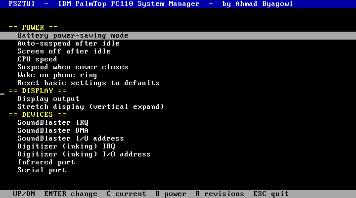
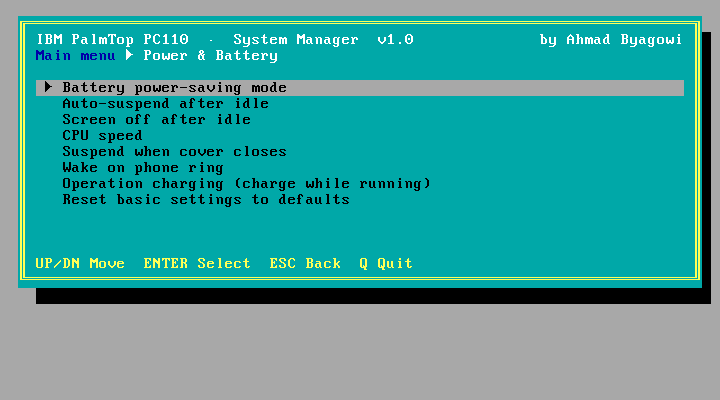
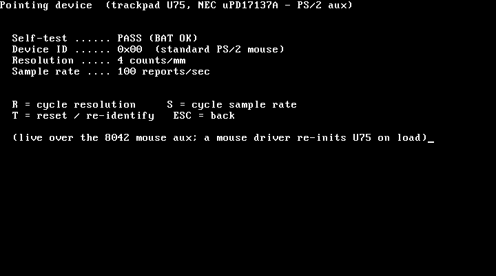

# PS2TUI — a text-UI front-end for the PC110 `PS2.EXE`

> **Standalone repo:** PS2TUI also has its own home at
> **https://github.com/ahmadexp/PS2TUI** (source + prebuilt binary + Makefile). This folder is a
> mirror kept alongside the `PS2.EXE` reverse-engineering notes.




*The PS2TUI main (category) menu and a sub-menu with the value picker.*

A full-screen, keyboard-driven menu for configuring the IBM PalmTop PC110, replacing the ~50
cryptic `PS2.EXE` command-line switches with a **two-level menu** (categories → settings). It does
**not** re-implement any setting write: every change is applied by running the real IBM `PS2.EXE`, so
all the actual APM / SCAMP / power-MCU / CMOS work is done by IBM's tested tool (the native features —
dumps, tests, diagnostics — are direct). See the reverse-engineering of `PS2.EXE` in
[`Discovery/PS2`](../../Discovery/PS2/).

Built and **tested on real PC110 hardware** (over [COMrade](../../Discovery/Live-Dump/)) and in QEMU:
rendering, two-level navigation, the option picker, and applying settings all verified.

The UI is organised into categories — **Power & Battery, Display, Devices, Keyboard & Pointer,
Advanced, Dumps & ROM, System Test, Diagnostics, Backup & Restore, Information** — each opening a
framed sub-menu. A title/breadcrumb bar and a context-sensitive footer run throughout; **Enter**
opens, **ESC** steps back.

### Menu tree

Every screen expanded — 10 categories, 57 items, with each value picker's choices shown as
leaves. Choosing any picker value opens a **Run? (Y/N)** confirm before it is applied. `[native]`
items run directly in PS2TUI (no `PS2.EXE`); `!` marks disruptive actions.

```
IBM PalmTop PC110 — System Manager
│
├─ Power & Battery
│   ├─ Battery power-saving mode
│   │   ├─ High
│   │   ├─ Medium
│   │   └─ Low
│   ├─ Auto-suspend after idle  (minutes)
│   │   ├─ 0
│   │   ├─ 1
│   │   ├─ 3
│   │   ├─ 5
│   │   ├─ 10
│   │   ├─ 15
│   │   ├─ 30
│   │   ├─ 60
│   │   └─ 99
│   ├─ Screen off after idle  (minutes)
│   │   ├─ 0
│   │   ├─ 1
│   │   ├─ 3
│   │   ├─ 5
│   │   ├─ 10
│   │   ├─ 15
│   │   └─ 17
│   ├─ CPU speed
│   │   ├─ Fast
│   │   ├─ Medium
│   │   └─ Slow
│   ├─ Suspend when cover closes
│   │   ├─ Enable
│   │   └─ Disable
│   ├─ Wake on phone ring
│   │   ├─ Enable
│   │   └─ Disable
│   ├─ Operation charging (while running)  [ULTRACHG.COM]
│   │   ├─ Enable
│   │   └─ Disable
│   └─ Reset basic settings to defaults  [action]
│       └─ (then: Run? Y/N)
│
├─ Display
│   ├─ Display output
│   │   ├─ LCD
│   │   └─ CRT
│   └─ Stretch display (vertical expand)
│       ├─ ON
│       └─ OFF
│
├─ Devices
│   ├─ SoundBlaster IRQ
│   │   ├─ 5
│   │   ├─ 10
│   │   └─ Disable
│   ├─ SoundBlaster DMA
│   │   ├─ 1
│   │   └─ 3
│   ├─ SoundBlaster I/O address
│   │   └─ 0220
│   ├─ Digitizer (inking) IRQ
│   │   ├─ 5
│   │   ├─ 10
│   │   └─ Disable
│   ├─ Digitizer (inking) I/O address
│   │   ├─ 15E0
│   │   ├─ 25E0
│   │   └─ 35E0
│   ├─ Infrared port
│   │   ├─ COM1
│   │   ├─ COM2
│   │   └─ Off
│   ├─ Serial port
│   │   ├─ COM1
│   │   ├─ COM2
│   │   └─ Off
│   ├─ Internal modem port
│   │   ├─ COM1
│   │   ├─ COM2
│   │   └─ Off
│   └─ PCMCIA modem port
│       ├─ COM1
│       ├─ COM2
│       └─ Off
│
├─ Keyboard & Pointer
│   ├─ Keyboard click sound
│   │   ├─ ON
│   │   └─ OFF
│   ├─ Keyboard typematic rate
│   │   ├─ Med
│   │   └─ Fast
│   ├─ Keyboard typematic delay
│   │   ├─ Normal
│   │   └─ Long
│   ├─ Keyboard device select
│   │   ├─ Auto
│   │   └─ Both
│   └─ Pointing device (identify + settings)  [native · 8042 aux → trackpad U75]
│       ├─ Self-test + device ID + resolution + sample rate (shown live)
│       ├─ R  = cycle resolution:  1 / 2 / 4 / 8 counts/mm
│       ├─ S  = cycle sample rate: 10 / 20 / 40 / 60 / 80 / 100 / 200 /s
│       ├─ T  = reset / re-identify
│       └─ ESC = back
│
├─ Advanced
│   ├─ Parallel port mode
│   │   ├─ BI
│   │   ├─ UNI
│   │   ├─ ECP
│   │   └─ EPP
│   ├─ IDE/ATA controller order
│   │   ├─ Primary
│   │   └─ Secondary
│   ├─ PCMCIA controller
│   │   ├─ Enable
│   │   └─ Disable
│   ├─ Support 3V PCMCIA cards
│   │   ├─ Enable
│   │   └─ Disable
│   ├─ LCD status panel shows
│   │   ├─ Auto
│   │   ├─ Time
│   │   └─ Battery
│   ├─ Battery charge profile
│   │   ├─ Standard
│   │   └─ Other
│   ├─ Floppy power management
│   │   ├─ Enable
│   │   └─ Disable
│   ├─ IRQ clear
│   │   ├─ Enable
│   │   └─ Disable
│   ├─ Token-ring RIPL speed
│   │   ├─ 4Mbps
│   │   └─ 16Mbps
│   └─ ! COMB serial-mux device
│       ├─ RS232
│       ├─ IRda
│       ├─ MIDI
│       └─ ASK
│
├─ Dumps & ROM
│   ├─ Dump system BIOS  → C:\PC110BIO.BIN   [native · F000, 64 KB]
│   ├─ Dump video BIOS   → C:\PC110VID.BIN   [native · C000, 32 KB]
│   └─ Dump font ROM     → C:\PC110FNT.BIN   [native · 1 MB, 128 banks]
│
├─ System Test
│   ├─ Memory info + RAM test          [native · conv/ext size + pattern]
│   ├─ Video / colour test             [native · 16 fg / 8 bg / charset]
│   ├─ Keyboard test                   [native · scancode/ascii]
│   ├─ Speaker test (beep)             [native · PIT ch2 ~1 kHz]
│   ├─ Real-time clock test (live)     [native · RTC ticking]
│   ├─ Timer (PIT) test                [native · ~18.2 Hz]
│   └─ Pointing device test            [native · INT 33h]
│
├─ Diagnostics
│   ├─ Hardware scan / report          [native · CPU/mem/APM/SCAMP/MCU/PCIC/font/UART/RTC]
│   ├─ Storage / disk info + read test [native · INT 13h geometry + sector 0]
│   ├─ Power / battery MCU detail      [native · 0xEC/0xED register file]
│   ├─ PCMCIA socket status            [native · 0x3E0/0x3E1 PCIC]
│   └─ Chipset config (VL82C420)      [native · SCAMP 0x74/0x76, unlocked]
│
├─ Backup & Restore
│   ├─ Backup all settings  → C:\PC110SET.BIN   [native · CMOS 0x10-0x7F]
│   └─ Restore all settings ← C:\PC110SET.BIN   [native]
│       └─ confirm Y/N → effective next boot
│
└─ Information
    ├─ Battery / AC status (live)      [native · APM INT 15h]
    ├─ Current settings (live)         [native · CMOS 0x70/0x71]
    ├─ Show firmware revisions         [PS2 _@REVision]
    ├─ ! Suspend the PC110 now  [action]
    │   └─ (then: Run? Y/N)
    ├─ ! Power OFF the PC110 now  [action]
    │   └─ (then: Run? Y/N)
    └─ ! Reset ALL advanced settings  [action]
        └─ (then: Run? Y/N)

Global keys:  B Battery · C Settings · R Revisions · Q Quit · ESC Back/Quit
```

## Using it

Copy `PS2TUI.COM` onto the PC110 (it is already installed at `C:\PS2TUI\PS2TUI.COM` on the unit
this was developed on) and run it:

```
PS2TUI
```

| Key | Action |
|---|---|
| ↑ / ↓ | Move between settings (category headers are skipped) |
| Enter | On a setting: open the value picker. On an action: confirm and run |
| (in picker) ↑/↓ + Enter | Choose a value → shows a confirm box → **Y** runs it, **N** cancels |
| **B** | **Live battery / AC status** — read natively via the APM BIOS (no `PS2.EXE`) |
| **C** | **Current settings** — read natively from CMOS (click, status panel, power mode, vertical-expand) |
| R | Show the firmware revision manifest (`PS2 _@REVision`) |
| ESC | Quit back to DOS |

Every apply shows the exact command (e.g. `PS2 CLICK OFF`) and asks for confirmation before
running it. Dangerous items (suspend / power-off / reset-all) are marked with a leading `!`.

> ⚠️ Reassigning the **Serial port / IR / modem** or choosing **Suspend/Power-off** can drop a
> remote (COMrade) session or change power behaviour — exactly as the raw `PS2.EXE` would.

## Ingested from PS2.EXE

PS2.EXE was disassembled and its hardware interface decoded (see
[`Discovery/PS2/DISASM.md`](../../Discovery/PS2/DISASM.md)). PS2TUI now performs the **read paths
natively**, with no `PS2.EXE` dependency:
- **Power/battery** (`B`) calls the APM BIOS directly (`INT 15h AX=5300`/`530A`). Verified live:
  *AC on-line, battery High, 100 %*.
- **Current settings** (`C`) reads the setting bytes straight from **CMOS** (`0x70/0x71`) — PS2
  stores them in the extended CMOS bank. Verified live: setting `_@STATUS BATTERY` with PS2.EXE
  then reading via PS2TUI shows *Battery*.

The vendor *setters* (`INT 15h AX=5380`, plus the `0x40/0x41` CMOS checksum) are decoded and
documented but still applied by invoking the real `PS2.EXE`, because blind-firing reverse-engineered
power/serial writes at a remote-only machine is unsafe.

## How it works

`PS2TUI` is a ~4 KB DOS `.COM` written in assembly:

- A data-driven table of settings (category, label, `PS2` command word, option list) drives the
  whole UI, so adding/adjusting settings is a one-line table edit.
- Rendering is direct-to-`B800` text output; input is `INT 16h`; the child is launched with the
  DOS EXEC call (`INT 21h/4Bh`) after shrinking the memory block (`INT 21h/4Ah`).
- Applying a setting builds `PS2 <cmd> [value]` and executes `C:\PS2.EXE` with that tail.

Covered settings: PMode, POwer, LCd, SPeed, Cover, RI, DEFAULT, SCreen, VEXP, IRQAudio, DMAAudio,
**ADDAUdio** (hidden), IRQINKing, ADDINKing, IR, SErial, IMODEM, PMODEM, CLick,
`_@Keyboard` (Speed/Response/Device), `_@LPT`, `_@ATA`, `_@PCIC`, `_@PCCD3v`, `_@STATus`,
`_@BATTery`, `_@FDDPM`, `_@IRQClear`, `_@Token ring`, `_@COMB`, `_@REVision`, OFF, `_@OFF`,
`_@DEFAULT`.

Beyond the settings, PS2TUI adds native features that PS2.EXE has no equivalent for:
- **DUMPS** — write byte-perfect **system BIOS** (`PC110BIO.BIN`), **video BIOS** (`PC110VID.BIN`)
  and the **1 MB font ROM** (`PC110FNT.BIN`) to the boot drive (verified against known-good images:
  font-ROM CRC-32 `e283a043`, video-BIOS `97686778`).
- **SYSTEM TEST** — Easy-Setup-style: RAM pattern test + sizes, video/colour test, keyboard test,
  speaker beep test, **live real-time-clock** test, **PIT timer** test, and a **pointing-device**
  test (INT 33h, vector-guarded).
- **DIAGNOSTICS**
  - **Hardware scan** — a one-screen live probe: CPU (CPUID vendor/family-model-stepping/FPU),
    conventional + extended memory, APM + battery, SCAMP VL82C420, power MCU, PCMCIA PCIC (chip ID),
    font ROM (signature), COM1 UART, and RTC (battery-valid + POST-error flags) — each present/absent
    from a real port read (uses the [Live-Dump](../../Discovery/Live-Dump/) RE).
  - **Storage / disk** — INT 13h geometry (cyl/heads/sectors) + a sector-0 read test.
  - **Power / battery MCU detail** — dumps the power-MCU register file (`0xEC/0xED` telemetry).
  - **PCMCIA socket status** — reads the 82365 PCIC and shows each socket's card-present state.
  - **Chipset config (VL82C420)** — atomically unlocks the `0x22/0x23` gate and dumps the SCAMP
    config space (all-`FF` post-POST otherwise); `SL` signature at idx 0x7A/0x7B confirms it.
    See [Discovery/Chipset §13a](../../Discovery/Chipset/).
  - **Pointing device (identify + settings)** — talks to the trackpad MCU (**U75, NEC µPD17137A**)
    over its only host interface, the **8042 PS/2 aux channel**: reset/self-test, device ID, and the
    live **resolution** / **sample-rate** settings you can cycle on screen. Restores the 8042 command
    byte on exit. The MCU firmware is internal mask ROM and is not host-dumpable — see
    [Discovery/Trackpoint §7a](../../Discovery/Trackpoint/). 
- **Operation charging** (Power menu) — enable/disable charging while the machine runs, by invoking
  the `ULTRACHG.COM` utility. Its mechanism (PC110 embedded-controller mailbox at `0x15E8/0x15EC`,
  `Zn10`/`Zn00` commands) is reverse-engineered in [`Discovery/ULTRACHG`](../../Discovery/ULTRACHG/).
- **BACKUP / restore all settings** — image the whole CMOS config region (`0x10–0x7F`, both
  checksums included) to `PC110SET.BIN` and write it back later (with a Y/N confirm; effective next
  boot). Captures every CMOS-persisted PS2/BIOS setting self-consistently.

Not in the menu (need a free-form input field, not a fixed picker): `ON AT` (wake-on-time alarm),
`_@CMOS` (direct CMOS read/modify), `_@FNkey` (send an Fn key code).

## Building

Host (any OS with NASM) — produces the ready-to-run `.COM`:

```sh
nasm -f bin PS2TUI.ASM -o PS2TUI.COM
```

There is no linker step; the source assembles to a flat DOS `.COM`. `PS2TUI.COM` in this folder is
the prebuilt, hardware-tested binary.

*(Note: on-device compilation via the PC110's own Turbo C++ `TCC.EXE` was attempted but its DPMI
host hangs under the bare DOS boot, so the tool is built with NASM on a host instead.)*

## Files
| File | |
|---|---|
| `PS2TUI.ASM` | NASM source (data-driven; edit the `rows` table to change the menu) |
| `PS2TUI.COM` | Prebuilt DOS binary (3,453 bytes), tested on real PC110 hardware |
